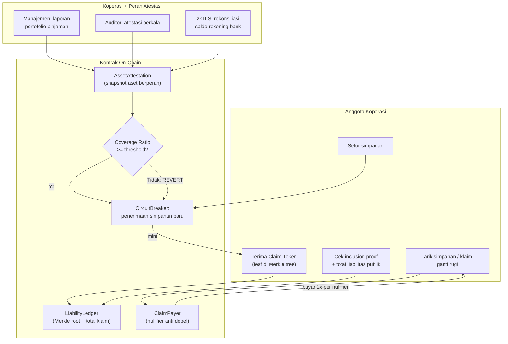

# KopraGuard — Proof-of-Backing Simpanan Koperasi

> **Ide hackathon RWA #1 (Top 5 overall)** — RWA + ZK
> Fokus: Indonesia (relevan juga untuk koperasi simpan pinjam di Filipina dan negara ASEAN lain)

## Elevator Pitch

Buku simpanan koperasi menjadi klaim on-chain yang bisa diverifikasi anggota sendiri. Portofolio pinjaman dan kas koperasi di-attestasi berkala oleh pihak berperan. Ketika rasio coverage jatuh di bawah ambang batas, **circuit breaker on-chain otomatis menghentikan penerimaan simpanan baru** — mencegah skema Ponzi tumbuh sebelum gagal bayar terjadi.

## Latar Belakang & Data Pasar

- 8 koperasi gagal bayar merugikan anggota **Rp 26 triliun** (Kemenkop, Januari 2025)
  - KSP Indosurya Cipta: kewajiban Rp 13,8 T, aset hanya Rp 8 T
  - KSP Sejahtera Bersama: kewajiban Rp 8,6 T, aset hanya Rp 1,3 T
- 7 koperasi masih menyisakan utang **Rp 23,9 triliun** kepada anggota (Kemenkop, November 2025)
- Paper akademik 2025 (Jurnal Akuntansi Keuangan dan Bisnis): pola Ponzi, 23.000+ korban, kelemahan pengawasan sebagai akar masalah
- Uang pensiunan menjadi korban utama; pengawasan regulator bersifat reaktif (baru diketahui saat gagal bayar)

## Grounding Riset

| Sumber | Kontribusi |
|---|---|
| LPOR — Layered Proof of Reserves (arXiv 2606.08211, Juni 2026) | Pola ledger liabilitas publik: inclusion proof per pengguna + total kewajiban bisa dihitung ulang publik |
| RWA-PoB (arXiv 2608.25269, Agustus 2026) | Mesin kebijakan coverage (BCR/RLC), pola peran atestasi multi-pihak, circuit breaker berbasis threshold |
| DeepWiki Maple core-v2 | Konfirmasi: deklarasi default/valuasi tetap aksi manual pihak terpercaya — gap yang mau ditutup untuk institusi kecil |
| Berita Kemenkop (Kompas, Antara, Tempo — 2025) | Data kerugian dan kronologi kasus |

## Problem Statement

Koperasi simpan pinjam open-loop berbadan hukum close-loop menjalankan praktik Ponzi tanpa terdeteksi. Anggota tidak punya cara memeriksa kesehatan koperasi; aset di bawah kewajiban baru terlihat saat gagal bayar. Regulator menerima laporan periodik manual yang mudah dimanipulasi. Tidak ada mekanisme preventif — semua kontrol bersifat reaktif setelah uang rakyat hilang.

## Pembeda Fitur (bukan regulasi)

1. **Sisi liabilitas on-chain (pola LPOR):** setiap simpanan = claim-token; anggota membuktikan inclusion via Merkle proof; total kewajiban dapat dijumlah ulang secara publik — manajemen tidak bisa menyembunyikan utang
2. **Sisi aset via atestasi berperan (pola RWA-PoB):** laporan berkala portofolio pinjaman + rekonsiliasi rekening bank (zkTLS dari portal bank) dari peran berbeda (manajemen, auditor, kustodian)
3. **Circuit breaker on-chain:** simpanan baru otomatis REVERT saat coverage ratio < threshold — mencegah Ponzi mendapatkan dana segar
4. **Nullifier klaim:** saat pembayaran ganti rugi (skenario PKPU), satu korban tidak bisa mengklaim dua kali — menjawab kasus nyata daftar korban dobel

## Jawaban 4 Pertanyaan Juri

1. **Masalah nyata?** Rp 26 T kerugian, 23.000+ korban, kasus masih berjalan November 2025, uang pensiunan rakyat.
2. **Pemakaian on-chain bermakna?** Circuit breaker, Merkle inclusion proof, nullifier — semua logika kontrak, bukan dashboard pelaporan pasif.
3. **Kebaruan?** Paper LPOR (Juni 2026) belum punya implementasi ke institusi simpanan; produk audit koperasi eksisting bersifat pasif dan manual.
4. **Skalabilitas?** Puluhan ribu KSP di Indonesia; koperasi sehat memakainya sebagai seal kepercayaan; regulator (pasca-PINP2SK) memakainya sebagai alat pengawasan; pola replikabel ke Filipina (koperasi komunitas) dan negara lain.

## Teknologi

- **RWA:** simpanan sebagai klaim ter-tokenisasi, atestasi aset berkala
- **ZK:** Merkle tree inclusion proof (Poseidon hash), nullifier; opsi zkTLS untuk rekonsiliasi rekening bank
- **Stack demo:** Solidity + Foundry, Merkle lib (Poseidon), frontend sederhana (Next.js), mock portal bank untuk zkTLS

## High-Level E2E Flow

## Skenario Demo Day

1. **Koperasi sehat:** simpanan masuk lancar, coverage hijau, claim-token ter-mint
2. **Koperasi bermasalah:** atestasi aset turun, coverage merah, deposit baru **REVERT di layar** + alarm
3. **Verifikasi anggota:** buka ledger publik, buktikan inclusion claim sendiri, jumlah total klaim cocok
4. **Anti klaim dobel:** korban coba klaim dua kali, nullifier blok yang kedua

## Kelemahan & Mitigasi

| Kelemahan | Mitigasi |
|---|---|
| Adopsi sukarela koperasi | Sasar koperasi sehat yang butuh seal kepercayaan pasca-skandal; jalur regulator Kemenkop pasca-PINP2SK butuh alat pengawasan |
| Validitas atestasi aset | Mulai dari rekonsiliasi bank via zkTLS (sederhana); lima peran RWA-PoB untuk fase dua |
| Angka coverage sevalid data masuk | Transparansi definisi threshold on-chain; jadikan parameter governansi |

## Roadmap Pasca-Hackathon

1. Pilot dengan 1-2 koperasi sehat (seal kepercayaan)
2. Integrasi dashboard pengawasan Kemenkop/departemen koperasi provinsi
3. Ekspansi peran atestasi penuh (pola RWA-PoB lima peran)
4. Replikasi ke negara ASEAN dengan masalah koperasi serupa
