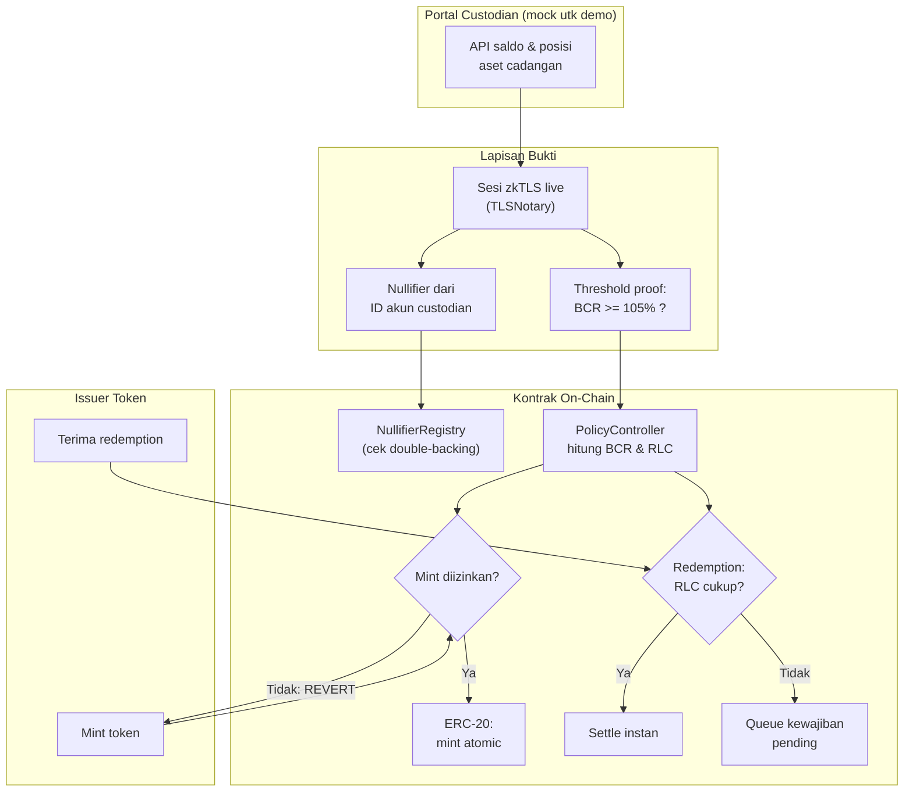

# BoundProof — Proof-of-Backing Terikat Sumber (zkTLS + Policy Engine)

> **Ide hackathon RWA #2 (Top 5 overall)** — RWA + ZK
> Fokus: tokenized treasury / fund / ekuitas (konteks global, kasus banjir token pre-IPO 2026)

## Elevator Pitch

Paper RWA-PoB punya mesin kebijakan backing (BCR/RLC) tapi input-nya klaim tanda tangan institusi — institusi bisa salah atau bohong. zkTLS punya pengikatan sumber, tapi tanpa mesin kebijakan. **BoundProof menggabungkan keduanya**: input cadangan/likuiditas diambil via sesi zkTLS live ke portal custodian, bukan self-attestation; ditambah nullifier registry anti double-backing antar token, dan threshold proof privat.

## Latar Belakang & Data Pasar

- Banjir token ekuitas pre-IPO (mis. gelombang token SpaceX-link 2026) tanpa verifikasi holding yang mengikat sumber
- Paper RWA-PoB menolak mint saat BCR 96,34% < threshold 105% pada skenario aset terenkumber — sementara proof-of-reserves agregat menerima semua skenario karena gros cadangan cukup
- zkPass (Juni 2026): zkTLS ke server broker, nullifier dari ID akun — atestasi satu akun broker tidak bisa menjamin dua token
- DIA ZK (Juli 2026): threshold proof — bukti "cadangan melebihi suplai" tanpa mengungkap angka
- Regulasi (GENIUS Act, MiCA) mengubah "buktikan backing" dari kesopanan pasar menjadi kewajiban berkelanjutan

## Grounding Riset

| Sumber | Kontribusi |
|---|---|
| RWA-PoB (arXiv 2608.25269 + repo `rischanlab/PoB`) | Mesin kebijakan BCR/RLC, kawalan mint/burn atomic, dataset skenario + test suite siap reproduksi |
| zkPass — Verifiable Proof of Reserve (Medium, Juni 2026) | Pengikatan sumber via zkTLS, nullifier registry lintas token |
| DIA ZK (blog, Juli 2026) | Threshold proof: bukti statement tanpa bocorkan nilai |
| zk-rwa-kit (ETHGlobal/Mantle) | Presedend pola mock portal + TLSNotary nyata yang diterima juri |

## Problem Statement

Proof of reserves agregat menerima mint di semua skenario karena hanya melihat gros cadangan. Aset terenkumber, salah nilai, atau tak likuid lolos. Klaim institusi ditandatangani pihak yang berkepentingan — bisa salah atau bohong (paper RWA-PoB mengakui sendiri: *"does not independently prove the existence, ownership, or condition of off-chain assets"*). Sisi kripto (zkTLS) sudah ada, sisi kebijakan (BCR/RLC) sudah ada — belum ada yang menggabungkan keduanya.

## Pembeda Fitur

1. **Input terikat sumber:** data reserve/likuiditas RWA-PoB diambil dari sesi zkTLS live ke API/portal custodian — bukan klaim EIP-712 yang ditandatangani sendiri
2. **Nullifier registry global:** satu akun custodian hanya bisa menjamin satu token; token kediga yang mint dari akun sama, REJECT — menutup double-counting cadangan
3. **Threshold proof privat:** bukti BCR di atas threshold tanpa publish saldo (pola DIA ZK)
4. **Mesin kebijakan tetap:** mint atomic terkait kenaikan liabilitas, burn saat redemption, queue saat RLC jatuh (reproduksi evaluasi paper)

## Jawaban 4 Pertanyaan Juri

1. **Masalah nyata?** Banjir token ekuitas/fund 2026 tanpa verifikasi holding terikat sumber; kewajiban backing berkelanjutan (GENIUS Act/MiCA).
2. **Pemakaian on-chain bermakna?** Policy controller ERC-20 mengawal supply — mint diblok on-chain, bukan peringatan dashboard.
3. **Kebaruan?** Paper Agustus 2026 dan artikel industri Juni 2026 sama-sama eksplisit menyebut gap masing-masing; kombinasi keduanya belum ada.
4. **Skalabilitas?** Jalur ke issuer token treasury/fund yang wajib bukti backing berkelanjutan; pola broker read-only API (zkPass) jadi jalur produksi.

## Teknologi

- **RWA:** tokenized treasury/fund, policy engine backing (BCR/RLC)
- **ZK:** zkTLS (TLSNotary) untuk pengikatan sumber, circuit threshold (Groth16/Noir opsional)
- **Stack demo:** Solidity + Foundry (basis repo paper), TLSNotary, mock portal custodian, Next.js dashboard

## High-Level E2E Flow

## Skenario Demo Day (reproduksi evaluasi paper)

Empat tombol, empat hasil transaksi berbeda:

1. **Valid state** (BCR 114,12%): mint sukses
2. **Encumbered assets** (BCR 96,34% < 105%): mint **REVERT** terlihat di tx
3. **Liquidity stress** (RLC 40%): redemption masuk **QUEUE** sebagai kewajiban pending
4. **Double-backing:** dua token mint dari satu akun custodian yang sama, yang kedua **REJECT** oleh nullifier registry

Dataset skenario dan test suite bawaan repo paper (`rischanlab/PoB`) langsung dipakai — risiko pembangunan rendah.

## Kelemahan & Mitigasi

| Kelemahan | Mitigasi |
|---|---|
| Produksi butuh kerjasama custodian / read-only API | Pola mock portal + TLSNotary nyata sudah presedend diterima (zk-rwa-kit); jalur produksi: broker dengan read-only API ala zkPass |
| Kepercayaan pada custodian tetap ada | zkTLS mengikat klaim ke sumber (tak bisa dipalsukan issuer); garis kepercayaan dibuat eksplisit |
| Trusted setup circuit demo | Gunakan ceremony publik / backend tanpa trusted setup untuk fase lanjut |

Kelemahan utama = kelemahan industri zkTLS seluruhnya, bukan kelemahan desain projek — dimaklumi juri.

## Roadmap Pasca-Hackathon

1. Integrasi dengan satu issuer token treasury nyata (pilot read-only API custodian)
2. Verifier on-chain penuh untuk proof zkTLS (menggantikan relayer semi-trusted)
3. Multi-custodian aggregation (satu token, banyak sumber cadangan)
