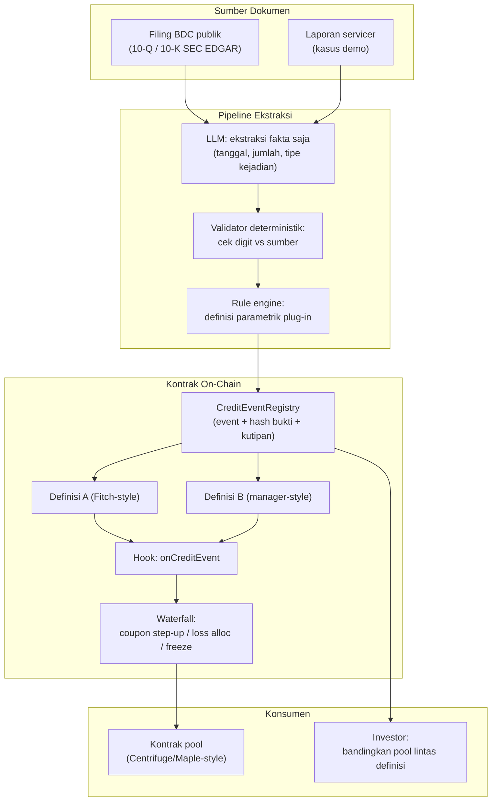

# DefaultLens — Registry Kejadian Kredit Machine-Readable

> **Ide hackathon RWA #3 (Top 5 overall)** — RWA + AI
> Fokus: private credit on-chain (kategori RWA terbesar: $6,99–7,48 miliar distributed value, rwa.xyz 2026)

## Elevator Pitch

Registry on-chain untuk klasifikasi kejadian kredit per loan: taksonomi enum + bukti bercitik + **mesin definisi parametrik**. Loan yang sama dapat dihitung di bawah definisi Fitch-style dan manager-style — hasil berbeda tampil berdampingan. Kontrak waterfall berlangganan hasilnya: coupon step-up, alokasi loss, freeze berjalan mekanis, bukan tergantung keputusan manual manusia.

## Latar Belakang & Data Pasar

- **Kanyon angka default (Sep 2026):** manajer melapor 1–2%, Fitch 6,3% (TTM Agustus 2026), Proskauer 2,51% (Q2 2026) — perbedaan murni karena definisi
- Penyebab: PIK toggle dan perpanjangan maturity dihitung berbeda tiap definisi; 12% kredit kecil (<$20–25 juta EBITDA) trade di bawah 90 cent (Houlihan Lokey Q2 2026)
- DeepWiki Maple core-v2: `triggerDefault` adalah aksi manual pool delegate — deklarasi default subjektif
- Tidak ada tokenized credit product yang publish jadwal kolateral, daftar obligor, atau tangga maturity tanpa login (Cryptoeconomics, Juli 2026)

## Grounding Riset

| Sumber | Kontribusi |
|---|---|
| Cryptobriefing (17 Sep 2026) | Data kanyon default rate: 1–2% vs 6,3% vs 2,51% |
| DeepWiki Maple core-v2 | Konfirmasi default dideklarasikan manual oleh pool delegate |
| PROVENANCE (Mantle, hackathon 2026) | Pola anti-hallucination: LLM menulis prosa saja, validator mencocokkan digit dengan rubrik deterministik |
| ARIA (Casper, hackathon 2026) | Pola loop reputasi agen dinilai dari outcome |
| Filing publik BDC (SEC EDGAR 10-Q/10-K) | Data demo nyata: laporan pinjaman BDC publik, bukan mock |

## Problem Statement

Definisi "default" tidak standar di pasar private credit $1,5–2 triliun (FSB). Loan yang sama dihitung "modifikasi" di buku manajer dan "default" di Fitch. Konsekuensi on-chain: coupon step-up, alokasi loss, freeze — semua trigger bergantung deklarasi manusia. Tidak ada feed kejadian kredit yang bisa dikonsumsi kontrak. Investor tidak bisa membandingkan Fund A vs Fund B tanpa membedah metodologi masing-masing.

## Pembeda Fitur

1. **Taksonomi credit event on-chain:** `missed_payment`, `pik_conversion`, `maturity_extension`, `distressed_exchange`, `cured` — tiap event membawa hash bukti + kutipan sumber
2. **Definisi sebagai plug-in parametrik:** mesin rule menghitung status loan yang sama di bawah skema definisi berbeda; hasil berdampingan, transparan
3. **AI hanya ekstraksi fakta:** klasifikasi 100% dari rule engine deterministik — menghilangkan risiko LLM menilai (pola PROVENANCE)
4. **Hook kontrak:** `onCreditEvent(loanId, definitionId)` — waterfall langsung bereaksi: coupon step-up, loss allocation, freeze

## Jawaban 4 Pertanyaan Juri

1. **Masalah nyata?** Gap 1–2% vs 6,3% = kanyon transparansi di kelas aset RWA terbesar ($6,99 miliar distributed).
2. **Pemakaian on-chain bermakna?** Event registry + hook waterfall = infrastruktur kontrak, bukan laporan PDF.
3. **Kebaruan?** SentinelFi memantau covenant, PROVENANCE me-rating aset, ARIA meng-underwrite baru — tidak ada yang menstandarkan klasifikasi kejadian kredit yang sudah terjadi.
4. **Skalabilitas?** SDK registry + integrasi pool (Centrifuge, Maple); sumber data demo nyata dari filing publik BDC.

## Teknologi

- **RWA:** registry kejadian kredit, integrasi waterfall pool
- **AI:** ekstraksi fakta terstruktur dari dokumen (LLM ekstraksi + validator deterministik)
- **Stack demo:** Solidity + Foundry, pipeline ekstraksi (LLM API + schema validation), Next.js dua-kolom definisi

## High-Level E2E Flow

## Skenario Demo Day

1. Tiga file kasus diunggah: satu **PIK toggle**, satu **missed payment**, satu **maturity extension**
2. Klasifikasi live on-chain, tiap event membawa hash bukti + kutipan
3. **Dua kolom definisi menampilkan hasil berbeda** untuk file yang sama (momen kunci demo)
4. Waterfall berjalan berbeda per definisi: coupon step-up vs tanpa aksi — dua transaksi nyata
5. Bonus: ekstraksi dari filing BDC nyata (EDGAR), bukan dokumen buatan

## Kelemahan & Mitigasi

| Kelemahan | Mitigasi |
|---|---|
| Ground truth akurasi klasifikasi | **Netral oleh desain:** tujuan bukan "klasifikasi benar" tapi "klasifikasi transparan per definisi" — tidak perlu ground truth untuk menunjukkan dua definisi menghasilkan dua hasil |
| Akses laporan pinjaman privat | Demo pakai filing publik BDC (EDGAR) — data nyata tanpa mock |
| Definisi legal per kontrak loan bervariasi | Registry berparameter per pool, bukan global; definisi = plug-in |

## Roadmap Pasca-Hackathon

1. Backfill historis: klasifikasi filing BDC multi-tahun, ukur divergence antar definisi
2. Integrasi hook ke pool tokenized credit (pilot 1 pool)
3. API + SDK untuk lender/analyst membandingkan pool lintas metodologi
4. Ekstensi taksonomi: restructuring, covenant amendment, cure period tracking
