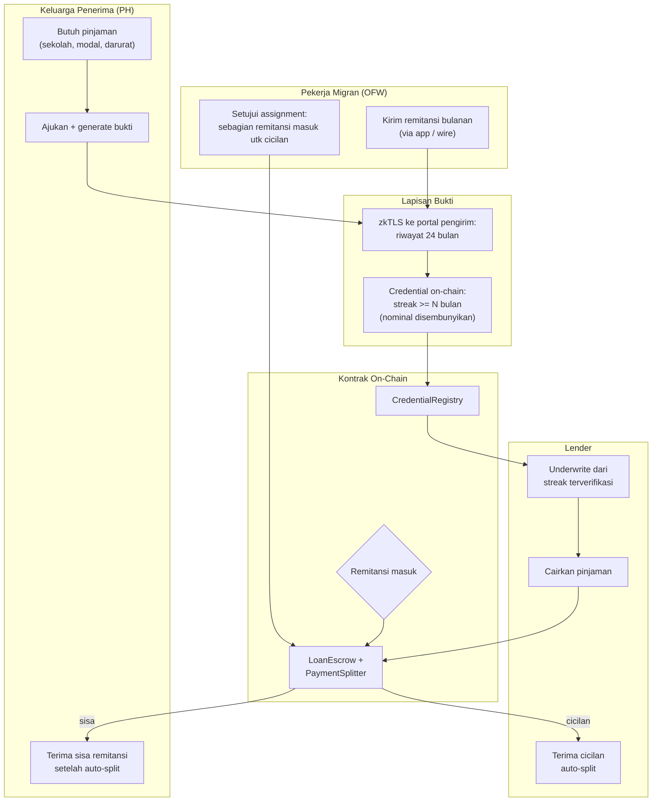

# PadalaProof — Kredensial Kredit dari Aliran Remitansi OFW

> **Ide hackathon RWA #4 (Top 5 overall)** — RWA + ZK (zkTLS)
> Fokus: Filipina (OFW), ekspansi natural ke TKI Indonesia dan pekerja migran Vietnam

## Elevator Pitch

Bukti ZK streak remitensi (via zkTLS dari portal/app pengirim) menjadi kredensial kredit portable. Cicilan pinjaman keluarga **auto-dipotong dari remitansi masuk berikutnya** via payment split kontrak — aliran remitensi diperlakukan sebagai receivable. Jumlah uang tidak pernah diungkap; hanya streak dan threshold yang terbukti.

## Latar Belakang & Data Pasar

- Cash remittances OFW rekor **$35,63 miliar pada 2025** (+3,3% YoY), setara **7,3% PDB Filipina** (BSP, Feb 2026)
- **44% dewasa Filipina unbanked**; banyak bergantung remitansi
- Pasar pinjaman konsumer tanpa kartu kredit **₱1,54 triliun**, bunga **~100% di atas rata-rata Asia Tenggara**
- Estimasi: lender bisa melihat riwayat penuh, hemat borrower **₱775 miliar/tahun** (komentar Pavel Fedorov, Salmon Group — Jun 2026)
- RUU Open Finance (HB 9149) baru efektif **2028–2029** — keluarga OFW butuh solusi sekarang
- Alternatif saat ini: rentenir "5-6" dengan bunga ekstrem

## Grounding Riset

| Sumber | Kontribusi |
|---|---|
| BSP via BusinessWorld / Manila Bulletin (Feb 2026) | Data remittances rekor + proyeksi $36,6 miliar 2026 |
| Fintech Times (Jul 2026) | 65% dewasa punya akun formal; GCash/Maya dominan; 300+ fintech PH |
| Worldngayon / Philstar (Jun–Jul 2026) | 44% unbanked, ₱775 miliar estimasi hemat, HB 9149 timeline, cerita sari-sari store & koperasi |
| zkOBS / zkMe | Presedend zkTLS untuk bukti data keuangan (saldo, streak) tanpa bocorkan nominal |
| RQP (eprint 2026/1330) | Kredensial terikat issuer + zkSNARK, agregasi efisien |

## Problem Statement

Keluarga OFW menerima aliran dana stabil bertahun-tahun ($35 miliar/tahun, terfragmentasi lintas Western Union, Remitly, GCash, bank) — tetapi aliran itu **tidak terlihat oleh lender**. File kredit CIC kosong; bunga pinjaman 2x rata-rata SEA; alternatif satu-satunya rentenir 5-6. Kerangka open finance resmi masih 2–3 tahun lagi. Data yang paling memprediksi kemampuan bayar justru yang paling tidak bisa dipakai.

## Pembeda Fitur

1. **Kredensial streak via zkTLS langsung dari portal/app pengirim** — jalan sekarang, tanpa menunggu framework open finance
2. **Portable antar lender** (verifiable credential on-chain), bukan skor blackbox satu platform
3. **Aliran remitansi = aset dasar:** repayment auto-split dari remitansi masuk via kontrak — receivable factoring untuk rumah tangga
4. **Privasi by design:** hanya streak + threshold terbukti, jumlah tak diungkap (pola "prove the statement, not the value")

## Jawaban 4 Pertanyaan Juri

1. **Masalah nyata?** $35,6 miliar/tahun, 44% unbanked, bunga 2x tetangga, ₱775 miliar potensi hemat terestimasi.
2. **Pemakaian on-chain bermakna?** Kredensial terverifikasi kontrak + payment split on-chain — eksekusi nyata, bukan catatan.
3. **Kebaruan?** zkMe verifikasi saldo untuk gate DeFi; Salmon/GCash pakai data internal closed; tidak ada yang underwrite dari streak remitansi ter-zkTLS lintas platform.
4. **Skalabilitas?** 300+ fintech PH sebagai konsumen kredensial; ekspansi alami ke TKI Indonesia dan pekerja migran Vietnam.

## Teknologi

- **RWA:** aliran remitansi sebagai receivable yang difaktorkan
- **ZK:** zkTLS (TLSNotary/Reclaim-style) dari portal pengirim; credential dengan nullifier anti-replay
- **Stack demo:** Solidity + Foundry (PaymentSplitter, CredentialRegistry), TLSNotary, mock app remitansi, Next.js

## High-Level E2E Flow

## Skenario Demo Day

1. Mock app remitansi + TLSNotary nyata: credential streak 24 bulan terbit on-chain — **nominal disembunyikan** (tunjukkan di UI)
2. Pinjaman cair berdasarkan kredensial
3. Remitansi bulan berikutnya masuk: **auto-split live di layar** — cicilan ke lender, sisa ke keluarga (tx nyata)
4. Skenario streak putus: limit pinjaman turun otomatis
5. Bandingkan total biaya vs rentenir 5-6 side-by-side di dashboard

## Kelemahan & Mitigasi

| Kelemahan | Mitigasi |
|---|---|
| Kolaborasi app remitansi utk produksi | Mulai sebagai **credit enhancement** (bukan satu-satunya dasar underwriting); kompatibel dengan pilot Open Finance BSP; zkTLS dari portal web pengirim tak butuh API resmi |
| Validasi model risiko streak | Framing beta dengan limit kecil; kelemahan bisnis biasa, bukan kelemahan mekanisme |
| Potong remitansi butuh persetujuan pengirim | Assignment eksplisit OFW di flow (langkah O2); kontrak menolak split tanpa persetujuan |

## Roadmap Pasca-Hackathon

1. Pilot dengan 1 lender digital PH (Salmon-style) + 1 koridor remitansi (HK/Singapura ke PH)
2. Model risiko: backtest streak vs performa bayar (data partner)
3. Ekspansi koridor: Timur Tengah ke Indonesia/Vietnam
4. Standarisasi skema kredensial agar interoperabel saat open finance resmi jalan
