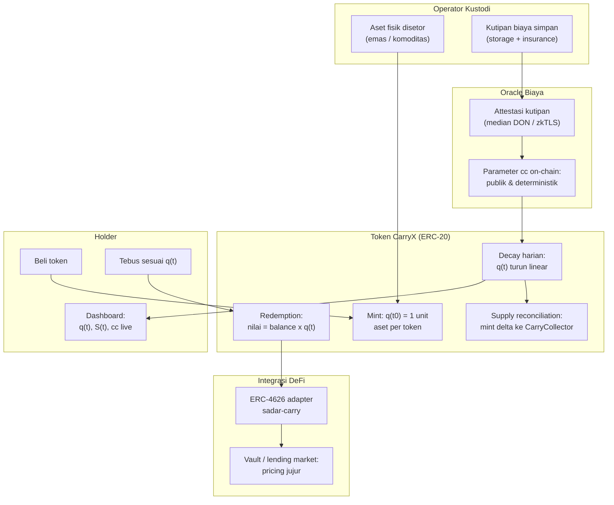

# CarryX — Token Negative-Carry: Implementasi Pertama Fungible Reserve Standard

> **Ide hackathon RWA #5 (Top 5 overall)** — RWA (+ ZK opsional untuk attestasi biaya)
> Fokus: aset fisik dengan biaya simpan (emas, komoditas gudang, resi gudang) — pasar global, relevan ASEAN (komoditas Indonesia/Malaysia)

## Elevator Pitch

Aset fisik punya negative carry struktural: kustodi, asuransi, audit. Model token sekarang mensubsidi, menyembunyikan biaya, atau merusak fungibilitas via rebasing. **CarryX mengimplementasikan FRS (paper Matrixdock, Maret 2026) untuk pertama kalinya**: biaya simpan ter-encode on-chain — q(t) meluruh deterministik, supply reconciliation menjaga ERC-20 fungible — plus dua ekstensi yang paper sebut terbuka: **oracle biaya kustodi ter-attestasi** dan **adapter ERC-4626 sadar-carry** agar vault/lending market memperhitungkan peluruhan secara jujur.

## Latar Belakang & Data Pasar

- Paper FRS (arXiv 2606.26704): "no prior framework has formally addressed how the structural negative carry of physical assets should be encoded in fungible token design" — eksplisit belum ada implementasi
- Token emas besar (PAXG, XAUT): biaya kustodi di level issuer, tidak on-chain, tidak deterministik — ekonomi biaya tersembunyi dari holder
- Paper FRS menyebut sendiri masalah terbuka: oracle cadangan trust-minimized, dan integrasi compliance (ERC-3643)
- Taxonomy RWA (arXiv 2606.08534): gap dokumentasi burn mechanics dan supply constraint di 20 sistem RWA terbesar
- Proyeksi industri: tokenisasi aset triliunan dolar dalam dekade ke depan — akuntansi jujur jadi prasyarat

## Grounding Riset

| Sumber | Kontribusi |
|---|---|
| FRS — Fungible Reserve Standard (arXiv 2606.26704, Matrixdock, Maret 2026) | Matematika q(t) linear decay, supply reconciliation ke CarryCollector, requirement fungibilitas |
| DIA ZK / zkPass | Pola attestasi sumber untuk input biaya kustodi |
| PAXG / XAUT (dokumentasi publik) | Baseline perbandingan: biaya di level issuer, opak |
| SoK RWA (arXiv 2604.06608) | Oracle problem & kebutuhan sinkronisasi off-chain ke on-chain |

## Problem Statement

Token aset fisik berlaku sebagai klaim penuh atas nilai aset, padahal nilainya meluruh setiap hari oleh biaya simpan. Tiga model yang ada semuanya cacat: (1) subsidi issuer — opak, tak berkelanjutan; (2) rebasing — merusak fungibilitas dan komposabilitas DeFi; (3) wrapper — biaya tersembunyi di layer tambahan. Holder tidak bisa mengaudit laju peluruhan nilainya sendiri. Tidak ada token yang jujur secara akuntansi.

## Pembeda Fitur

1. **Implementasi pertama FRS** — paper Maret 2026, nol implementasi; first-mover klaim kuat
2. **Oracle biaya kustodi ter-attestasi** (ekstensi #1): laju cc bukan angka issuer — kutipan penyimpanan diverifikasi (median DON / zkTLS), parameter publik dan deterministik
3. **Adapter ERC-4626 sadar-carry** (ekstensi #2): vault dan lending market menghitung q(t) saat pricing share — integrasi DeFi tidak berbohong tentang nilai
4. **Transparansi penuh real-time:** q(t), S(t), cc queryable kapan saja oleh siapa saja — vs NAV ETF yang terbit sekali sehari

## Jawaban 4 Pertanyaan Juri

1. **Masalah nyata?** Token emas bernilai jutaan dolar dengan ekonomi biaya tersembunyi; proyeksi tokenisasi triliunan; holder tidak tahu laju peluruhan nilainya.
2. **Pemakaian on-chain bermakna?** Decay + rekonsiliasi supply + adapter = logika kontrak murni — inovasi mekanisme level standar token.
3. **Kebaruan?** Klaim first-mover implementasi paper 6 bulan lalu plus dua ekstensi yang paper sebut terbuka.
4. **Skalabilitas?** Standar untuk issuer komoditas/warehouse; asset-agnostic (emas, perak, resi gudang); penerbit besar (Matrixdock) bergerak ke arah ini.

## Teknologi

- **RWA:** token komoditas dengan carrying cost ter-encode, oracle biaya
- **ZK (opsional):** attestasi kutipan biaya kustodi via zkTLS
- **Stack demo:** Solidity + Foundry, Anvil time-travel (`evm_increaseTime`), mock storage quotes, ERC-4626 adapter, Next.js dashboard

## High-Level E2E Flow

## Skenario Demo Day

1. Mint 100 token emas, q(t0) = 1 — dashboard live
2. Time-travel (Anvil `evm_increaseTime` 1 tahun): **q(t) turun di layar**, supply reconciliation mint token delta ke CarryCollector
3. Vault share price tetap benar via adapter sadar-carry — side-by-side dengan **wrapper naif yang merusak akuntansi** (momen kunci)
4. Query publik: siapa saja bisa panggil `q(t)`, `S(t)`, `cc` dari kontrak
5. Narasi perbandingan: biaya tersembunyi PAXG vs CarryX tercantum eksplisit

Paling sederhana didemokan dari lima ide top — paling mungkin selesai dengan lengkap.

## Kelemahan & Mitigasi

| Kelemahan | Mitigasi |
|---|---|
| Wow factor lebih kecil dari ide lain | Naikkan dengan narasi perbandingan biaya tersembunyi PAXG vs CarryX + demo side-by-side wrapper rusak |
| Parameter cc butuh governansi | Kelemahan standar semua protokol DeFi — dimaklumi; parameter publik dan upgradenya transparan |
| Demo pakai mock storage quotes | Attestasi via median DON pola lazim; produksi: zkTLS dari operator vault |

**Dari semua 10 ide, kelemahan CarryX paling ringan** — ranking #5 bukan karena lemah, tapi karena plafon impresi lebih rendah.

## Roadmap Paska-Hackathon

1. Deploy testnet + audit kontrak rekonsiliasi supply (invariant accounting identity)
2. Formal verification invariant q(t) x S(t) = R(t) (paper FRS menyarankan ini)
3. Pilot dengan 1 gudang komoditas/kustodian emas regional
4. Integrasi ERC-3643 untuk deployment regulasi (arah yang paper tunjuk)
