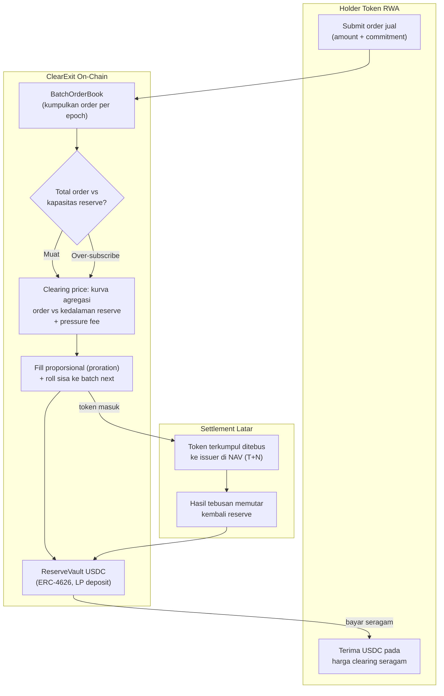

# ClearExit — Rail Exit Lelang Harga Seragam untuk Token RWA

> **Ide hackathon RWA #6 (Batch 2, peringkat B#1)** — RWA murni (mekanisme lelang)
> Fokus: token RWA redeemable (tokenized treasuries, money market fund, private credit vault)

## Elevator Pitch

Holder token RWA yang ingin keluar tidak harus memilih antara menunggu settlement issuer T+1 sampai T+90 atau menjual ke venue yang harganya dikutip kurator/market maker. ClearExit adalah rail exit lelang seragam (uniform-price batch auction): semua order jual dalam satu batch dieksekusi di **satu harga clearing yang sama**, reserve vault USDC menjadi counterparty, kelebihan demand diproratakan on-chain, dan token yang terkumpul ditebus ke issuer di NAV untuk memutar kembali reserve. Split order menjadi tidak menguntungkan secara matematis — harga splitter identik dengan harga penjual besar.

## Latar Belakang & Data Pasar

- Nilai RWA on-chain mencapai **$33,5 miliar** pada 2026, hampir tiga kali lipat setahun sebelumnya; namun **lebih dari separuh nilainya idle** — pola mint-and-redeem, bukan secondary trading (Stobox, Agustus 2026)
- Blackstone **BCRED** ($82 miliar) meng-gate **$3,7 miliar** permintaan redemption (Stobox, Juli 2026) — tekanan exit nyata bahkan di TradFi terbesar
- Tokenized private credit melewati **$19 miliar** pinjaman aktif (akhir 2025) — segmen non-Treasury terbesar, sekaligus paling tipis likuiditas sekundernya
- Venue exit instan yang ada sekarang semuanya menitipkan penentuan harga pada pihak sedikit:
  - **KPK USDC RWA vault**: diskon ditetapkan kurator, 0,05%–3,00% per aset, limit akuisisi per aset, settlement issuer 12–36 jam (Midas) hingga asinkron (Centrifuge)
  - **Upshift RWA Clear**: harga = oracle + spread tetap — spread tetap berarti mispricing saat tekanan jual tinggi
  - **Symbiotic Liquid Lane**: RFQ oleh market maker terpilih
- Symbiotic (Juli 2026): ekonomi LP di DEX pool RWA buruk (APY efektif 5,2% dengan impermanent loss struktural) dibanding vault kurator (8,9%) pada modal $10 juta yang sama

## Grounding Riset

| Sumber | Kontribusi |
|---|---|
| [Prop RFQ (ePrint 2026/1739, Agustus 2026)](https://eprint.iacr.org/2026/1739) | Paper exit pricing untuk RWA redeemable. Kesimpulan eksplisit: mekanisme yang dibandingkan **tidak** menyediakan sekaligus akses permissionless, ketahanan order-splitting, dan exit kecil yang fair. Cadence-nya hanya memangkas keuntungan split 9,67% dan rawan cadence griefing murah |
| [Symbiotic — instant liquidity vault (Juli 2026)](https://resources.symbiotic.fi/how-rwa-issuers-should-think-about-liquidity-a-capital-efficiency-comparison) | Bukti permintaan exit instan + struktur vault kurator yang justru mau dihilangkan |
| [KPK USDC RWA vault (live)](https://kpk.io/blog/kpk-usdc-rwa-liquidity) | Kurator menetapkan diskon per aset — trust assumption yang digantikan lelang |
| [Upshift RWA Clear](https://docs.upshift.finance/products/rwa-clear) | Pola oracle + spread tetap; lemah justru pada skenario tekanan |
| [Uniswap continuous-clearing-auction (audited) + PR #360 RWA Launcher](https://github.com/Uniswap/continuous-clearing-auction) | Primitive uniform-price auction sudah teruji & ter-audit di sisi **issuance**; sisi **exit** masih kosong |
| [Wharton WIFPR (Mei 2026)](https://wifpr.wharton.upenn.edu/wp-content/uploads/2026/05/WIFPR-Tokenizing-Real-World-Assets-Cong-Mayer-and-Rabetti.pdf) | Speed matching principle: kecepatan trading token harus mengikuti kecepatan underlying — batch berkala fit dengan aset T+N |
| [RWA Bible — gates & proration (Agustus 2026)](https://rwa-bible.com/en/fundamentals/tokenized-fund-redemption-mechanics-gates-proration-explained/) | Proration dan gate hanya hidup di dokumen legal fund; belum ada primitive on-chain |
| [Stobox liquidity gap (Juli & Agustus 2026)](https://www.stobox.io/blog/tokenization-intelligence-rwa-liquidity-gap) | Data idle RWA, kasus BCRED, struktur segmen private credit |

## Problem Statement

Mengeluarkan dana dari token RWA hari ini memaksa holder memilih tiga jalur yang semuanya cacat: (1) menunggu jendela redemption issuer (T+1 sampai T+90, gate, proration — semua hanya hidup di dokumen legal); (2) menjual ke pool AMM tipis yang rentan arbitrase NAV-stale dan merugikan LP; (3) venue exit instan yang harganya dikutip kurator atau segelintir market maker — spread tetap meng-mispricing saat tekanan, order besar bisa di-split untuk menguras reserve (didokumentasikan paper Prop RFQ), dan holder retail kecil menerima harga terburuk. Tidak ada rail exit permissionless di mana harga terbentuk dari kompetisi terbuka dan semua peserta — besar, kecil, maupun splitter — menerima harga yang sama.

## Pembeda Fitur (bukan regulasi)

1. **Uniform clearing price per batch:** semua order jual yang ter-fill di batch yang sama menerima satu harga. Keuntungan order-splitting menjadi **nol secara matematis** — bukan dikurangi 9,67% seperti mekanisme cadence Prop RFQ, dan tanpa permukaan griefing karena tidak ada penalti pola order per-individu
2. **Proration on-chain:** saat total order melebihi kapasitas reserve, semua peserta ter-fill proporsional pada harga seragam yang sama, sisanya otomatis roll ke batch berikutnya — mekanisme gate TradFi dibawa menjadi primitive kontrak yang bisa diverifikasi
3. **Kurator dihapus:** harga clearing terbentuk dari agregasi order melawan kurva tekanan reserve yang deterministik on-chain, bukan quote diskresioner KPK/Symbiotic-curator. Pihak yang perlu dipercaya **berkurang satu**, dengan alasan kuat: penentuan harga digantikan kompetisi order terbuka
4. **Pressure-aware exit fee:** fee naik sebagai fungsi dari kedalaman reserve yang tersisa dan meluruh saat reserve pulih — menggantikan cadence response Prop RFQ dengan sinyal berbasis state (reserve), bukan pola perilaku individu yang bisa digriefing murah
5. **Komposabel dengan CCA Uniswap:** pola uniform price + cumulative accumulator di-reuse dari repo audited (continuous-clearing-auction); engineering fokus pada sisi exit dan reserve waterfall yang memang belum ada

## Jawaban 4 Pertanyaan Juri

1. **Masalah nyata?** Lebih dari separuh $33,5 miliar RWA on-chain idle; BCRED meng-gate $3,7 miliar redemption; private credit $19 miliar+ nyaris tanpa secondary — exit adalah binding constraint pertama kelas aset ini.
2. **Pemakaian on-chain bermakna?** Pencocokan order, perhitungan clearing price, proration, kurva fee tekanan, dan waterfall reserve — semuanya logika kontrak, bukan dashboard.
3. **Kebaruan?** Paper Prop RFQ (Agustus 2026) sendiri menyatakan tidak ada mekanisme yang memberi permissionless + split-resistant + small-exit fair sekaligus; incumbent (KPK, Upshift, Symbiotic) semuanya pricing kurator/spread/RFQ; CCA hanya sisi issuance. ClearExit menutup celah yang terbuka di literatur dan pasar bersamaan.
4. **Skalabilitas?** Pola vault exit untuk issuer sudah terbukti ada permintaannya (KPK & Symbiotic live dengan modal jutaan dolar). ClearExit = modul yang bisa dipasang issuer vault mana pun; mulai satu aset treasury/MMF, lalu shared reserve multi-aset.

## Teknologi

- **RWA:** token redeemable (ERC-20) + reserve vault USDC (ERC-4626 untuk LP)
- **Mekanisme:** uniform-price batch auction + proration + pressure fee curve; opsi sealed-bid via commit-reveal (bukan ZK — commit-reveal cukup, tidak dipaksakan)
- **Stack demo:** Solidity + Foundry, mock RWA token redeemable, faucet USDC, Base Sepolia/Anvil, Next.js

## High-Level E2E Flow

## Skenario Demo Day

1. **Seeding:** LP deposit 500k USDC ke reserve vault; tampil kapasitas batch dan kurva fee
2. **Batch normal:** 3 wallet submit order jual $10k/$50k/$5k; batch clear; ketiganya menerima **harga clearing identik** di tx yang terlihat di explorer
3. **Serangan split gagal:** satu wallet split $50k jadi 10 order $5k di batch sama; clearing price tetap satu — PnL splitter = 0, ditampilkan beranding dengan skenario venue spread tetap
4. **Proration live:** tekanan total order 700k vs reserve 500k; semua peserta ter-fill ±71% di harga seragam; sisa roll ke batch berikut terlihat di state kontrak
5. **Pressure fee:** reserve menyusut drastis; fee batch berikut naik sesuai kurva — angka berubah on-chain

## Kelemahan & Mitigasi

| Kelemahan | Mitigasi |
|---|---|
| Reserve butuh kapital LP nyata; demo pakai faucet | Mulai satu aset; pola shared reserve multi-aset; idle USDC diputar ke money market (pola Symbiotic/Upshift sudah membuktikan layak) |
| Batch berkala vs ekspektasi "instan" | Interval batch pendek (5–15 menit); positioning: harga fair mengalahkan harga instan yang salah — didukung speed matching principle (Wharton) |
| Aset permissioned: hanya wallet eligible boleh jual | Eligibility gate di kontrak rail; kompatibel pola whitelist ERC-3643/7943 |
| Whale bisa menekan clearing price batch kecil | Floor harga terhadap NAV oracle terakhir + band maximum discount + reserve depth guard |
| Clearing price bisa di bawah NAV saat panik | Itu harga pasar yang sebenarnya — transparan dan seragam untuk semua; band mencegah underpricing ekstrem |
| Demo memakai mock issuer redemption di latar | Eksplisit di pitch; jalur produksi mengikuti pola KPK yang membuktikan issuer kooperatif untuk vault exit |

## Roadmap Pasca-Hackathon

1. Deploy rail untuk 1 token treasury/MMF di testnet publik + parameter study kurva fee
2. Audit + pilot mainnet kecil dengan reserve terbatas
3. Integrasi dengan issuer vault live (pola KPK/Symbiotic menunjukkan pintu masuknya)
4. Shared reserve multi-aset — satu kolam USDC melayani banyak token, kapital tak terfragmentasi
5. Opsional: sealed-bid commit-reveal untuk mencegah front-running antar-order dalam batch
