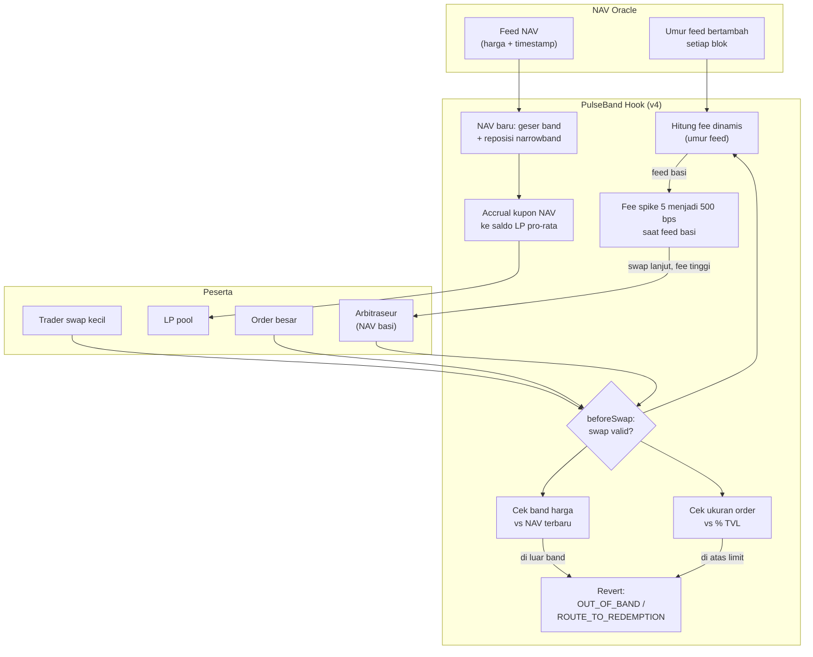

# PulseBand — Oracle Slip-Band Hook untuk Pool RWA di Uniswap v4

> **Ide hackathon RWA #7 (Batch 2, peringkat B#2)** — RWA + desain mekanisme DeFi (Uniswap v4 hooks)
> Fokus: pool AMM untuk token RWA ber-NAV (tokenized treasuries, MMF, gold) dengan proteksi heartbeat NAV

## Elevator Pitch

NAV token RWA berdenyut lambat — update harian atau mingguan — sementara AMM memberi quote setiap detik. Setiap update NAV adalah jendela arbitrase melawan LP (beli murah di pool, redeem di NAV baru), dan inilah alasan LP menolak seed pool RWA sehingga likuiditas sekunder tetap tipis. PulseBand adalah Uniswap v4 hook yang mengimplementasikan resep yang sudah diresepkan industri tapi belum dibangun terbuka: **band likuiditas mengikuti feed NAV, fee meledak saat feed basi, order besar dipaksa ke rail redemption, dan accrual kupon RWA mengalir pro-rata ke LP** — mengubah pool RWA dari jebakan LP menjadi venue kecil yang aman.

## Latar Belakang & Data Pasar

- Kasus nyata **Nest nALPHA/nBASIS**: redemption cepat (±10 menit) tapi NAV update hanya harian atau lebih lambat. Setelah NAV baru rilis, harga pool tertinggal — arbitraseur membeli murah di DEX lalu menebus di NAV baru; **LP menanggung seluruh impermanent loss** (post-mortem Gate Learn / TechFlow)
- Kesimpulan artikel industri: AMM hanya pantas jadi *convenience layer* untuk RWA; resep yang diberikan — **narrowband market making + oracle slip-band/hooks + yield bridging + routing order** — belum ada implementasi open-source-nya
- Stobox (Agustus 2026): turnover harian RWA bervariasi lebar antar kelas aset — gold paling aktif, private credit paling tipis; lebih dari separuh nilai RWA idle
- Symbiotic (Juli 2026): LP DEX untuk RWA menghasilkan APY efektif 5,2% dengan IL struktural — return di bawah holding langsung karena AMM secara mekanis menjual aset yang naik (NAV accrual) ke arbitraseur
- Kompetisi hook RWA yang ada mengarah lain: CloakSwap RWA (HackMoney 2026) memakai hook untuk **privasi eligibility**, Index-Fi (ETHOnline 2026) basket vault dengan **mock oracle tanpa proteksi staleness**

## Grounding Riset

| Sumber | Kontribusi |
|---|---|
| [Gate Learn — Liquidity Challenge of RWAs (Agustus 2025)](https://www.gate.com/learn/articles/the-liquidity-challenge-of-rwas-why-amms-can-only-be-a-convenience-layer-and-not-the-main-market) + [TechFlow versi 2026](https://techflowpost.com/en-US/article/27729) | Preskripsi lengkap slip-band + hooks + yield bridging + routing; post-mortem kasus Nest |
| [DeepWiki Uniswap v4-core](https://deepwiki.com/Uniswap/v4-core) | Konfirmasi feasibility: `beforeSwap` bisa revert berdasar ukuran order; dynamic fee via `DYNAMIC_FEE_FLAG` + override per-swap; `updateDynamicLPFee`; band harga via perbandingan oracle; hook bisa `modifyLiquidity` untuk posisi yang dia kelola |
| [CloakSwap RWA (ETHGlobal HackMoney 2026)](https://ethglobal.com/showcase/rwacompliance-nnjy1) | Bukti hook RWA hidup di hackathon — tapi sumbu privasi, bukan proteksi harga |
| [Index-Fi (ETHOnline 2026)](https://ethglobal.com/showcase/index-fi-9e0ue) | Basket vault RWA tanpa jawaban atas staleness — celah yang PulseBand isi |
| [Symbiotic capital efficiency comparison (Juli 2026)](https://resources.symbiotic.fi/how-rwa-issuers-should-think-about-liquidity-a-capital-efficiency-comparison) | Kuantifikasi kenapa LP AMM RWA rugi struktural: 5,2% vs 8,9% APY |
| [Stobox liquidity gap (Agustus 2026)](https://www.stobox.io/blog/tokenization-intelligence-rwa-liquidity-gap) | Data thin secondary sebagai masalah #1 kelas aset |

## Problem Statement

Pool AMM untuk token RWA tidak sehat karena mismatch denyut: NAV berubah sekali sehari/minggu, pool berquote tiap detik. Di antara dua update NAV, harga pool adalah angka basi yang bisa dieksekusi — arbitraseur menguras pool tepat saat informasi baru masuk, yield kupon RWA bocor ke arbitraseur alih-alih LP (AMM secara mekanis menjual aset yang ter-accrue), dan order besar menghantam likuiditas tipis. Industri sudah menuliskan resep solusinya (slip-band, fee adaptif, routing, yield bridging), tetapi tidak ada implementasi terbuka yang bisa dipakai issuer — jadi setiap proyek RWA yang butuh pool sekunder memulai dari nol dan mengulang kesalahan yang sama.

## Pembeda Fitur (bukan regulasi)

1. **Staleness fee spike:** umur feed NAV melewati threshold, `beforeSwap` meng-override fee LP dari misal 5 bps ke 500 bps — arbitrase menjadi tidak menguntungkan **tepat pada saat paling berbahaya** (menjelang/ketika harga basi), tanpa mematikan pool
2. **Size router on-chain:** swap di atas persentase tertentu dari TVL di-revert dengan reason code `ROUTE_TO_REDEMPTION` — order besar secara arsitektural dialihkan ke rail redemption (pola ClearExit kompatibel), pool fokus menjadi convenience layer sesuai resep industri
3. **Yield bridging:** delta accrual NAV (kupon/bunga) dikredit ke saldo LP pool secara pro-rata via hook — LP menerima "fee swap + native yield", menjawab IL struktural yang membuat LP RWA rugi (angka Symbiotic: 5,2% vs 8.9%)
4. **Band shift otomatis:** NAV baru masuk, hook memindahkan band harga valid — swap yang akan mendorong harga keluar band di-revert; hook juga mengelola posisi narrowband miliknya sendiri via `modifyLiquidity` sehingga selalu ada likuiditas dalam band
5. **Transparansi bawaan:** premium/discount vs NAV, umur feed, dan kedalaman effektif terbaca dari event hook — investor bisa due diligence tanpa infrastruktur eksternal

## Jawaban 4 Pertanyaan Juri

1. **Masalah nyata?** Kasus Nest: LP rugi nyata karena heartbeat mismatch; thin secondary adalah masalah #1 RWA (lebih dari separuh $33,5 miliar idle); tidak ada issuer yang punya pool sekunder sehat.
2. **Pemakaian on-chain bermakna?** Seluruh proteksi hidup di hook contract — fee dinamis, revert ukuran, band harga, distribusi yield — bukan dashboard.
3. **Kebaruan?** Resep slip-band + yield bridging diresepkan artikel industri sejak 2025 tapi belum ada implementasi open; CloakSwap beda sumbu (privasi eligibility), Index-Fi tanpa proteksi staleness. PulseBand = first open implementation.
4. **Skalabilitas?** Hook adalah drop-in untuk issuer RWA mana pun yang ingin pool sekunder: deploy pool v4 dengan hook, selesai. Aligned dengan arsitektur Uniswap v4 yang sedang menjadi standar; jalur audit dan distribusi jelas.

## Teknologi

- **RWA:** token ber-NAV (treasuries/MMF/gold) + NAV oracle feed
- **Mekanisme DeFi:** Uniswap v4 hooks — dynamic fee (`DYNAMIC_FEE_FLAG`), `beforeSwap` gate ukuran & band, `modifyLiquidity` posisi narrowband hook, accrual distribusi yield
- **Tanpa ZK/AI** — tidak esensial untuk mekanisme, tidak dipaksakan
- **Stack demo:** Solidity + Foundry, v4 PoolManager + hook, mock NAV feed dengan umur yang bisa dimanipulasi waktu (prod: Chainlink/RedStone), Next.js dashboard band & fee

## High-Level E2E Flow

## Skenario Demo Day

1. **Seeding:** deploy pool RWA/USDC dengan hook; NAV feed fresh; band harga tampil di dashboard
2. **Swap normal:** trade kecil lolos, fee 5 bps, harga pool di dalam band
3. **NAV update:** feed turun 3%; band bergeser otomatis; harga pool mengikuti tanpa arbitrase merugikan LP
4. **Arbitrase dibunuh:** warp waktu sampai feed basi; coba strategi beli-di-pool-redeem-di-NAV; fee 500 bps membuat PnL arbitrase **negatif** — ditampilkan kalkulasi on-chain
5. **Size router:** submit swap 2% TVL; tx revert dengan reason `ROUTE_TO_REDEMPTION` terlihat di explorer
6. **Yield bridging:** tanpa swap apa pun, saldo LP bertambah dari accrual kupon NAV — tx internal hook terlihat

## Kelemahan & Mitigasi

| Kelemahan | Mitigasi |
|---|---|
| Demo memakai mock NAV oracle | Eksplisit di pitch; mekanisme kontrak yang dinilai; produksi pakai Chainlink/RedStone — antarmuka oracle sama |
| Hook tidak bisa reposisi posisi LP eksternal (bukan pemiliknya) | Hook mengelola posisi narrowband miliknya sendiri; LP eksternal tetap dilindungi band-revert + fee spike |
| AMM tetap convenience layer; volume kecil berarti fee revenue kecil | Yield bridging menambah return LP di luar fee swap; routing order besar memang bukan tugas pool (sesuai resep industri) |
| Aset permissioned membatasi peserta pool | Whitelist via hook `beforeSwap`; kompatibel pola ERC-3643/7943 |
| Feed NAV private credit jarang tersedia | Mulai dari treasuries/MMF/gold — segmen dengan feed terbanyak dan pool paling aktif (Stobox) |
| Bug hook = risiko besar | Scope hook kecil dan jinak (revert + fee + accrual); fuzz test menyeluruh; audit sebelum mainnet |

## Roadmap Pasca-Hackathon

1. Open-source hook library + dokumentasi pola "NAV-following pool"
2. Pilot pool untuk 1 token treasury di testnet publik dengan feed nyata
3. Audit keamanan hook + integrasi whitelist issuer
4. Deploy pool pertama bersama issuer partner; ukur metrik: arb loss LP sebelum vs sesudah
5. Standarisasi: usulkan pola slip-band sebagai referensi implementasi untuk komunitas v4 hooks
