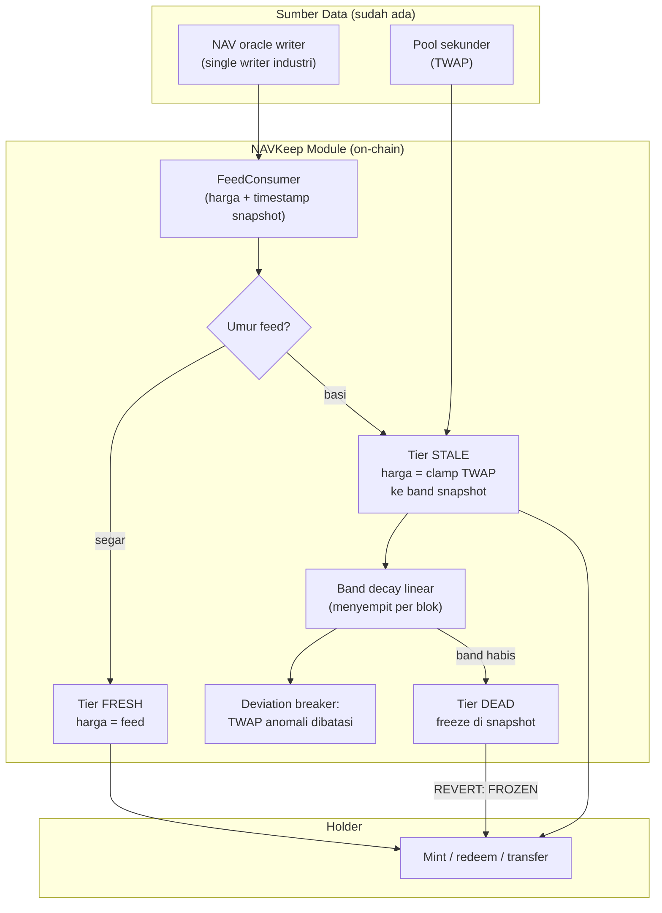

# NAVKeep — Tangga Kontinuitas Pricing saat Feed NAV Mati

> **Ide hackathon RWA #8 (Batch 2, peringkat B#3)** — RWA + arsitektur oracle
> Fokus: token RWA ber-NAV (tokenized treasuries, MMF, gold, fund vault) yang pricing-nya bergantung satu oracle

## Elevator Pitch

Semua token RWA ber-NAV punya satu titik gagal tunggal: siapa yang menulis NAV ke on-chain. Kalau writer diam — diserang, insiden, akhir pekan, atau sengaja menunda — kontrak menghadapi dua pilihan yang sama buruknya: transaksi pakai harga basi (subsidi bagi pihak yang punya informasi lokal) atau freeze total tanpa gradasi. NAVKeep memasang tangga fallback deterministik on-chain di depan token: **feed segar dipakai apa adanya; feed basi, harga = TWAP pasar sekunder yang di-clamp band menyempit di sekitar snapshot valid terakhir; band habis, mint/redeem membeku di snapshot.** Token tetap hidup dengan kebijakan yang bisa dibaca semua holder sejak blok pertama.

## Latar Belakang & Data Pasar

- Analisis industri 2026 menyebut tiga eksposur oracle RWA: staleness struktural, **single privileged writer**, dan pertanyaan terbuka *"what the contract does when the feed simply stops"* (Tokenomics.net) — pertanyaan yang belum dijawab protokol mana pun
- Konstruksi umum industri memang rawan: "monthly attestation on a daily-redeemable token is a **thirty-day blind window** by construction" (Tokenomics.net, 2026)
- Arsitektur Centrifuge (via DeepWiki): NAV masuk lewat trait `AssetsUnderManagementNAV`; epoch close hanya memvalidasi `max_nav_age` — feed berhenti berarti epoch **macet tanpa kebijakan** apa pun
- Lifecycle BUIDL (BlackRock): NAV strike, cutoff, dan wire semuanya off-chain di tangan transfer agent — pola single-writer adalah default industri, bukan pengecualian
- Paper teori terbaru (Tang, arXiv 2609.15797, September 2026): trading sekunder kontinu menghasilkan **information recovery** — sinyal pasar memiliki informasi riil tentang nilai aset; presisi informasi yang lebih tinggi menurunkan adverse selection dan menaikkan kualitas tokenisasi. Fondasi teori untuk tier harga-pasar di NAVKeep

## Grounding Riset

| Sumber | Kontribusi |
|---|---|
| [Tokenomics.net — RWA Tokenization glossary (2026)](https://www.tokenomics.net/glossary/rwa-tokenization/) | Tiga eksposur oracle; kutipan "thirty-day blind window"; pertanyaan terbuka perilaku kontrak saat feed berhenti |
| [DeepWiki Centrifuge Chain](https://deepwiki.com/centrifuge/centrifuge-chain) | NAV via `AssetsUnderManagementNAV`, gate `max_nav_age`, epoch close — konfirmasi arsitektur macet saat feed diam |
| [Tang — A prelude to the theory of RWA Tokenization (arXiv 2609.15797, September 2026)](https://arxiv.org/abs/2609.15797) | Information recovery via trading kontinu; presisi informasi menentukan kualitas tokenisasi — dasar tier market-implied |
| [Wharton WIFPR (Mei 2026)](https://wifpr.wharton.upenn.edu/wp-content/uploads/2026/05/WIFPR-Tokenizing-Real-World-Assets-Cong-Mayer-and-Rabetti.pdf) | Speed matching principle — kebijakan pricing harus menghormati kecepatan informasi underlying |
| [SoK RWA Tokenization (arXiv 2604.06608)](https://arxiv.org/abs/2604.06608) | Oracle problem pada skala institusional; sinkronisasi state on-chain vs off-chain sebagai friksi fundamental |
| [Stobox liquidity gap (Agustus 2026)](https://www.stobox.io/blog/tokenization-intelligence-rwa-liquidity-gap) | Gold/treasuries = segmen dengan pool sekunder paling aktif — tier market-implied realistis untuk segmen ini |

## Problem Statement

Token RWA ber-NAV mewariskan seluruh kepercayaan pricing pada satu penulis feed. Saat feed hidup, sistem bekerja; saat feed diam, sistem tidak punya kebijakan: menerima transaksi dengan harga basi berarti memberi subsidi eksfiltrasi kepada siapa pun yang tahu nilai sebenarnya lebih dulu, sementara freeze seketika memenjarakan holder tanpa jadwal dan tanpa informasi. Literatur 2026 menyebutnya pertanyaan terbuka; arsitektur produksi (Centrifuge, pola transfer agent BUIDL) mengonfirmasi celahnya. Tidak ada protokol yang punya jawaban terstruktur untuk kematian feed — NAVKeep membangun jawabannya sebagai modul yang bisa dipasang di depan token RWA apa pun.

## Pembeda Fitur (bukan regulasi)

1. **State machine tier on-chain (FRESH/STALE/DEAD):** transisi tier deterministik dari umur feed dan deviasi sinyal — bukan keputusan admin yang panik; holder bisa membaca kebijakan dan jadwalnya sejak blok pertama
2. **Market-implied NAV ter-clamp:** saat STALE, harga transaksi = TWAP pool sekunder yang di-**clamp** band di sekitar snapshot valid terakhir; sinyal pasar dipakai (didukung teori information recovery) tapi tidak dipercaya penuh — manipulator paling jauh hanya bisa menggeser harga sampai tepi band
3. **Band decay linear:** lebar band menyempit seiring waktu — makin lama feed mati, makin kecil ruang gerak manipulasi dan makin kuat jangkar ke realitas terakhir yang terverifikasi; biaya manipulasi naik secara eksponensial relatif terhadap keuntungannya
4. **Graceful freeze:** band habis = tier DEAD = mint/redeem membeku di snapshot — degradasi bertahap dengan umur yang bisa dihitung, menggantikan binary hidup/mati
5. **Tidak menambah pihak, justru mengurangi dependensi:** sumber data hanya oracle yang sudah dipakai token + pool sekunder yang sudah ada; single writer berubah dari titik gagal total menjadi titik gagal yang ditoleransi — tanpa vendor, kurator, atau committee baru

## Jawaban 4 Pertanyaan Juri

1. **Masalah nyata?** Konstruksi "attestasi bulanan untuk token redeemable harian" = blind window 30 hari adalah pola nyata industri; epoch Centrifuge macet saat feed diam adalah fakta arsitektural, bukan hipotesis.
2. **Pemakaian on-chain bermakna?** State machine tier, clamp, decay, dan gate mint/redeem semuanya logika kontrak — kebijakan kontinuitas hidup on-chain, bukan runbook operator.
3. **Kebaruan?** Riset batch ini menemukan nol implementasi fallback oracle-death untuk RWA ber-NAV; Tokenomics.net menyebutnya pertanyaan terbuka; paper Tang (September 2026) baru memberi justifikasi teorinya — NAVKeep adalah turunan engineering pertamanya.
4. **Skalabilitas?** Modul komposabel di depan ERC-20/ERC-4626 apa pun dengan feed NAV; issuer mendapatkan klaim resilience tanpa mengganti vendor oracle; mulai dari segmen dengan pool aktif (treasuries/MMF/gold), lalu menurun ke aset yang lebih illiquid.

## Teknologi

- **RWA:** token redeemable ber-NAV + snapshot ledger on-chain
- **Arsitektur oracle:** consumer feed gaya Chainlink + TWAP oracle pool sekunder (Uniswap) + clamp/decay math on-chain
- **Tanpa ZK/AI** — mekanisme murni kebijakan kontrak; tidak dipaksakan
- **Stack demo:** Solidity + Foundry, mock NAV feed yang bisa dimatikan hidupkan lewat script, mock token redeemable + pool mini untuk TWAP, Anvil dengan warp waktu, Next.js visualisasi tier & band

## High-Level E2E Flow

## Skenario Demo Day

1. **Normal:** feed hidup; redeem dieksekusi dengan harga feed; tier FRESH terlihat di UI
2. **Kill the oracle:** script menghentikan update feed; tier FLIP ke STALE on-chain; redeem tetap bisa dengan harga TWAP-ter-clamp; UI menampilkan band yang menyempit per blok
3. **Manipulasi gagal:** whale swap besar di pool untuk menarik TWAP keluar; clamp menahan harga di tepi band — deviasi breaker revert swap ekstrem; keuntungan manipulator terbatas terlihat di kalkulasi
4. **Freeze terjadwal:** warp waktu sampai band habis; tier DEAD; redeem revert `FROZEN` — holder sudah tahu sejak kapan ini akan terjadi (decay schedule publik)
5. **Pemulihan:** feed hidup kembali; tier kembali FRESH; transaksi normal resume — seluruh siklus kegagalan ditangani tanpa intervensi admin

## Kelemahan & Mitigasi

| Kelemahan | Mitigasi |
|---|---|
| Tier STALE butuh pool sekunder yang benar-benar bertransaksi; aset illiquid tidak punya TWAP berarti | Target awal segmen dengan pool aktif (treasuries/MMF/gold — paling likuid per Stobox); untuk aset tanpa pool, NAVKeep transisi FRESH langsung ke DEAD — tetap lebih baik daripada crash tanpa kebijakan |
| TWAP bisa dimanipulasi di dalam band | Band decay menyempit; clamp membatasi keuntungan maksimal; deviation breaker untuk swap ekstrem; biaya manipulasi naik relatif terhadap keuntungan seiring waktu |
| Parameter band width & decay rate sulit dituning | Parameter governansi per aset; mulai konservatif (band sempit, decay cepat) — salah terlalu ketat lebih aman daripada terlalu longgar |
| Tier DEAD tetap mengunci holder | Sikap jujur: tanpa informasi baru, bertransaksi = menebak; freeze dengan jadwal publik adalah default etis — dan jauh lebih baik daripada transaksi dengan harga basi tanpa sadar |
| Demo memakai mock feed + mock pool | Eksplisit; yang dinilai adalah state machine & clamp math di kontrak; antarmuka feed identik dengan Chainlink-style consumer produksi |
| Penerapan nyata butuh issuer bersedia memasang modul | Value prop langsung: resilience tanpa ganti vendor oracle; mulai dari issuer baru launching token ber-NAV yang butuh diferensiasi kepercayaan |

## Roadmap Pasca-Hackathon

1. Parameter study memakai data historis feed & pool nyata (mis. tokenized treasury): kalibrasi band width dan decay rate optimal per kelas aset
2. Deploy modul di depan vault testnet dengan feed publik nyata
3. Tulis pola desain sebagai spesifikasi terbuka / usulan ERC informal: "NAV continuity module"
4. Integrasi dengan issuer token ber-NAV baru sebagai fitur resilience bawaan
5. Riset lanjutan: sinyal gabungan multi-sumber (TWAP + immutable snapshot + disclosure berkala) dengan bobot terjadwal
