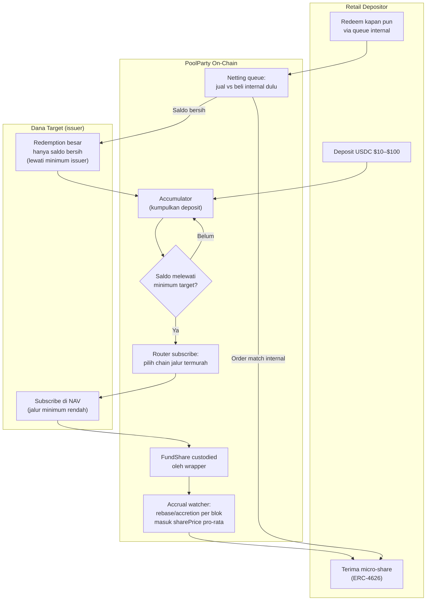

# PoolParty — Vault Mikro-Akses yang Memecah Barrier Minimum Dana RWA

> **Ide hackathon RWA #9 (Batch 3 B2C, peringkat C#1)** — RWA murni (vault akses retail)
> Fokus: tokenized treasuries / money market fund dengan minimum institusional (BENJI-class, OUSG-class)

## Elevator Pitch

Dana RWA terbaik dikunci untuk institusi: BUIDL minimum $100k (redemption $250k), OUSG khusus accredited investor, dan fund yang sama bisa berbeda minimum 250.000 kali lipat tergantung chain. PoolParty adalah vault mikro-akses: retail deposit $10–$100, satu wrapper tersertifikasi mengumpulkan deposit, berlangganan dana target lewat jalur minimum termurah, lalu menerbitkan micro-share ERC-20 ke tiap depositor dengan accrual yield pro-rata per blok. Satu subscriber institusional, ribuan pemilik retail — barrier minimum pecah tanpa menambah pihak baru.

## Latar Belakang & Data Pasar

- Prospektus **FOBXX/BENJI** (Juli 2025, dibaca ulang September 2026) menetapkan minimum investasi awal **per blockchain**: $20 di Stellar, $100 di Aptos/Base/Solana, $1.000 di Polygon/Arbitrum, $100.000 di Avalanche, **$5.000.000 di Ethereum** — fund yang sama, share yang sama, selisih 250.000 kali lipat
- **BUIDL** (BlackRock): Form D amandemen 23 Juli 2026 mencantumkan minimum $100k, akumulasi $5,14 miliar terjual sejak Maret 2024; minimum redemption $250k (CoinDesk, Mei 2026)
- **OUSG** (Ondo): $5k untuk mint/redemption instan, $100k non-instan — hanya untuk accredited + qualified purchaser; investor retail AS tidak boleh sama sekali
- **BENJI** adalah satu-satunya dana treasury ter-tokenisasi yang menerima retail AS (struktur 1940 Act) — tapi lewat app tertutup dengan minimum chain-dependent; **USDY** hanya non-AS
- Limit redemption instan OUSG: $50 juta global per 24 jam, $25 juta per investor per hari — permukaan likuiditas terukur dan publik
- Pasar tokenized treasuries: **$15,65 miliar** (rwa.xyz via web3aiblog, September 2026); kritik yang berulang: realitas akses bertentangan dengan janji financial inclusion RWA (Gate Blog, Mei 2026)
- Preseden pola agregasi: **Index-Fi** (ETHOnline 2026) membuktikan minat vault eksposur RWA — tapi orientasinya basket saham, oracle mock, dan tidak menyentuh masalah minimum akses

## Grounding Riset

| Sumber | Kontribusi |
|---|---|
| [Web3AI Blog — minimum per-chain BENJI (September 2026)](https://www.web3aiblog.com/blog/how-to-buy-tokenized-treasuries-2026) | Data utama: tabel minimum per blockchain dari prospektus FOBXX; angka $15,65B pasar |
| [eco.com — KYC tiers BUIDL/OUSG/BENJI (Mei 2026)](https://eco.com/support/en/articles/15254021-tokenized-treasury-kyc-requirements-2026-buidl-ousg-benji-access-tiers) | Struktur tier akses enam dana terbesar; siapa yang boleh masuk, lewat jalur apa |
| [Ondo — halaman OUSG](https://ondo.finance/ousg) | Minimum $5k instan / $100k non-instan; status accredited-only |
| [eco.com — OUSG deep dive (September 2026)](https://eco.com/support/en/articles/15254014-ousg-deep-dive-2026-ondo-s-short-treasury-fund) | Limit redemption instan $50M/24 jam; komposisi underlying |
| [Franklin Templeton — Benji](https://digitalassets.franklintempleton.com/benji/) | Satu-satunya jalur retail AS terdaftar; yield harian via rebase |
| [Index-Fi (ETHOnline 2026)](https://ethglobal.com/showcase/index-fi-9e0ue) | Preseden vault eksposur RWA — pembeda: tidak memecah minimum |
| [Gate Blog — perbandingan OUSG/BUIDL/BENJI (Mei 2026)](https://www.gate.com/blog/tokenized-treasuries-ousg-buidl-benji-comparison) | Kritik financial inclusion: akses terkunci institusi |

## Problem Statement

Retail dengan $50 tidak punya jalan masuk ke produk yield ber-grade BlackRock/Franklin. BUIDL menuntut $100k plus status qualified purchaser; OUSG menolak retail AS total; satu-satunya opsi retail (BENJI) memaksa user ke chain tertentu dan app tertutup dengan minimum yang berbeda 250.000 kali lipat antar chain. Tidak ada produk on-chain yang mengubah barrier minimum menjadi masalah agregasi kontrak — padahal pooling capital adalah primitive yang paling alami untuk smart contract.

## Pembeda Fitur (bukan regulasi)

1. **Minimum-breaking aggregation**: wrapper = satu subscriber yang memenuhi (dan memilih) minimum dana target; ribuan depositor retail memegang micro-share ERC-4626. Pihak **tidak bertambah** — dana tetap melihat satu subscriber, hanya kepemilikan subscriber itu yang jadi multi-pemilik on-chain
2. **Chain arbitrage otomatis pada sisi subscribe**: data minimum per-chain BENJI dipakai sebagai input nyata — vault subscribe di jalur termurah, micro-share terbit di chain pilihan user; biaya bridge masuk perhitungan net yield
3. **Redemption pooling dua arah**: micro-share redeemable kapan pun lewat queue internal vault; vault men-net order internal dulu (retail jual ke retail beli, nol biaya issuer), hanya saldo bersih yang ditebus ke issuer saat melewati minimum redemption — mirror dari sisi masuk
4. **Yield pass-through pro-rata per blok**: accrual dana target (rebase harian BENJI / price accretion OUSG) dialokasikan ke sharePrice micro-share secara kontinu; fee wrapper flat satu angka on-chain, tanpa lapisan tersembunyi
5. **Health-aware gating**: kalau dana target menampilkan tanda gate (queue membesar, diskon ke NAV), vault otomatis menutup subscribe baru — sinyal likuiditas jadi parameter operasional, bukan hanya wacana

## Jawaban 4 Pertanyaan Juri

1. **Masalah nyata?** Retail terblokir minimum $100k–$5M di pasar $15,65 miliar yang terus tumbuh; data dari prospektus dan Form D — bukan survei, tapi dokumen legal penerbitnya sendiri.
2. **Pemakaian on-chain bermakna?** Pooling, alokasi accrual pro-rata, netting queue internal, dan keputusan subscribe — semuanya state kontrak; bukan sekadar dashboard agregator.
3. **Kebaruan?** Tidak ada proyek 6 bulan ini yang menjual "minimum-breaking RWA access": Index-Fi beda tujuan (basket eksposur), jalur institusi (prime broker OUSG) tertutup, app Benji justru membatasi. Angka $20 vs $5.000.000 untuk fund yang sama belum dieksploitasi siapa pun.
4. **Skalabilitas?** Mulai dari dana registered paling bersih secara legal (BENJI-class) di testnet; roadmap integrasi produk lain via struktur yurisdiksi yang sesuai; model usaha = fee AUM 20–50 bps dari spread minimum yang dipecah.

## Teknologi

- **RWA:** tokenized treasury/MMF (BENJI-class untuk demo, mock rebase harian) + micro-share ERC-4626
- **Mekanisme:** pooling wrapper + internal netting queue + pro-rata accrual distributor
- **Stack demo:** Solidity + Foundry, mock fund dengan minimum configurable, faucet USDC, Base Sepolia/Anvil, Next.js

## High-Level E2E Flow

## Skenario Demo Day

1. **Barrier diperlihatkan:** coba subscribe langsung $50 ke dana target — tx revert, reason `BELOW_MINIMUM` ($5.000 di chain demo)
2. **Pooling lolos:** 10 wallet deposit $50 masing-masing ke PoolParty; accumulator menyentuh $500; wrapper subscribe di jalur minimum rendah; tx subscribe issuer sukses terlihat di explorer
3. **Micro-share terbit:** 10 share dengan nilai $50 + sharePrice ter-update; saldo fund share wrapper terlihat
4. **Yield pro-rata:** warp waktu 30 hari (anvil); event rebase mock masuk; sharePrice naik; ke-10 wallet ditampilkan untung proporsional identik
5. **Netting internal:** 2 wallet redeem, 1 wallet deposit baru — match internal, nol tx ke issuer; saldo bersih nol; tunjukkan event `InternalNetted`

## Kelemahan & Mitigasi

| Kelemahan | Mitigasi |
|---|---|
| Wrapper share = turunan exposure, wilayah abu-abu regulasi | Demo pakai testnet + mock fund; jalur produksi = struktur feeder fund terdaftar; ini alasan mulai dari BENJI-class (1940 Act) yang legal-nya paling bersih |
| Wrapper harus jadi investor eligible (satu KYC) | Itu persis struktur satu subscriber institusional — jumlah pihak sama dengan sebelum pooling, pelayanan berlipat; KYC tidak per pese retail |
| Bank-run pada queue internal saat tekanan | Proration on-chain ala ClearExit (lihat 06) + health-aware gating menutup subscribe saat tanda gate |
| Rebase vs price-accretion beda mekanika accrual | Adapter per pola (BENJI rebase, OUSG accretion) — dua-duanya observable on-chain |
| Minimum issuer bisa berubah tanpa jeda | Minimum oracle sederhana + parameter configurable; perubahan minimum hanya memindah ambang, tidak merusak mekanisme |
| Angka minimum bisa basi (bacaan Sep 2026) | Verifikasi ulang prospektus/Form D sebelum pitch — angka $20/$5M per-chain adalah hook utama |

## Roadmap Pasca-Hackathon

1. Testnet publik dengan mock BENJI-class + parameter study biaya bridge vs pilihan chain
2. Struktur legal wrapper (feeder) untuk satu dana registered + pilot kecil mainnet permissioned
3. Integrasi produk kedua (OUSG-class via struktur non-AS) — vault multi-dana
4. Ekosistem: sambungkan ke NetYield (13) untuk rotasi yield dan BayarDiri (11) untuk borrow vs micro-share
5. Fitur advance: round-up deposit (gas-abstraksi ERC-4337) dan auto-DCA terjadwal
