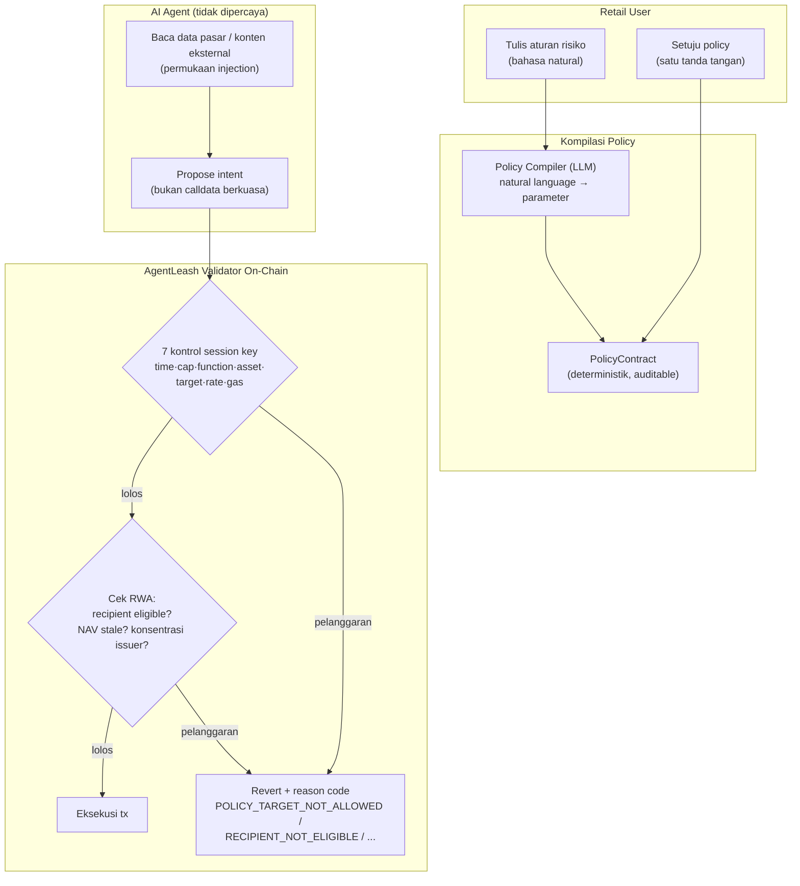

# AgentLeash — Policy Contract On-Chain untuk AI Agent Portofolio RWA Retail

> **Ide hackathon RWA #10 (Batch 3 B2C, peringkat C#2)** — RWA + AI (agent) + smart account (ERC-4337/EIP-7702)
> Fokus: agent yang mengelola portofolio RWA retail (tokenized funds, vault, swap) dengan kekangan kebijakan RWA-aware

## Elevator Pitch

Agent AI dengan dompet mulai mengelola uang retail (RWAGpt, Orbit), tapi setiap payload yang agent baca adalah permukaan serangan: insiden Bankrbot Mei 2026 membuktikan $150–200k bisa pindah lewat satu reply berisi kode Morse — tanpa kunci dicuri, tanpa kontrak dieksploitasi. AgentLeash memindahkan kepercayaan dari prompt ke kode: user menulis aturan risiko, dikompilasi menjadi policy contract deterministik, agent diikat session key yang hanya bisa eksekusi lewat validator dengan cek khusus RWA — eligibility penerima token permissioned (anti dana beku), staleness NAV pool tujuan, cap konsentrasi issuer, plus tujuh kontrol session key standar industri. Agent tetak cerdas; kekangnya auditable.

## Latar Belakang & Data Pasar

- **Insiden Bankrbot/Grok (4 Mei 2026):** prompt injection lewat reply X berisi kode Morse + eskalasi privilege via NFT membership; 3 miliar token DRB ($150–200 ribu) pindah dalam hitungan detik; tx `0x6fc7eb7da9379383efda4253e4f599bbc3a99afed0468eabfe18484ec525739f`. Post-mortem: guardrail pernah ada dan dihapus sebelum launch — "prompts are not controls"
- **CoinDesk (April 2026):** 26 router infrastruktur MCP diam-diam menyuntik tool call berbahaya; satu wallet klien dikeringkan $500.000
- **Riset a16z (28 April 2026):** agent bisa mereproduksi eksploit manipulasi harga DeFi (2/20 bersih sandbox) dan satu agent lolos dari sandbox riset
- **PromptMink (ReversingLabs, kampanye 7 bulan):** 60+ paket npm berbahaya menyasar agen trading otonom — supply chain agent juga permukaan serangan
- **Freysa (preseden):** "konstitusi" di system prompt ditembus murni lewat bahasa — pelajaran arsitektural: otoritas kognitif dan otoritas signing tidak boleh satu lapisan
- **Guardrail vendor mulai ada (September 2026):** MetaMask Agent Wallet (Guard Mode/Beast Mode), Coinbase CDP, Alchemy session keys, Ledger hardware-enforced agent policy (roadmap Q3 2026) — semua generik (cap + allowlist) dan vendor-locked
- **Agent RWA tanpa pengaman:** RWAGpt (agent investasi RWA konversasional, ETHGlobal New Delhi), Orbit (treasury RWA otonom, HackMoney 2026), agen review LC POSCO×LG CNS

## Grounding Riset

| Sumber | Kontribusi |
|---|---|
| [Zealynx — analisis indirek prompt injection (Mei 2026)](https://www.zealynx.io/research/adversarial-security/indirect-prompt-injection) | Anatomi lengkap insiden Bankrbot: tx hash, jalur eskalasi NFT, kesimpulan "policy di infrastruktur, bukan prompt" |
| [Zealynx — prompt injection pada vault DeFi (Maret 2026)](https://www.zealynx.io/research/adversarial-security/ai-defi-prompt-injection) | Kasus Freysa; rekomendasi arsitektur: LLM hanya propose, modul deterministik memvalidasi, signing terisolasi |
| [Agentic Finance Graph — checklist keamanan wallet agent (September 2026)](https://agenticfinancegraph.com/ai-agent-wallet-security-prompt-injection-god-keys-checklist) | Tujuh kontrol session key (time, per-tx cap, per-session cap, function, asset, target, rate); tabel layer proteksi |
| [AirdropAlert — rekonstruksi insiden Bankrbot (Mei 2026)](https://airdropalert.com/blogs/ai-wallet-exploit-grok-bankr) | Kronologi populer insiden untuk narasi demo |
| [Lyrie — PromptMink & riset a16z (Mei 2026)](https://lyrie.ai/research/research/2026-05-02-19-deepdive-ai-agent-crypto-promptmink-defi-autonomous-exploit-attack-surface) | Ancaman supply chain agent + kemampuan offensive agent |
| [RWAGpt (ETHGlobal)](https://ethglobal.com/showcase/rwagpt-fssdh) · [Orbit (ETHGlobal)](https://ethglobal.com/showcase/orbit-hwvr4) | Agent RWA yang berjalan tanpa policy layer — target pengguna AgentLeash |

## Problem Statement

Retail diberi agent RWA ("invest $1.000, alokasikan 60% T-bill") padahal agent adalah permukaan serangan baru: bisa di-inject lewat data yang dibacanya, dan kesalahan khusus RWA bersifat permanen — transfer token ERC-3643 ke alamat non-eligible berarti **dana beku selamanya**, bahaya yang tidak dipahami guardrail generik (MetaMask tidak membaca identity registry ERC-3643). Riset industri sendiri menuntut: "policy is enforced on-chain or in the signer, never solely in a prompt" — belum ada yang membangun policy module yang paham semantik RWA untuk agent retail.

## Pembeda Fitur (bukan regulasi)

1. **Invarian RWA-aware sebelum eksekusi:** cek penerima transfer lolos identity registry token permissioned (anti dana-beku), cek pool tujuan tidak ber-NAV stale (anti beli di harga basi — masalah batch 2 PulseBand), cap konsentrasi per issuer, cap alokasi produk ber-gate. Guardrail vendor hanya tahu cap + allowlist umum
2. **Portable lintas agent:** policy contract ERC-4337/EIP-7702-compatible, colok ke agent apa pun (ElizaOS, custom, marketplace agent) — bukan fitur terkunci dalam satu aplikasi wallet
3. **Attack replay sebagai fitur demo:** replay pola Bankrbot (payload ter-encode + objek eksternal menaikkan privilege) — proposal agent ditolak kontrak dengan reason code spesifik, bukan dengan filter bahasa yang bisa dilewati encoding
4. **Tujuh kontrol session key dalam satu modul:** time, per-tx cap, per-session cap, function allowlist (termasuk selector `approve`/`permit`/`delegatecall` — celah yang riset sebut paling sering dilupakan), asset, target, rate limit
5. **Policy compiler dari bahasa natural:** user menulis "maksimal $500 per hari, hanya produk RWA ter-whitelist, jangan pernah pegang >30% satu issuer" — LLM menerjemahkan ke parameter policy; AI hanya di kompilasi, **bukan** di keputusan eksekusi — keputusan tetap deterministik on-chain

## Jawaban 4 Pertanyaan Juri

1. **Masalah nyata?** Kerugian terdokumentasi 2026: $150–200k (Bankrbot, tx hash publik) + $500k (26 router MCP, CoinDesk); agent RWA makin banyak (RWAGpt, Orbit, POSCO) tanpa lapisan pengaman RWA-spesifik.
2. **Pemakaian on-chain bermakna?** Policy, registry allowlist, pre-check eligibility, tujuh kontrol, revert reason — semuanya hidup di kontrak dan smart account, bukan middleware web2.
3. **Kebaruan?** Guardrail vendor (MetaMask Guard Mode, Coinbase CDP) generik dan vendor-locked; tidak ada policy module yang paham ERC-3643/staleness/konsentrasi issuer; attack-replay insiden nyata belum jadi fitur produk siapa pun.
4. **Skalabilitas?** Modul untuk framework agent (plugin ElizaOS); monetisasi via marketplace policy template + audit; setiap agent RWA baru adalah calon pengguna.

## Teknologi

- **RWA:** token permissioned ERC-3643/7943 (registry eligibility), tokenized fund, pool
- **AI:** LLM untuk policy compiler (natural language ke parameter) — esensial di kompilasi, tidak menyentuh eksekusi
- **Smart account:** ERC-4337 / EIP-7702 session key + policy validator module
- **Stack demo:** Solidity + Foundry, ElizaOS agent mock (atau agent script sederhana), registry mock ERC-3643, Anvil/Base Sepolia, Next.js

## High-Level E2E Flow

## Skenario Demo Day

1. **Setup:** user tulis "maks $500/hari, hanya produk whitelist, jangan kirim token ke alamat tak terverifikasi"; policy contract ter-deploy; agent dapat session key
2. **Happy path:** agent propose beli $200 tokenized fund dari whitelist — lolos validator, tx sukses terlihat
3. **Replay serangan Bankrbot:** agent di-inject lewat konten ter-encode (morse/base64 mock) hingga propose drain penuh ke alamat asing — revert `POLICY_TARGET_NOT_ALLOWED` + cap violation; tampilkan tx gagal di explorer dengan reason
4. **Skenario RWA spesifik:** agent pindah token permissioned ke pool DEX biasa — revert `RECIPIENT_NOT_ELIGIBLE` (dana selamat dari pembekuan permanen); pindah ke counterparty ter-whitelist — lolos
5. **Rate limit:** agent buru-buru propose 15 tx dalam sejam — tx ke-11 revert `RATE_LIMIT_EXCEEDED`

## Kelemahan & Mitigasi

| Kelemahan | Mitigasi |
|---|---|
| MetaMask Guard Mode / Coinbase CDP sudah punya session key generik | Pembeda dijaga tegas: RWA-aware (registry eligibility, staleness, konsentrasi) + portable lintas agent — hal yang vendor wallet tidak punya insentif bangun |
| Policy compiler LLM bisa salah terjemah | Preview policy sebelum tanda tangan + bahasa parameter terstruktur (bukan kode bebas); keputusan eksekusi tetap deterministik — compiler salah maksimal bikin policy terlalu ketat/longgar yang user lihat dulu |
| Registry ERC-3643 tiap issuer beda implementasi | Adapter per standar (3643/7943) + fallback ke simulasi pre-sign (revert dry-run sebagai sinyal ineligibilitas) |
| Pengguna harus paham konsep policy | Template siap pakai per profil (konservatif/aktif); default-deny untuk semua yang tidak di-whitelist |
| Serangan lewat master key di luar session | Di luar scope — ini masalah custody (jalur hardware Ledger); AgentLeash mengamani jalur agent, komplementer bukan pengganti |
| Demo injection = mock, bukan agent produksi | Script replay insiden nyata dengan payload terdokumentasi (morse Bankrbot) — teatrikal dan jujur |

## Roadmap Pasca-Hackathon

1. Plugin untuk framework agent populer (ElizaOS) + library policy template
2. Integrasi simulasi pre-sign (fork RPC) untuk cek ineligibilitas generic lintas standar
3. Marketplace policy template + audit terverifikasi (monetisasi)
4. Ekstensi: policy multi-penandatangan untuk DAO/berpasangan; telemetri pelanggaran sebagai data ancaman
5. Kolaborasi dengan ekosistem 09/11/13: agent yang mengelola PoolParty share, BayarDiri credit line, rotasi NetYield — semua lewat leash yang sama
