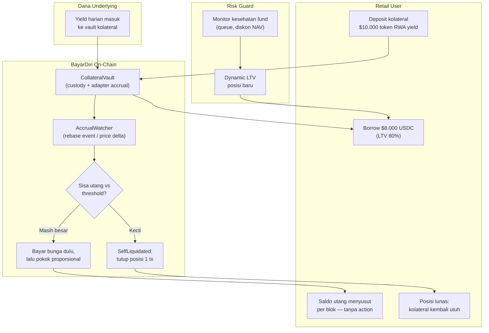

# BayarDiri — Pinjaman RWA Ber-Yield yang Membayar Bunganya Sendiri

> **Ide hackathon RWA #11 (Batch 3 B2C, peringkat C#3)** — RWA murni (lending mechanism)
> Fokus: retail holder tokenized treasury/MMF (BENJI-class rebase, OUSG-class accretion) yang butuh likuiditas tanpa melepas aset

## Elevator Pitch

Retail pegang tokenized T-bill dengan yield ~3,4% tapi butuh cash mendesak. Pilihan hari ini: redeem (nunggu proses harian atau limit instan), jual di pasar sekunder tipis, atau pasrah. BayarDiri membuka jalur keempat: deposit token RWA ber-yield sebagai kolateral, pinjam USDC, dan **accrual yield kolateral otomatis membayar bunga plus pokok utang** — saldo utang menyusut per blok sampai lunas sendiri, kolateral kembali utuh tanpa user menyentuh apa pun. Pola self-repaying yang dulu hanya hidup di DeFi-native (Alchemix) dibawa ke aset income on-chain yang lajunya stabil dan observable.

## Latar Belakang & Data Pasar

- Pasar tokenized treasuries **$15,65 miliar** (rwa.xyz via web3aiblog, September 2026) — kelas aset yield-bearing dengan laju paling stabil di RWA
- **BENJI** mendistribusikan yield **harian via rebase** (token baru di-airdrop ke holder); **OUSG** memakai NAV accumulating (3,45% APY, fee 0,15% di-waive sampai batas waktu tertentu) — dua-duanya accrual observable on-chain, laju relatif dapat diprediksi
- Likuiditas redemption tetap berbatas: OUSG instan dibatasi **$50 juta global per 24 jam / $25 juta per investor per hari**; BENJI diproses harian — holder kecil menangguh, bukan instan
- **Aave Horizon** (2026): institusi meminjam stablecoin vs RWA — tanpa mekanisme self-repay, tanpa segmen retail
- **PawnStars** (ETHGlobal 2026, pemenang bounty): pinjaman vs RWA — tapi kolateralnya token RWA yang di-mint user dari dokumen (kualitas asimetris), harga ditentukan AI agent, tanpa logika yield
- **Alchemix** (2021): preseden self-repaying loan via yield strategi Yearn — membuktikan permintaan produk; **belum ada aplikasi ke kolateral RWA** pada riset September 2026 (catatan jujur: repo Alchemix tidak terindeks DeepWiki saat riset; verifikasi lanjut disarankan sebelum pitch)

## Grounding Riset

| Sumber | Kontribusi |
|---|---|
| [Alchemix — protokol self-repaying loan](https://alchemix-finance.com/) | Preseden mekanisme: yield kolateral otomatis mengurangi utang; permintaan produk terbukti sejak 2021 |
| [Ondo — halaman OUSG](https://ondo.finance/ousg) | APY 3,45%, fee waiver berbatas waktu, pola NAV accumulating |
| [eco.com — OUSG deep dive (September 2026)](https://eco.com/support/en/articles/15254014-ousg-deep-dive-2026-ondo-s-short-treasury-fund) | Limit redemption instan $50M/24 jam — parameter likuiditas kolateral |
| [Franklin Templeton — Benji](https://digitalassets.franklintempleton.com/benji/) | Distribusi yield harian via rebase — sumber accrual on-chain paling bersih |
| [eco.com — cara memegang tokenized MMF (Juni 2026)](https://eco.com/support/en/articles/15276704-how-to-hold-a-tokenized-money-market-fund-onchain-2026) | Perbandingan kecepatan/keterjangkauan redemption antar dana |
| [PawnStars (ETHGlobal)](https://ethglobal.com/showcase/pawnstars-xqbng) | Kompetitor lending-RWA hackathon — pembeda: kolateral self-minted + AI pricing, tanpa yield routing |
| [Stobox — liquidity gap (Juli 2026)](https://www.stobox.io/blog/tokenization-intelligence-rwa-liquidity-gap) | Bukti likuiditas sekunder tipis = alternatif jual tidak menarik bagi holder kecil |

## Problem Statement

Holder retail tokenized treasury terjebak pilihan buruk saat butuh cash: redeem berarti menunggu (proses harian atau antre limit instan), jual berarti melewati pasar sekunder tipis dengan harga tidak pasti, dan tidak ada produk yang memanfaatkan fakta bahwa asetnya sendiri menghasilkan pendapatan stabil. Di kredit konsumen, utang menumpuk bunga; di sini justru aset kolateral bisa bekerja membayar cicilannya sendiri — mekanisme yang belum pernah dirakit untuk RWA on-chain.

## Pembeda Fitur (bukan regulasi)

1. **Accrual-to-debt routing on-chain:** kontrak membaca event rebase / price accretion kolateral dan mengarahkannya ke bunga lalu pokok utang secara proporsional — saldo utang turun per blok, setiap pembayaran terlihat sebagai event `DebtRepaidFromYield`
2. **Self-liquidation threshold:** saat sisa utang kecil, accrual terakhir melunaskan dan menutup posisi dalam satu tx `SelfLiquidated` — kolateral kembali utuh ke user, tanpa gas tambahan, tanpa action user
3. **LTV sadar-karakter-RWA:** kolateral USD-denominated yield-bearing dengan volatilitas minimal — LTV tinggi (85–90%) dibenarkan strukturnya, beda total dari lending kolateral volatile yang harus konservatif
4. **Healthy-ratio guard:** saat fund underlying menunjukkan tanda gate (queue redemption membengkak, diskon ke NAV), LTV untuk posisi baru otomatis turun — sinyal likuiditas menjadi parameter risiko dinamis, bukan tembok statis
5. **Dukungan dua pola accrual:** adapter untuk token rebase (BENJI-style) dan price-accreting (OUSG-style) — menutup dua keluarga besar tokenized fund

## Jawaban 4 Pertanyaan Juri

1. **Masalah nyata?** Kebutuhan likuiditas tanpa melepas aset yield adalah klasik (HELOC di TradFi) dan belum ada on-chain untuk RWA; pasar treasury ter-tokenisasi $15,65 miliar dan retail-nya butuh cash-flow flexibility.
2. **Pemakaian on-chain bermakna?** Routing accrual, amortisasi, threshold self-liquidation, guard dinamis — logika inti penuh di kontrak; angka utang berubah di state on-chain, bukan di dashboard.
3. **Kebaruan?** Alchemix = yield DeFi variabel, bukan RWA; Aave Horizon = institusional tanpa self-repay; PawnStars = kolateral self-minted tanpa logika yield. Kombinasi "income asset on-chain sebagai sumber pelunasan utangnya sendiri" kosong.
4. **Skalabilitas?** Mulai dari satu token treasury mock/testnet; revenue = spread borrow rate vs underlying yield; integrasi natural dengan PoolParty (09) — micro-share jadi kolateral.

## Teknologi

- **RWA:** kolateral tokenized fund (rebase + accretion adapter), USDC sebagai aset pinjaman
- **Mekanisme:** accrual router + amortisasi otomatis + self-liquidation + dynamic LTV guard
- **Stack demo:** Solidity + Foundry, mock BENJI-style (rebase harian) + mock OUSG-style (price accretion), faucet USDC, Anvil (warp untuk percepatan accrual), Next.js dashboard utang

## High-Level E2E Flow

## Skenario Demo Day

1. **Buka posisi:** deposit $10.000 mock BENJI-style, borrow $8.000 USDC; dashboard menampilkan utang $8.000 + estimasi pelunasan dari yield
2. **Yield bekerja:** warp anvil beberapa hari; event rebase masuk; stream event `DebtRepaidFromYield` muncul; angka utang turun bertahap di state kontrak
3. **Perbandingan visual:** berdampingan — kartu kredit biasa (utang naik) vs BayarDiri (utang turun); selisih menyolok setelah 30 hari warp
4. **Self-liquidation:** lanjutkan warp sampai threshold; satu tx `SelfLiquidated`; kolateral penuh kembali ke wallet, utang $0
5. **Guard dinamis:** injeksi skenario gate (queue fund membesar) — LTV posisi baru turun dari 80% ke 60%, terlihat di parameter kontrak

## Kelemahan & Mitigasi

| Kelemahan | Mitigasi |
|---|---|
| Pola Alchemix (2021) di luar jendela riset 6 bulan — risiko sudah ada yang duplikat untuk RWA | Verifikasi lanjut sebelum pitch; pada riset 3 ronde September 2026 tidak ditemukan duplikat "self-repaying RWA loan" |
| Yield ~3,4% lambat melunasi utang besar — bunga borrow rate harus di bawah itu | Posisi revenue model: spread positif hanya jika borrow rate > underlying yield; target pengguna = butuh likuiditas jangka pendek-menengah, bukan leverage |
| Accrual rebase di wallet kolateral bisa terganggu kalau token rebase tidak kompatibel ERC-4626 | Adapter khusus + normalisasi balance; pola distrove/sDAI sudah membuktikan vault atas token rebase layak |
| Kalau yield berhenti (fund gate/pause), pelunasan berhenti | Utang tetap berbunga normal — nasabah bayar manual seperti lending biasa; ini downside symmetric, bukan kehilangan |
| Likuidasi kolateral saat borrow overcollateral position memburuk | Kolateral USD-denominated minim volatilitas; margin call terjadwal + guard LTV dinamis menutup mayoritas skenario |
| Demo memakai warp untuk mempercepat accrual | Eksplisit di pitch; mekanisme identik, hanya percepatan waktu — accrual rebase harian nyata |

## Roadmap Pasca-Hackathon

1. Testnet dengan mock dua pola accrual + parameter study spread/LTV
2. Pilot permissioned dengan satu token treasury real (redeem instan terbatas sebagai jalur likuidasi kolateral)
3. Fitur belanja: bayar langsung dari credit line (USDC virtual card bridge)
4. Kolateral kedua: tokenized gold yield-less dengan LTV lebih rendah (ekspansi kelas aset)
5. Ekosistem: micro-share PoolParty (09) sebagai kolateral; agent AgentLeash (10) boleh membuka posisi dalam batas policy
