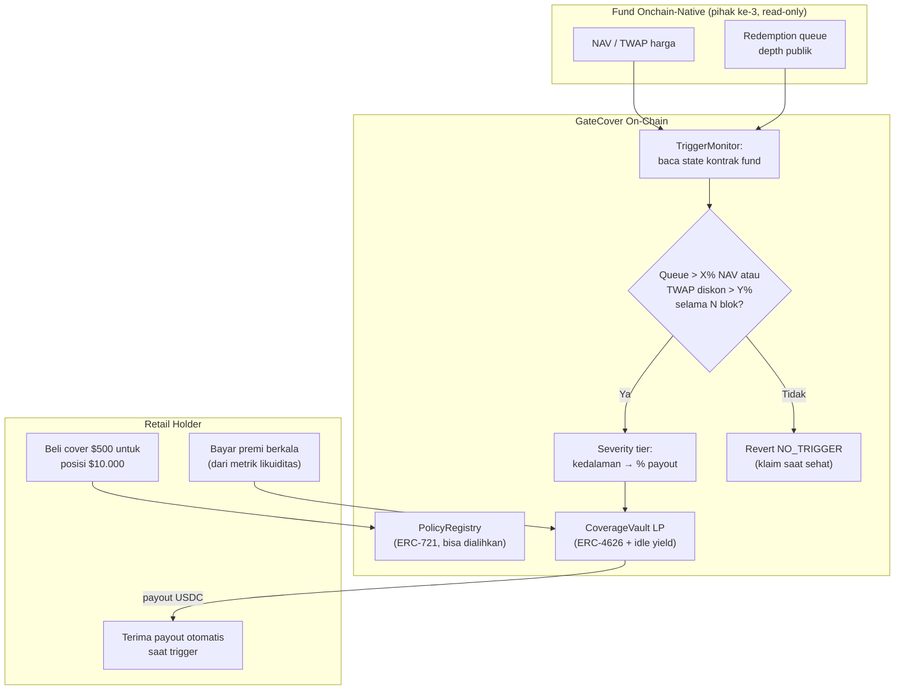

# GateCover — Proteksi Parametrik Retail terhadap Redemption Gate

> **Ide hackathon RWA #12 (Batch 3 B2C, peringkat C#4)** — RWA + mekanisme parametrik (trigger on-chain)
> Fokus: holder retail tokenized fund / private credit yang terpapar risiko redemption gate

## Elevator Pitch

Retail membeli "yield 14% private credit" tanpa sadar fund bisa meng-gate redemption tepat saat uang paling dibutuhkan — Blackstone BCRED membuktikan gate $3,7 miliar bukan teori. GateCover adalah asuransi parametrik yang trigger-nya dibaca langsung dari state on-chain fund itu sendiri: panjang queue redemption melewati ambang, atau diskon ke NAV bertahan di atas batas selama N blok — payout USDC otomatis, proporsional tingkat keparahan. Bukan cuaca, bukan klaim manual, bukan DON baru: fund-nya sendiri sumber datanya. Incumbent parametrik 2026 semuanya trigger eksternal; peristiwa keuangan on-chain sebagai pemicu pembayaran masih kosong.

## Latar Belakang & Data Pasar

- **Blackstone BCRED** (Februari 2026): fund $82 miliar meng-gate **$3,7 miliar** permintaan redemption — board men-backstop sisanya dengan modal eksekutif; event nyata yang menghantam holder kelas "semi-retail"
- **RWA Bible** (Agustus 2026): gate & proration hidup di dokumen legal fund (contoh cap 5% per kuartal) — holder tidak menyadarinya sampai terjadi; tokenisasi tidak menghapusnya
- **Stobox** (Juli & Agustus 2026): **>56% nilai RWA on-chain idle**; tokenized private credit segmen tumbuh tercepat dan "mewarisi liquidity mismatch" pinjaman multi-tahun — persis risiko yang ingin diproteksi
- Venue exit instan mengambil keuntungan justru dari situasi ini: diskon KPK 0,05%–3% per aset; holder jual murah saat gate, bukan kompensasi
- **Parametrik on-chain sudah matang tapi salah domain**: Parametrix (2 versi, Chainlink Convergence 2026 — cuaca via Open-Meteo + DON median), Arc Climate Pay (frost/heat/rain/drought/wind), Reflex (aviation/energi/maritim), Paramify (flood USGS), Paramora (curah hujan pertanian) — semuanya trigger data eksternal fisik
- Pola severity-proportional payout (coverage × severity 0–100) dan vault LP ber-tranche milik Parametrix — reusable untuk domain baru

## Grounding Riset

| Sumber | Kontribusi |
|---|---|
| [Stobox — liquidity gap (Juli 2026)](https://www.stobox.io/blog/tokenization-intelligence-rwa-liquidity-gap) | Kasus BCRED gate $3,7M/$82M; data 56% idle; struktur risiko private credit |
| [RWA Bible — redemption gates & proration (Agustus 2026)](https://rwa-bible.com/en/fundamentals/tokenized-fund-redemption-mechanics-gates-proration-explained/) | Semantik gate TradFi yang kini diwarisi produk ter-tokenisasi; contoh cap 5%/kuartal |
| [Parametrix (Chainlink Convergence 2026)](https://github.com/UNORTHOD0xd/Parametrix) | Pola parametrik on-chain: policy ERC-1155/721, vault LP, severity payout — reusable |
| [Arc Climate Pay](https://climate.arcworld.io/) | Bukti UX retail parametrik: set trigger, bayar premi, payout otomatis |
| [Reflex (Avalanche)](https://github.com/ucEzette/reflex) | Parametrik multi-sektor dengan pool likuiditas per industri — pemisahan risiko |
| [KPK — USDC RWA vault](https://kpk.io/blog/kpk-usdc-rwa-liquidity) | Ekonomi diskon exit: holder tertekan = spread venue menganga |

## Problem Statement

Tidak ada produk yang mengganti rugi holder saat redemption gate menghantam. Yang ada hanya jual-dengan-diskon (venue exit yang untung dari kesengsaraanmu) atau nunggu tanpa kepastian. Asuransi parametrik on-chain sudah membuktikan layak dan diminati (gelombang proyek 2025–2026), tapi semuanya memicu pembayaran dari data fisik eksternal — cuaca, penerbangan, sungai — lewat jaringan oracle khusus. Padahal untuk fund yang onchain-native, peristiwa paling merugikan holder (gate, queue membengkak, diskon ke NAV) sudah tertulis di state kontraknya sendiri: sumber trigger paling murah, paling tamper-resistant, dan tidak menambah pihak data baru.

## Pembeda Fitur (bukan regulasi)

1. **Trigger on-chain murni:** sinyal = panjang queue redemption kontrak fund melewati X% NAV, atau TWAP diskon-ke-NAV melewati Y% selama N blok. Tidak perlu oracle cuaca/DON baru — fund-nya sendiri sumber datanya; pihak data **tidak bertambah sama sekali** untuk fund onchain-native
2. **Severity-proportional payout:** makin dalam gate/queue, makin besar persentase cover terbayar (queue 10% bayar 30% cover; queue 25% bayar 100%) — kontinum, bukan binary
3. **Pricing dari metrik likuiditas historis on-chain:** premi dihitung dari holder count, aktivitas transfer, kedalaman queue historis — metrik exit-ability yang sama yang dianjurkan Stobox sebagai tolok ukur kesehatan
4. **Cover yang bisa dialihkan:** policy ERC-721 — jual-beli di pasar sekunder; nilai cover naik saat kesehatan fund turun, menciptakan sinyal pasar risiko-gate yang belum ada
5. **Vault LP ber-tranche + idle yield:** premi + idle USDC diputar ke money market (pola Symbiotic/KPK/Upshift yang terbukti) — ekonomi underwriting sehat tanpa custody baru

## Jawaban 4 Pertanyaan Juri

1. **Masalah nyata?** BCRED $3,7 miliar gated dari fund $82 miliar; >56% RWA idle karena exit-ability diragukan; gate hidup diam-diam di dokumen legal setiap fund terbuka.
2. **Pemakaian on-chain bermakna?** Monitor queue/TWAP, severity tier, payout waterfall — semuanya kontrak; bahkan trigger-nya adalah state kontrak pihak ketiga (fund) yang dibaca langsung.
3. **Kebaruan?** Seluruh gelombang parametrik 2025–2026 (Parametrix, Arc Climate Pay, Reflex, Paramify, Paramora) bertumpu trigger eksternal fisik; peristiwa keuangan on-chain sebagai trigger parametrik belum diduduki siapa pun.
4. **Skalabilitas?** Mulai dari fund onchain-native dengan queue publik (Midas-class); model revenue = premi berjalan; cakupan diperluas per fund seiring data historis terkumpul.

## Teknologi

- **RWA:** target proteksi = tokenized fund dengan state publik (queue, NAV, transfer)
- **Mekanisme:** parametrik trigger + severity tier + vault LP ERC-4626 + policy ERC-721
- **Opsional AI:** model actuarial untuk pricing premi dari data historis — dapat diganti tabel deterministik untuk MVP (tidak dipaksakan)
- **Stack demo:** Solidity + Foundry, mock fund onchain-native dengan queue configurable, faucet USDC, Anvil/Base Sepolia, Next.js

## High-Level E2E Flow

## Skenario Demo Day

1. **Beli cover:** beli cover $500 untuk posisi $10.000 di mock fund; premi tampil (mis. $12/bulan) dihitung dari metrik likuiditas historis fund
2. **Klaim saat sehat ditolak:** coba klaim — revert `NO_TRIGGER`; state fund sehat ditampilkan
3. **Gate ringan:** warp + injeksi tekanan — queue 10% NAV selama N blok; tx `PayoutTriggered`; 30% cover ($150) masuk wallet; severity tier terlihat
4. **Gate berat:** tekanan diperdalam — queue 25%; payout 100% ($500); event severity maksimum
5. **Sekunder:** jual policy ERC-721 saat fund mulai tidak sehat — harga cover naik (demand sinyal risiko); atau tampilkan kurva harga parametrik

## Kelemahan & Mitigasi

| Kelemahan | Mitigasi |
|---|---|
| Fund yang gate-nya dideklarasikan off-chain (BCRED-style) tidak punya queue on-chain | Scope produksi dimulai dari fund onchain-native (queue/NAV publik); jalur ekstensi = resolusi optimistic UMA-style untuk deklarasi off-chain — dicatat jujur sebagai fase lanjut |
| Fund bisa mengubah struktur kontrak (upgrade) menggeser sumber trigger | Diversifikasi sinyal (queue + TWAP diskon dua-duanya); alert on-chain saat ABI berubah |
| Adverse selection: yang beli cover tahu fund-nya bermasalah | Premi dinamis berbasis metrik real-time — fund tidak sehat otomatis premi mahal; waiting period sebelum cover aktif |
| Vault LP menanggung korelasi (banyak fund gate bersamaan saat makro buruk) | Tranche + cap eksposur per fund + reinsurance parametrik lanjutan (pola Reflex per-sektor pool) |
| Bisa digaming: memicu queue kecil dengan spam redemption murah | Ambang X% dari NAV (bukan jumlah tx) + durasi N blok + biaya spam redemption melebihi payout trigger kecil |
| Demo memakai mock fund | Eksplisit; sinyal yang dibaca identik dengan apa yang bisa dibaca dari kontrak fund onchain-native real |

## Roadmap Pasca-Hackathon

1. Testnet + integrasi baca-saja ke 1–2 fund onchain-native real di testnet publik
2. Backtest premi dari data historis queue/transfer on-chain (dataset yang belum pernah dihargakan)
3. Pilot mainnet kecil permissioned dengan cap per fund
4. Agregat premi jadi data publik "harga risiko gate" — sinyal pasar baru, lisensi ke agregator
5. Ekstensi trigger: diskon NAV jangka panjang, pause kontrak, perubahan fee mendadak — perpustakaan trigger parametrik keuangan
