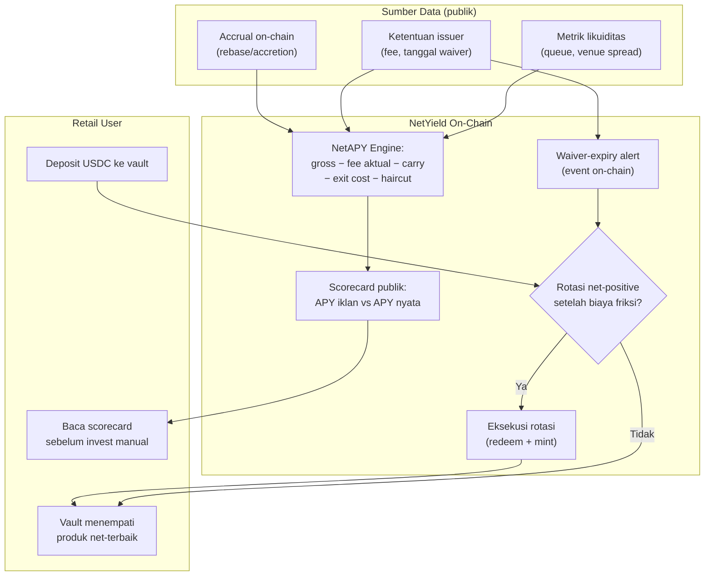

# NetYield — Vault Retail "APY Jujur" dengan Rotasi Otomatis

> **Ide hackathon RWA #13 (Batch 3 B2C, peringkat C#5)** — RWA (agregasi + strategi vault)
> Fokus: retail pembanding produk RWA yield-bearing (tokenized treasuries/MMF) lewat angka APY banner yang menyesatkan

## Elevator Pitch

Retail membandingkan produk RWA lewat angka APY banner — angka yang dihitung sebelum fee aktual, sebelum waiver fee kadaluarsa, mengabaikan biaya keluar (diskon venue, delay redemption) dan gate risk. NetYield menghitung **net APY riil** tiap produk — yield kotor minus fee aktual, negative carry ter-encode, biaya exit efektif, haircut likuiditas, semua komponen bersumber on-chain atau dokumen publik — lalu memutar deposit otomatis ke yang terbaik hanya bila rotasi masih menguntungkan setelah biaya friksi. Scorecard publik "APY iklan vs APY nyata" adalah produknya sendiri; vault berbayar adalah mesin revenuenya.

## Latar Belakang & Data Pasar

- **FRS** (arXiv 2606.26704, Matrixdock — paper juga dipakai CarryX/05): model issuer-subsidized "menyembunyikan ekonomi aset yang sesungguhnya"; biaya simpan sering tak terlihat di level issuer — fondasi mengapa APY banner menipu
- Kasus konkret fee yang berubah diam-diam: **OUSG 3,45% APY dengan management fee 0,15% yang di-waive "sampai batas waktu"** — sumber industri saling bertentangan soal tanggalnya (pertengahan 2026 vs awal 2027); **BENJI** expense ratio 0,22% (0,20% post-waiver). Konsumen tidak punya satu pun tempat yang menghitung dampaknya
- **Stobox** (Agustus 2026): "a dashboard number measures supply, not whether it can be traded, financed, priced, or exited" — AUM dashboard menyesatkan; >56% nilai idle
- Friksi keluar nyata: diskon venue exit KPK 0,05%–3% per aset; minimum redemption instan OUSG $50M/24 jam global; minimum per-chain BENJI $20–$5.000.000 (lihat PoolParty/09)
- **Index-Fi** (ETHOnline 2026): preseden vault eksposur RWA — bobot statis by design, oracle mock, tanpa konsep yield bersih
- Agregator yang ada (rwa.xyz) mengukur sisi supply/AUM, bukan pengalaman yield bersih konsumen

## Grounding Riset

| Sumber | Kontribusi |
|---|---|
| [FRS — Fungible Reserve Standard (arXiv 2606.26704)](https://arxiv.org/html/2606.26704) | Kerangka biaya tersembunyi pada asset-backed token; issuer-subsidized conceal true economics |
| [Stobox — liquidity gap (Agustus 2026)](https://www.stobox.io/blog/tokenization-intelligence-rwa-liquidity-gap) | Kritik angka dashboard; metrik exit-ability (holder, transfer, venue) yang menjadi input NetYield |
| [Ondo — halaman OUSG](https://ondo.finance/ousg) + [eco.com deep dive (September 2026)](https://eco.com/support/en/articles/15254014-ousg-deep-dive-2026-ondo-s-short-treasury-fund) | Kasus fee waiver berbatas waktu; APY banner vs net setelah fee |
| [Web3AI Blog — minimum & biaya per produk (September 2026)](https://www.web3aiblog.com/blog/how-to-buy-tokenized-treasuries-2026) | Keragaman fee/minimum antar produk; inkonsistensi data publik yang perlu dinetralkan |
| [KPK — USDC RWA vault](https://kpk.io/blog/kpk-usdc-rwa-liquidity) | Struktur biaya keluar (diskon per aset) sebagai komponen net APY |
| [Index-Fi (ETHOnline 2026)](https://ethglobal.com/showcase/index-fi-9e0ue) | Preseden basket vault — pembeda: statis, tanpa true-yield accounting |
| [CarryX (ide 05 koleksi ini)](05-carryx.md) | Adapter sadar-carry level token — NetYield konsumen sinyal semacam itu lintas produk |

## Problem Statement

Keputusan beli produk RWA retail dibuat di atas data yang salah: APY banner dihitung sebelum fee (yang bisa berubah setelah waiver), mengabaikan biaya masuk-keluar (bridge chain termahal vs termurah bisa beda $20 vs $5.000.000 minimum), mengabaikan gate risk dan diskon exit. Tidak ada agregator yang menghitung yield bersih sejati dari data on-chain plus ketentuan publik produk — dan tidak ada vault yang memanfaatkan perhitungan itu untuk memutar dana user secara otomatis hanya saat menguntungkan.

## Pembeda Fitur (bukan regulasi)

1. **Formula net-APY verifiable per komponen:** accrual teramati on-chain (rebase/accretion), fee aktual (bukan banner, termasuk tanggal waiver), negative carry ter-encode (konsumsi pola FRS untuk token yang meng-encode q(t)), biaya exit efektif (spread venue + delay), haircut likuiditas — tiap komponen bisa diklik sumbernya
2. **Rotasi sadar-friksi:** keputusan pindah dihitung setelah biaya rotasi (redemption window + minimum + bridge); rotasi dieksekusi on-chain hanya bila net gain positif — bukan rebalancing ritual
3. **Scorecard publik sebagai produk mandiri:** leaderboard "APY iklan vs APY nyata" gratis dan bisa diverifikasi — hook yang membawa trafik; vault berbayar (fee performa dari delta yield) menangkap nilainya
4. **Waiver-expiry alert on-chain:** event kontrak memantau tanggal berakhirnya fee waiver dari dokumen issuer; sebelum habis, vault menghitung ulang dan keluar otomatis bila net APY pasca-waiver kalah — insiden fee yang berubah diam-diam jadi tidak mungkin
5. **Divergensi data sebagai sinyal:** sumber publik yang saling bertentangan (mis. tanggal waiver OUSG berbeda antar sumber) ditandai di scorecard — transparansi kualitas data adalah fitur, bukan malu

## Jawaban 4 Pertanyaan Juri

1. **Masalah nyata?** Biaya tersembunyi terdokumentasi (waiver OUSG dengan tanggal yang bahkan tidak konsisten antar sumber; expense BENJI; diskon exit KPK sampai 3%) — retail membuat keputusan finansial di atas angka yang salah, di pasar $15,65 miliar.
2. **Pemakaian on-chain bermakna?** Perhitungan komponen, keputusan rotasi, eksekusi mint/redeem, event alert waiver — semuanya kontrak; scorecard dirender dari event on-chain.
3. **Kebaruan?** rwa.xyz = AUM supply-side; Index-Fi = basket statis mock oracle; tidak ada net-yield consumer-side engine apalagi rotator sadar-friksi. Kerangka FRS baru diterapkan level token tunggal (CarryX), belum level agregasi.
4. **Skalabilitas?** Mulai 3–5 produk treasury paling likuid; fee performa 10% dari delta yield; scorecard jadi media/ranking publik dengan traction inbound; data lisensi ke wallet/agregator.

## Teknologi

- **RWA:** agregasi tokenized treasury/MMF (rebase + accretion adapter), eksekusi mint/redeem
- **Mekanisme:** net-APY engine + friction-aware rotation engine + waiver alert
- **Opsional AI:** ekstraksi parameter dokumen issuer (tanggal waiver, jadwal fee) — MVP bisa semi-manual dengan review; tidak dipaksakan
- **Stack demo:** Solidity + Foundry, mock 3 produk dengan parameter fee/waiver berbeda, faucet USDC, Anvil (warp), Next.js scorecard + dashboard

## High-Level E2E Flow

## Skenario Demo Day

1. **Scorecard menyolokkan:** produk A "3,45% iklan" menjadi "2,91% nyata" (fee pasca-waiver + exit cost); produk B "3,40%" menjadi "3,12%"; komponen tiap angka bisa diklik sumbernya
2. **Deposit + penempatan:** user deposit USDC; vault menempatkan di produk net-terbaik; tx terlihat
3. **Rotasi beralasan:** injeksi perubahan (produk C menaikkan fee / queue memburuk); engine hitung ulang; rotasi dieksekusi; before-after net APY tampil
4. **Rotasi ditolak:** skenario beda — perubahan kecil, biaya rotasi melampaui keuntungan; tx rotasi **tidak** dieksekusi, alasan (breakdown biaya) tampil — "tidak melakukan apa-apa" juga keputusan yang terlihat
5. **Waiver alert:** warp melewati tanggal waiver produk A; event `WaiverExpiring` muncul beberapa blok sebelumnya; hitung ulang; dua-duanya bisa dilihat di explorer

## Kelemahan & Mitigasi

| Kelemahan | Mitigasi |
|---|---|
| Ketentuan issuer (waiver, fee) hidup di dokumen — tidak semua on-chain | Ekstraksi semi-manual + AI opsional untuk MVP; angka diverifikasi ganda; divergensi antar sumber ditampilkan apa adanya (fitur #5) |
| Data bisa basi / issuer diam-diam mengubah | Alert perubahan + timestamp sumber di scorecard; klaim angka selalu tertaut tanggal pembacaan |
| Overlap konsep dengan CarryX (05) | Dibedakan tegas: CarryX = standard/adapter satu token; NetYield = produk agregasi lintas produk untuk retail — keduanya komplementer (NetYield konsumsi sinyal carry ala CarryX) |
| Rotasi mengunci dana di jendela redemption antar produk | Friction engine sudah menghitung window sebagai biaya oportunitas; buffer likuiditas minimal tetap di USDC |
| Yield delta antar produk treasury sering tipis — rotasi jarang terpicu | Justru fitur kejujuran: kebanyakan waktu "hold" adalah keputusan benar; nilai utama justru scorecard + alert; segmen private credit (delta lebih lebar) fase lanjut |
| Demo memakai mock parameter issuer | Parameter produk real (OUSG/BENJI) publik dan bisa dimuat langsung untuk scorecard live di pitch |

## Roadmap Pasca-Hackathon

1. Scorecard live untuk 5 produk treasury real (data publik) — traction dan kredibilitas dulu, tanpa vault
2. Vault testnet dengan friction engine + backtest historis keputusan rotasi
3. Vault mainnet permissioned; fee performa 10% dari delta yield
4. Ekspansi kelas aset: private credit (delta yield lebar) + integrasi PoolParty (09) untuk jalur masuk mikro
5. API scorecard untuk wallet/agregator pihak ketiga (lisensi data)
