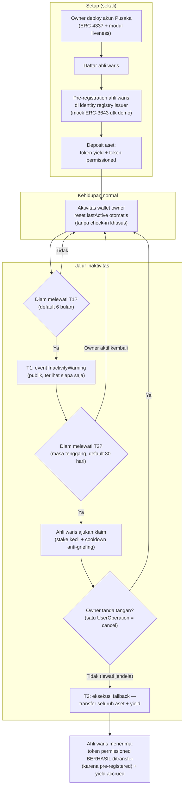

# Pusaka — Warisan Akun RWA dengan Fallback Inaktivitas Bertingkat

> **Ide hackathon RWA #14 (Batch 4 dApps, peringkat D#1)** — RWA + ERC-4337
> Fokus: suksesi aset on-chain untuk pegangan retail token RWA (yield token + token permissioned ERC-3643)

## Elevator Pitch

2,3–3,7 juta BTC sudah hilang permanen bersama pemiliknya dan proyeksi $6 triliun aset crypto berpindah lewat warisan sampai 2045. Token RWA justru kelas aset yang paling butuh rencana warisan: T-bill dan MMF token adalah aset "pegang selamanya" untuk retail — kalau pemiliknya pergi, aksesnya ikut pergi. Pusaka adalah akun pintar ERC-4337 dengan jalur suksesi on-chain berbasis inaktivitas bertingkat: warning publik, masa tenggang dengan jendela pembatalan satu tanda tangan, lalu klaim ahli waris. Pembeda intinya RWA-spesifik: **pre-registration ahli waris di identity registry issuer sejak setup** — sehingga transfer token permissioned (ERC-3643) yang biasanya pasti revert ke wallet tak terdaftar benar-benar berhasil saat fallback terjadi. Tanpa death oracle, tanpa provider custody, tanpa pihak baru.

## Latar Belakang & Data Pasar

- **Chainalysis** (dikutip Ledger Academy Des 2025 & Startup Fortune Apr 2026): **2,3–3,7 juta BTC hilang permanen** — 11–18% dari suplai maksimal; kematian tanpa rencana akses salah satu penyumbang terbesar
- **Bank of America** (2024, dikutip Ledger Academy): proyeksi **$6 triliun** aset crypto berpindah lewat warisan sampai 2045
- **Cremation Institute** (dikutip Ledger Academy): **~90%** pemilik crypto khawatir soal warisan, hanya fraksi kecil yang punya rencana formal
- **Tangem** (Apr 2026): 21% dewasa AS (~55 juta orang) punya crypto, mayoritas tanpa rencana warisan; kasus **QuadrigaCX** (2019, C$250 juta tak terakses setelah satu-satunya pemegang kunci meninggal) jadi pelajaran single-point-of-failure
- **Token permissioned (ERC-3643)**: transfer hanya valid antar wallet terverifikasi di identity registry issuer — jalur warisan "kirim ke ahli waris" pasti revert; tidak satu pun alat warisan yang ada menangani lapis ini
- Preseden produk dan kelemahannya: **Liana/Nunchuk** (timelock Bitcoin — per-UTXO, tiap dana baru harus dikonfigurasi ulang manual), **Sarcophagus** (release data terenkripsi, bukan aset), **Evoke Vault** (alarm, bukan eksekutor), **Casa/Unchained** (collaborative custody — bergantung provider tetap hidup saat klaim)

## Grounding Riset

| Sumber | Kontribusi |
|---|---|
| [Ledger Academy — Crypto Inheritance Guide (Des 2025)](https://www.ledger.com/academy/topics/crypto/what-happens-to-your-crypto-when-you-die-the-complete-guide) | Angka 2,3–4 juta BTC hilang, $6T by 2045, 90% khawatir; kritik dead-man-switch: kode tak bisa beda rawat inap vs kematian, release prematur irreversible |
| [Startup Fortune — Bitcoin inheritance tools maturing (Apr 2026)](https://startupfortune.com/bitcoin-inheritance-is-a-ticking-problem-and-the-tools-to-solve-it-are-finally-maturing/) | Empat model warisan (dokumentasi, multisig, collaborative custody, on-chain timelock); kelemahan per-UTXO manual Bitcoin |
| [CryptoSens — Inheritance time bomb (Feb 2026)](https://cryptosens.pro/2026/02/28/bitcoins-self-custody-culture-created-an-inheritance-time-bomb-and-2026-may-be-when-it-starts-detonating/) | Framing urgensi 2026: pemegang awal menua; aset terlihat on-chain selamanya, akses hilang selamanya |
| [Tangem — Family access after death (Apr 2026)](https://www.tangem.com/en/blog/post/crypto-inheritance-family-access-after-death/) | 21% dewasa AS punya crypto; proses estate exchange lambat tapi ada — self-custody tidak ada sama sekali |
| [Spark Glossary — Dead Man's Switch](https://www.spark.money/glossary/dead-man-switch) | Peta implementasi eksisting (Liana, Nunchuk Taproot 2026); konfirmasi tak ada solusi Ethereum account-level |
| [Blofin — Account Abstraction 2026](https://blofin.com/academy/education/account-abstraction-smart-wallets) | Lima kapabilitas standar smart wallet 2026 (social recovery, sponsorship, bundling, policy, passkey) — inactivity inheritance BUKAN salah satunya |
| [ERC-4337 Specification](https://eips.ethereum.org/EIPS/eip-4337) | EntryPoint, validateUserOp, validationData (aggregator/validUntil/validAfter) — fondasi arsitektur akun |
| [DeepWiki — eth-infinitism/account-abstraction](https://deepwiki.com/eth-infinitism/account-abstraction) | validAfter/validUntil = building block waktu; logika inactivity-recovery (lastActive, delay, owner-cancel) harus dibangun custom — konfirmasi gap |

## Problem Statement

Retail pemegang token RWA berhadapan dengan tiga kegagalan sekaligus. Pertama, aset self-custody mati bersama pemiliknya — blockchain tak punya konsep sertifikat kematian, 11–18% suplai BTC sudah lenyap lewat jalan ini, dan RWA retail memproduksi pemegang jangka panjang baru setiap hari. Kedua, alat dead-man-switch yang ada menukar satu masalah dengan masalah lain: kode tak bisa membedakan owner di rumah sakit dari owner yang meninggal (kritik yang didokumentasikan Ledger), dan di Bitcoin tiap dana baru harus dikonfigurasi ulang manual. Ketiga — dan ini yang tak disentuh siapa pun: untuk token RWA permissioned, suksesi gagal bukan di soal kunci, tapi di soal **eligibility** — transfer ke ahli waris revert karena wallet-nya tak terdaftar di registry issuer. Tidak ada produk yang menutup tiga lapis itu sekaligus.

## Pembeda Fitur (bukan regulasi)

1. **Account-level otomatis**: fallback hidup di akun pintar, bukan per-dana — semua aset yang masuk kapan pun (deposit baru, token baru) langsung terlindungi tanpa konfigurasi ulang; menjawab kelemahan per-UTXO Bitcoin yang didokumentasikan Startup Fortune
2. **Inaktivitas bertingkat dengan jendela pembatalan**: T1 warning (event publik on-chain), T2 masa tenggang, T3 eksekusi; owner membatalkan kapan saja dengan SATU UserOperation — bukan biner hidup/mati; menjawab kritik "kode tak kenal rumah sakit"
3. **Pre-registration ahli waris di identity registry ERC-3643**: saat setup, akun memandu ahli waris menyelesaikan registrasi identitas ke issuer — fallback transfer token permissioned jadi benar-benar bisa dieksekusi; pembeda RWA-spesifik yang tak dimiliki Liana/Nunchuk/Sarcophagus/Evoke/Casa
4. **Yield tetap mengalir selama proses**: aset tetap diparkir token ber-yield selama warning dan grace — warisan tumbuh selama proses suksesi berjalan
5. **Tanpa pihak baru**: owner + ahli waris + registry issuer (semuanya sudah ada) — tak ada death oracle (cukup liveness), tak ada provider custody yang harus tetap hidup; kasus QuadrigaCX jadi anti-pattern yang didesain keluar

## Jawaban 4 Pertanyaan Juri

1. **Masalah nyata?** 11–18% suplai BTC hilang permanen; $6 triliun proyeksi transfer warisan sampai 2045; 21% dewasa AS pegang crypto mayoritas tanpa rencana; RWA retail menambah pemegang jangka panjang baru tiap hari — masalahnya irreversible, tak ada customer service yang bisa mengembalikan.
2. **Pemakaian on-chain bermakna?** State machine inaktivitas (lastActive, tier, cooldown), validAfter/validUntil pada validasi ERC-4337, jalur cancel satu signature, pre-registration — semua logika hidup di akun kontrak, bukan layanan luar.
3. **Kebaruan?** DeepWiki konfirmasi ERC-4337 tak punya logika inactivity-recovery native (hanya building block waktu); lima kapabilitas standar smart wallet 2026 tak termasuk inactivity inheritance; tak ada satu pun alat warisan yang menyentuh permissioned tokens — klaim diuji terhadap pemetaan produk lengkap (Liana, Nunchuk, Sarcophagus, Evoke, Casa, Unchained).
4. **Skalabilitas?** Kategori dengan willingness-to-pay terbukti (langganan Casa/Unchained); model fee setup + tahunan; issuer ERC-3643 punya insentif jelas — produk yang bisa diwariskan lebih layak dibeli; jalur EIP-7702 melindungi EOA eksisting tanpa migrasi.

## Teknologi

- **RWA**: token ber-yield dikonsumsi via interface ERC-4626 (vault pihak ketiga yang sudah ada — tidak dibangun sendiri) + token permissioned ERC-3643 (mock registry + mock token untuk demo)
- **Mekanisme**: akun pintar ERC-4337 (EntryPoint v0.7) + modul liveness bertingkat; validAfter/validUntil sebagai building block eksekusi tertunda; paymaster agar ahli waris tak butuh gas
- **Tanpa ZK/AI**: tidak esensial — liveness + klaim optimistik + jendela sanggah owner cukup
- **Stack demo**: Solidity + Foundry/Anvil (warp untuk lompat waktu), viem, Next.js

## High-Level E2E Flow

## Skenario Demo Day

1. **Setup (1 menit)**: owner deploy akun Pusaka; tambah ahli waris; pre-registration wallet ahli waris di mock identity registry; deposit token permissioned + token yield
2. **Wall moment**: coba transfer langsung token permissioned ke wallet ahli waris versi TANPA pre-registration — tx revert, reason `IDENTITY_NOT_REGISTERED`; lalu tunjukkan wallet pre-registered lolos — kontras satu layar, inti pembeda terlihat mata
3. **Klaim terlalu dini**: ahli waris coba klaim saat owner masih aktif — revert `OWNER_ACTIVE`
4. **Warp 6 bulan diam**: event `InactivityWarning` muncul di explorer (T1); masa tenggang T2 mulai, countdown terlihat di UI
5. **Cancel path**: owner tanda tangan satu UserOperation — timer reset, kembali normal (membuktikan "rumah sakit" scenario tertangani)
6. **Eksekusi fallback**: warp melewati T2+T3 tanpa aktivitas; ahli waris klaim — seluruh aset + yield accrued masuk wallet ahli waris; transfer token permissioned BERHASIL karena pre-registration
7. **Penutup**: tunjukkan yield yang terkumpul selama masa tenggang di explorer — warisan tumbuh selama proses

## Kelemahan & Mitigasi

| Kelemahan | Mitigasi |
|---|---|
| Inaktivitas ≠ kematian (owner di rawat inap / lupa wallet) | T1 warning event publik + T2 masa tenggang panjang + cancel satu signature; aktivitas wallet NORMAL otomatis reset timer — bukan check-in khusus yang harus diingat |
| Transfer on-chain ≠ suksesi legal (probate, pajak) | Positioning jujur: jalur akses teknis, bukan pengganti estate planning; pre-registration memakai jalur KYC issuer sehingga identitas ahli waris terverifikasi — lebih kuat secara legal daripada seed phrase di amplop |
| Kontrak harus hidup puluhan tahun | Core jalur fallback immutable (tanpa upgrade); parameter tier hanya via timelock publik; audit sebelum mainnet |
| Griefing: ahli waris spam klaim | Cooldown antar percobaan klaim + stake kecil yang hangus bila owner membuktikan liveness |
| Ahli waris non-teknis | Paymaster gasless (ahli waris tak butuh ETH); instruksi terenkripsi di IPFS yang rilis saat fallback (adaptasi pola Sarcophagus — diakui) |
| Demo pakai mock registry & mock token | Sebut eksplisit di awal demo; jalur produksi = kemitraan issuer ERC-3643 — issuer punya insentif (produk lebih layak diwariskan = lebih layak dibeli) |
| Ahli waris berubah / hilang | Rotasi ahli waris kapan pun oleh owner (tx biasa); multi-heir proporsional di roadmap |

## Roadmap Pasca-Hackathon

1. Audit modul + testnet publik; parameter T1/T2/T3 configurable per profil pemegang
2. Integrasi 1–2 issuer ERC-3643 nyata (program "inheritance-ready issuer") + kemitraan wallet
3. Fee setup + tahunan; dukungan EIP-7702 agar EOA eksisting ikut terlindungi tanpa migrasi dana
4. Ekstensi: multi-heir dengan pembagian proporsional; instruksi terenkripsi; laporan nilai estate untuk keperluan probate/pajak
5. Ekosistem: lapisan suksesi untuk pemegang micro-share PoolParty (09) dan posisi ber-kolateral BayarDiri (11)
