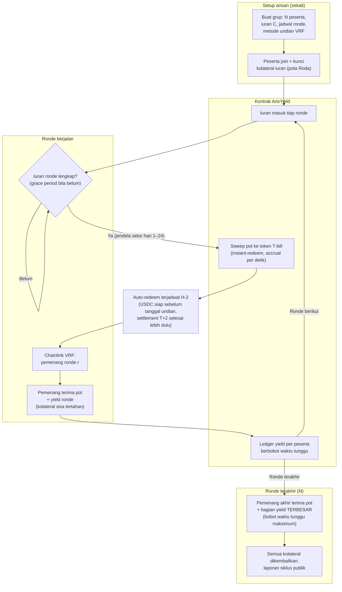

# ArisYield — Arisan On-Chain dengan Pot Ber-Yield dan Rotasi Berbobot Waktu Tunggu

> **Ide hackathon RWA #15 (Batch 4 dApps, peringkat D#2)** — RWA murni (social savings + float yield)
> Fokus: arisan/ROSCA — pot idle diparkir token T-bill ber-yield, kompensasi struktural untuk rotasi akhir

## Elevator Pitch

Arisan menyimpan uang jutaan rumah tangga Indonesia — 16,18% penduduk ikut arisan (BPS 2025), DI Yogyakarta sampai 58,82% — dan 249 putusan pengadilan 2018–2024 mencatat bagaimana kepercayaannya dipecundangi: bendahara kabur, iuran menguap. Gelombang ROSCA-onchain 2025–26 (Roda, CROSCA, Crosca, Moigye, LedgerLoop) menyelesaikan lapis kepercayaan dengan escrow kontrak — tapi semuanya membiarkan pot mati menganggur antar ronde, dan pemenang akhir tetap pihak yang paling dirugikan struktur. ArisYield memarkir pot di token T-bill ber-yield dan membagi hasilnya **pro-rata berbobot waktu tunggu**: pemenang akhir otomatis menerima bagian yield terbesar. Kontrak menggantikan bendahara sepenuhnya — jadwal, undian VRF, pencairan, bagi hasil.

## Latar Belakang & Data Pasar

- **BPS 2025** (Statistik Sosial Budaya, via periskop.id & GoodStats, Jun 2026): **16,18%** penduduk usia 10+ ikut arisan dalam 3 bulan terakhir; tertinggi **DIY 58,82%**, Jateng 30,74%, Jatim 27,74%
- **IJEIRC** (Mar 2025, tinjauan PRISMA putusan Mahkamah Agung): **249 putusan pengadilan** kasus arisan online 2018–2024; puncak 2021 (74 kasus); dominasi wanprestasi + fraud; ~70% kasus perdata 2021 = wanprestasi
- **Jurnal hukum Surakarta** (Mar 2026): gagal bayar arisan yang didahului manipulasi kepercayaan penuhi unsur pidana Pasal 486 & 492 KUHP — bukan sekadar sengketa perdata
- **OJK** (Mei 2025): peringatan resmi arisan online ilegal = modus ponzi, sasaran ibu rumah tangga & generasi muda (IASC mencatat 128.281 laporan penipuan finansial s.d. Mei 2025 — mencakup semua modus, bukan khusus arisan)
- **CROSCA** (DoraHacks): ROSCA global diperkirakan **$100B+/tahun**, ratusan juta peserta (hui Vietnam 10–15 juta, paluwagan komunitas OFW Filipina)
- Gelombang ROSCA-onchain 2025–26: **Roda** (Arc — escrow USDC, dynamic collateral withholding, solvency invariant), **CROSCA** (lelang diskon + reputasi portabel), **Crosca** (Initia — kolateral berbobot reputasi), **Moigye** (VeryChain — KYC + stake), **LedgerLoop** (scoring GNN) — **semua pot USDC polos tanpa yield**
- **Observers** (Agu 2025): post-mortem gelombang 2016–2022 (Bloinx, Daret, Njangi On-Chain, Nexspecto gagal scale); konvergensi stablecoin + aset terdigitalisasi membuka jendela adopsi baru
- Primitif yield: **Liquid Treasury $TSY** (Uniform Labs) — accrual per detik, redemption instan 24/7 — pot arisan bisa bekerja tanpa risiko jendela settlement

## Grounding Riset

| Sumber | Kontribusi |
|---|---|
| [periskop.id — Partisipasi arisan BPS 2025 (Jun 2026)](https://periskop.id/artikel/20260623/bukan-jakarta-ini-provinsi-yang-warganya-paling-banyak-ikut-arisan-pada-2025) | Data utama: 16,18% nasional, 58,82% DIY, peringkat 10 provinsi |
| [IJEIRC — Putusan pengadilan arisan online 2018–2024 (Mar 2025)](https://doi.org/10.61796/ijeirc.v2i3.416) | 249 putusan MK; dominasi fraud & wanprestasi; puncak 2021 |
| [Bisnis.com — Peringatan OJK arisan online ilegal (Mei 2025)](https://finansial.bisnis.com/read/20250531/90/1881332/ojk-minta-masyarakat-waspadai-arisan-online-ilegal-sasar-ibu-rumah-tangga-kaum-muda) | Optics regulasi + data IASC; framing risiko ponzi yang harus dihindari produk |
| [JUKIM — Pidana gagal bayar arisan (Mar 2026)](https://journal.admi.or.id/index.php/JUKIM/article/view/2639) | Dasar hukum pidana Pasal 486/492 KUHP; arisan default bukan sengketa kecil |
| [Roda (Arc)](https://github.com/Lesnak1/Roda) | Pola escrow + dynamic collateral withholding + solvency invariant — diadaptasi, diakui |
| [CROSCA (DoraHacks)](https://dorahacks.io/buidl/43519) | Klaim pasar $100B+/tahun; pola lelang diskon + reputasi; benchmark kebaruan yield-float |
| [Crosca (Initia)](https://github.com/Chainora/Crosca) / [Moigye (VeryChain)](https://github.com/gabrielantonyxaviour/moigye) / [LedgerLoop](https://github.com/edycutjong/ledgerloop) | Konfirmasi ruang ramai 2025–26 — dan tak satu pun ber-yield |
| [Observers — ROSCAs and blockchain (Agu 2025)](https://www.observers.com/roscas-and-blockchain-why-the-perfect-match-never-worked/) | Post-mortem gelombang lama + syarat keberhasilan gelombang baru (UX, aksesibilitas) |
| [Liquid Treasury ($TSY)](https://www.liquidtreasury.co/) | Primitif accrual per detik + redemption instan untuk pot antar ronde |

## Problem Statement

Arisan gagal di dua lapis. Lapis kepercayaan: bendahara menguap dan iuran hilang — 249 putusan pengadilan dan peringatan OJK membuktikannya aktif terjadi; gelombang ROSCA-onchain 2026 menyelesaikan lapis ini dengan escrow kontrak. Lapis produktivitas: pot menganggur berbulan-bulan tanpa bunga, dan struktur rotasi membebani pemenang akhir — dia menyetor penuh paling lama sambil menanggung risiko kelompok paling lama, tanpa kompensasi apa pun. Tidak ada proyek onchain yang menyentuh lapis kedua. ArisYield menjawab keduanya: escrow kontrak (mengikuti pola yang terbukti) + pot ber-yield dengan pembagian berbobot waktu tunggu (baru).

## Pembeda Fitur (bukan regulasi)

1. **Pot ber-yield**: kontribusi langsung di-sweep ke token T-bill via vault; pot tumbuh sendiri antar ronde — fitur yang tak ada di Roda/CROSCA/Crosca/Moigye/LedgerLoop (semuanya USDC polos)
2. **Rotasi berbobot posisi net negatif**: yield dibagi pro-rata berbobot jumlah periode posisi net negatif tiap anggota — lama memberi pinjaman implisit ke grup (bukan lama uang menginap: uang semua orang menginap sama lama; yang beda adalah siapa yang sedang membiayai siapa). Pemenang akhir (pihak paling dirugikan struktur ROSCA) otomatis menerima bagian yield terbesar; mekanisme keadilan struktural baru yang tak dimiliki ROSCA manapun, onchain maupun offchain. Satu-liner: arisan tradisional membuat pemenang akhir membiayai pemenang awal tanpa bunga; ArisYield mengambil bunga dari menginapnya pot di T-bill dan membayarnya ke yang menunggu
3. **Bendahara dihapus**: jadwal iuran, undian Chainlink VRF, pencairan, bagi hasil — semua deterministik di kontrak; pihak berkurang satu, alasannya: seluruh fungsi bendahara (amanah, jadwal, undi) dapat dikode
4. **Kolateral iuran berjalan** (adaptasi pola Roda — diakui): liability sisa ronde pemenang awal dihitung ulang tiap settlement dan ditahan dari pot/escrow — menjawab pemenang-awal-kabur
5. **Penjadwalan redemption sadar T+2**: jadwal arisan deterministik sejak hari pertama — jendala setor hari 1–24, auto-redeem pot ke USDC terjadwal H-2 (settlement T+2 selesai sebelum tanggal bayar), undian + pencairan hari 28; opsi pemenang "roll" menerima token yield langsung bila tak butuh tunai (default tetap USDC karena UX arisan = tunai). Kontras positioning: rail exit instan (ClearExit, 06) menjual keinstanan yang berperang melawan T+N; ArisYield menjual jadwal yang justru cocok dengan T+N

## Jawaban 4 Pertanyaan Juri

1. **Masalah nyata?** 16,18% populasi nasional (DIY 58,82%) berpartisipasi; 249 putusan pengadilan 2018–2024 + peringatan ponzi OJK Mei 2025 = masalah yang sedang aktif ditertibkan negara; global $100B+/tahun.
2. **Pemakaian on-chain bermakna?** Vault yield, jadwal rotasi, formula pembagian berbobot, VRF draw, penahanan kolateral — semua state kontrak; undian tak bisa diatur bendahara karena bendaharanya tidak ada.
3. **Kebaruan?** Ruang ROSCA-onchain 2025–26 ramai tapi seragam (escrow trust); tak satu pun menyentuh produktivitas pot & keadilan rotasi — klaim kebaruan dibatasi jujur di dua fitur itu; "trustless arisan" sendiri BUKAN klaim kami.
4. **Skalabilitas?** Grup arisan sudah terbentuk secara sosial — bukan cold start pasar, hanya cold start alat; L2 murah + paymaster gasless menjawab kritik aksesibilitas (Observers); fee per siklus dari volume grup.

## Teknologi

- **RWA**: KONSUMSI vault/token yield yang sudah ada via interface ERC-4626 — tidak membangun vault sendiri (menambah pihak & beban audit); kandidat produksi: token redeem instan $TSY-class atau yield token permissionless; demo = mock ERC-4626 vault (accrual per blok, anvil warp) dengan interface identik produksi
- **Mekanisme**: circle factory (EIP-1167 minimal proxy) + konsumsi ERC-4626 (iuran masuk USDC lalu `deposit()`, bayar `redeem()`, snapshot sharePrice per ronde untuk akuntansi berbobot) + ledger bagi-hasil berbobot + Chainlink VRF + ERC-4337 paymaster (peserta tanpa gas)
- **Tanpa ZK/AI**: tidak esensial untuk mekanisme
- **Stack demo**: Solidity + Foundry/Anvil (warp antar ronde), viem, Next.js, 5 wallet tersiapkan

## High-Level E2E Flow

## Skenario Demo Day

1. **Buat arisan (1 menit)**: 5 wallet join (undang satu juri pakai wallet-nya kalau mau); iuran 100 USDC; jadwal mingguan; VRF draw
2. **Sweep terlihat**: iuran ronde pertama masuk — tx sweep pot ke token yield; saldo pot vs posisi yield tampil terpisah di dashboard
3. **Warp 1 minggu**: iuran ronde 2 masuk; accrual harian terlihat menumpuk di ledger per peserta
4. **Auto-redeem H-2 + VRF draw live**: kontrak menukar pot yield ke USDC terjadwal (tx terlihat di explorer — primitif sadar T+2); request randomness di explorer; nomor pemenang muncul dari request id — undian tak mungkin diatur; pencairan otomatis + bukti tx
5. **Ronde dipadatkan**: warp cepat sampai ronde akhir; papan peringkat yield-per-peserta tampil — pemenang akhir menerima bagian yield TERBESAR (bobot waktu tunggu), pembeda inti terlihat angka
6. **Serangan diuji**: wallet non-peserta coba tarik pot — revert `NOT_MEMBER`; peserta bolos iuran — grace period + penahanan kolateral terlihat di state
7. **Penutup**: total yield yang dihasilkan grup selama siklus + distribusi berbobot, semua publik di explorer

## Kelemahan & Mitigasi

| Kelemahan | Mitigasi |
|---|---|
| Yield nominal kecil (pot kecil, tenor mingguan) | Positioning: proteksi + keadilan struktural, bukan investasi; angka yield = yield pasar T-bill transparan, bukan bonus platform buatan |
| Optics regulasi — OJK sedang menertibkan arisan online ponzi | Non-custodial murni (kontrak, bukan platform dana); tanpa janji imbal hasil tambahan; nama & copy hindari kesan "platform arisan berbunga"; siapkan jawaban: yield berasal dari T-bill pasar, bukan rekrutmen |
| Ruang ramai (Roda/CROSCA/Crosca/Moigye/LedgerLoop) | Pitch wajib eksplisit: pembeda = yield-float + rotasi berbobot; kredit referensi pola escrow-kolateral ke Roda; jangan klaim menciptakan kategori |
| Pemenang awal kabur tetap mungkin | Kolateral withholding (pola Roda); varian "lock-all" untuk grup kecil: seluruh iuran siklus dikunci di muka |
| Demo butuh multi-wallet + VRF + lompat waktu | VRF testnet (atau mock VRF fork); 5 wallet disiapkan; anvil warp; durasi demo 4 menit sudah diuji urutannya |
| Peserta non-teknis (kritik Observers atas gelombang lama) | Paymaster gasless + akun abstraksi; UI bahasa Indonesia; onboarding via link undangan |
| Token T-bill institusional permissioned (BUIDL/WTGXX-class) — kontrak harus masuk whitelist issuer | Opsi produksi: token redeem instan dengan KYB cepat ($TSY-class) atau yield token permissionless; whitelist = dependensi regulasi nyata, diakui jujur |
| Issuer gate/tunda redemption tepat di H-2 (kasus ekstrem ala BCRED) | Pencairan ronde mundur — status terlihat on-chain, bukan diam-diam; mitigasi: redeem terjadwal H-3/H-4 atau token ber-buffer likuiditas instan |

## Roadmap Pasca-Hackathon

1. Testnet publik dengan grup pilot (komunitas kampus/RT); template arisan (mingguan/bulanan; undian vs lelang diskon ala CROSCA)
2. Reputasi lintas siklus on-chain (adaptasi CROSCA) + kolateral dinamis berbobot histori
3. Mainnet L2 murah; integrasi token T-bill nyata di market yang eligibility-nya memungkinkan
4. Skala sosial: arisan goal-based (kurban, pendidikan), arisan modal usaha UMKM
5. Ekosistem: pemenang yang tak butuh dana langsung bisa meneruskan ke JatuhTempo (16) — dana terus bekerja sampai tanggal pakainya
