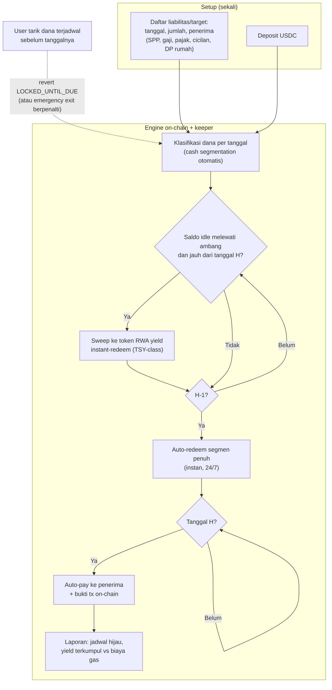

# JatuhTempo — Uang yang Tahu Tanggal Tugasnya

> **Ide hackathon RWA #16 (Batch 4 dApps, peringkat D#3)** — RWA + otomasi on-chain
> Fokus: dana berjadwal (liabilitas & target) dengan float bekerja di token RWA instant-redeem

## Elevator Pitch

Bisnis AS menahan lebih dari $5 triliun kas yang nyaris tak berbunga; UMKM dan rumah tangga lebih buruk lagi — uang untuk SPP tanggal 5, gaji tanggal 25, dan pajak tanggal 15 parkir diam menunggu tanggalnya. Produk treasury RWA 2026 (Stable Sea, Crossmint, Prividium) menyerahkan dashboard dan keputusan manual ke tim finance; tidak ada yang menjadikan **tanggal jatuh tempo sebagai input utama**. JatuhTempo: daftar liabilitas/target, engine menyapu USDC idle ke token RWA ber-yield dengan redemption instan, auto-redeem H-1, auto-bayar di tanggal H — kepastian tanggal dan float yang bekerja, tanpa pihak baru.

## Latar Belakang & Data Pasar

- **Stable Sea × WisdomTree** (Agu 2026): bisnis AS menahan **>$5 triliun** kas & setara kas dengan bunga minimal; tokenized RWA tumbuh $6 miliar (awal 2025) menjadi **>$31 miliar** (pertengahan 2026, RWA.xyz); Treasury/MMF >$15 miliar; UMKM dikatakan "largely left out" oleh minimum dan proses manual
- **ZKsync Prividium** (halaman treasury): **25–40 bps** hasil hilang tiap tahun oleh operasi manual; kas idle 2–3 hari saat transit (~1,5% saldo); "auto-sweep idle funds into trusted MMFs" masih visi enterprise bank-konsortium
- **Liquid Treasury $TSY** (Uniform Labs): accrual **per detik** sejak dana masuk, redemption **instan 24/7/365** dari liquidity buffer 5–20%, API-first (REST/SDK/CLI) — primitif yang membuat auto-bayar di tanggal pasti layak diandalkan
- **ACT Tomorrow's Treasury** (Jan 2026): stablecoin masuk agenda corporate treasurer; swap instan stablecoin ↔ MMF diakui sebagai pola kerja yang dicari
- **McKinsey** (via tempo.xyz): modal terjebuk di akun nostro = 34% biaya pembayaran internasional
- **WisdomTree via Stable Sea**: WTGXX (minimum $1, yield 7-hari 3,46%), FLTTX ($25, 3,75%), WTSIX ($25, 4,41%) — konsep "ladder segmen kas" sudah diakui, tapi dieksekusi manual oleh finance team

## Grounding Riset

| Sumber | Kontribusi |
|---|---|
| [Stable Sea × WisdomTree (Agu 2026)](https://www.prnewswire.com/news-releases/stable-sea-expands-wisdomtree-relationship-with-two-new-tokenized-funds-for-business-cash-302858855.html) | Angka $5T idle; pertumbuhan $6B→$31B; segmen UMKM "left out"; konsep cash segmentation ladder |
| [ZKsync — Treasury Management](https://www.zksync.io/treasury-management) | 25–40 bps hilang manual; float transit; auto-sweep masih visi enterprise |
| [Liquid Treasury ($TSY)](https://www.liquidtreasury.co/) | Primitif inti: accrual per detik + redemption instan 24/7 + API-first |
| [ACT — Stablecoins on corporate treasury agenda (Jan 2026)](https://www.treasurers.org/hub/treasurer-magazine/why-stablecoins-moving-corporate-treasury-agenda) | Validasi permintaan treasurer; swap instan stablecoin ↔ MMF |
| [tempo.xyz — Tokenized deposits & treasury (Mei 2026)](https://tempo.xyz/learn/tokenized-deposits/) | McKinsey nostro 34%; pola "programmable escrow, automated sweep accounts" |
| [Crossmint — Treasury Optimization](https://www.crossmint.com/solutions/treasury-optimization) | Benchmark: yield 3–4% idle balance, tapi sweep manual/drag-drop — bukan tanggal-driven |

## Problem Statement

Uang berjadwal hari ini diperlakukan seperti uang mati: menunggu tanggal bayar di rekening tanpa bunga. Untuk bisnis itu $5 triliun idle dan 25–40 bps yang hilang tiap tahun; untuk rumah tangga Indonesia, tabungan berjangka bank ±1–2% sementara T-bill token >4% tapi tak tersentuh. Produk treasury RWA 2026 menganggap penyapuan dana sebagai keputusan manual tim finance — beban yang UMKM dan individu tidak punya. Yang belum ada: **tanggal sebagai input utama** — mesin yang menjamin dana PENUH ada di tempatnya di tanggal H, sementara bekerja di hari-hari sebelumnya, dan menolak dipakai untuk hal lain sebelum waktunya.

## Pembeda Fitur (bukan regulasi)

1. **Tanggal-jatuh-tempo-first**: input utama user adalah daftar liabilitas/target bertanggal; engine mengklasifikasi dana per tanggal dan menyusun segmen kas otomatis (pola "cash segmentation ladder" Stable Sea, diotomatisasi penuh) — bukan yield-first seperti vault aggregator
2. **Auto-redeem H-1 + auto-pay H di atas primitif redemption instan** ($TSY-class): keandalan tanggal menjadi properti kontrak — tanpa jendela T+1, tanpa banking hours, tanpa harap-harapan
3. **dApp untuk UMKM & individu** — segmen yang diakui Stable Sea "largely left out"; bukan platform enterprise dengan KYB broker-dealer
4. **Dual mode satu engine**: bayar-liabilitas (SPP, gaji, pajak, sewa, cicilan, invoice supplier) dan capai-target (DP rumah, uang kuliah — target-date savings)
5. **Kunci disiplin**: penarikan dana terjadwal sebelum tanggalnya revert dengan reason `LOCKED_UNTIL_DUE` (emergency exit tersedia dengan penalti terukur) — "tidak bisa dicuri oleh diri sendiri"

> **Batas tegas vs NetYield (13)**: NetYield optimasi APY antar produk; JatuhTempo optimasi KEPASTIAN TANGGAL — dana utuh di tempatnya saat dibutuhkan, yield bonus. Komplementer: NetYield bisa jadi strategi parking untuk segmen berjarak-tanggal panjang.

## Jawaban 4 Pertanyaan Juri

1. **Masalah nyata?** $5 triliun kas idle; 25–40 bps bocor tiap tahun oleh operasi manual; UMKM tanpa akses MMF; rumah tangga: tabungan berjangka 1–2% vs T-bill token 4%+ dengan akses instan.
2. **Pemakaian on-chain bermakna?** Scheduler, klasifikasi dana, sweep threshold, auto-redeem, auto-pay, kunci penarikan — semua kontrak + keeper; jawaban terkuat di batch ini untuk "logika inti hidup di kontrak", bukan dashboard pelaporan.
3. **Kebaruan?** Stable Sea/Crossmint/Prividium = dashboard manual atau treasury enterprise; tidak ada produk automation tanggal-jatuh-tempo level dApp; primitif redemption instan accrual per detik baru tersedia 2026 — jendela timing terbuka.
4. **Skalabilitas?** Vertikal B2B kecil (payroll tim 3–10 orang, AP supplier) dengan float bisnis sungguhan + B2C di yurisdiksi dengan akses token yield; API-first $TSY memudahkan integrasi; model fee subscription per jadwal aktif.

## Teknologi

- **RWA**: KONSUMSI vault/token yield instant-redeem yang sudah ada via interface ERC-4626 — tidak membangun vault sendiri; kandidat produksi $TSY-class (accrual per detik, redemption instan) atau yield token permissionless; demo = mock ERC-4626 vault dengan interface identik produksi
- **Mekanisme**: scheduler kontrak + keeper (Chainlink Automation-class, anyone-can-trigger + reward) + lock `LOCKED_UNTIL_DUE` + paymaster
- **Tanpa ZK/AI**: tidak esensial untuk mekanisme
- **Stack demo**: Solidity + Foundry/Anvil (warp antar tanggal), viem, Next.js, wallet mock penerima (sekolah/DJP/staf)

## High-Level E2E Flow

## Skenario Demo Day

1. **Setup (1 menit)**: daftar 3 liabilitas (SPP tgl 5 Rp 2 jt; gaji 2 staf tgl 25 Rp 10 jt; pajak tgl 15 Rp 3 jt) + 1 target (DP rumah 12 bulan ke depan)
2. **Klasifikasi & sweep**: deposit 30 jt USDC; engine membagi segmen per tanggal; saldo idle di atas ambang di-sweep ke token yield — tx terlihat di explorer
3. **Warp 10 hari**: dashboard accrual harian jalan; tanggal 14: auto-redeem segmen pajak; tanggal 15: auto-pay ke wallet mock "DJP" — status hijau
4. **Bulan berjalan**: SPP tgl 5 dan gaji tgl 25 auto-bayar berurutan; semua jadwal hijau; laporan yield bulanan (mis. Rp 100 ribu+) dibandingkan biaya gas
5. **Disiplin diuji**: coba tarik dana segmen pajak sebelum tanggalnya — revert `LOCKED_UNTIL_DUE`; tunjukkan jalur emergency exit dengan penalti terukur
6. **Penutup**: proyeksi yield setahun vs dana diam di rekening biasa — angka penutup yang langsung dipahami juri non-teknis

## Kelemahan & Mitigasi

| Kelemahan | Mitigasi |
|---|---|
| Token RWA permissioned tak tersedia untuk retail Indonesia (dinding eligibility) | Jujur di pitch: demo mock; produksi mulai dari token yield permissionless yang RWA-backed (sDAI/sUSDS-class) atau vertikal B2B dengan KYB — jangan klaim akses retail global di hari pertama |
| Keeper dependency (auto-pay butuh pengeksekusi) | Anyone-can-trigger + reward; keeper TIDAK memegang dana (hanya memicu fungsi kontrak); keeper gagal = user bisa trigger "due now" manual — dana tetap sampai |
| Nilai yield per item kecil | Value prop utama = kepastian + otomasi (tak ada tanggal terlewat, tak ada denda keterlambatan), yield bonus — framing wajib jujur, jangan jual sebagai investasi |
| Adjacent NetYield (13) | Bedakan tegas di pitch: engine kepastian tanggal vs produk optimasi APY; sebut komplementer (NetYield jadi strategi parking segmen jarak-tanggal panjang) |
| Risiko counterparty token yield (issuer risk) | Whitelist token + cap eksposur per issuer; syarat masuk whitelist = redemption instan (surrender period minimal) |
| Demo butuh warp waktu + wallet mock penerima | Anvil warp + 3 wallet mock (sekolah, DJP, staf); sebut mock eksplisit di awal demo |

## Roadmap Pasca-Hackathon

1. Testnet publik + pilot internal (payroll tim kecil / SPP); library kalender Indonesia (tanggal merah, hari besar) sebagai modul jadwal
2. Integrasi Liquid Treasury API untuk market yang eligible; strategi parking multi-token dengan cap per issuer
3. Mode B2B: bulk payroll & AP + export pembukuan; fee subscription per jadwal aktif
4. Ekosistem: sambungkan ke NetYield (13) sebagai strategi yield, BayarDiri (11) untuk kebutuhan likuiditas mendesak vs dana terkunci, PoolParty (09) untuk akses minimum
5. Fitur: co-payer (pasangan/ortu), laporan pajak otomatis, goal-sharing keluarga
