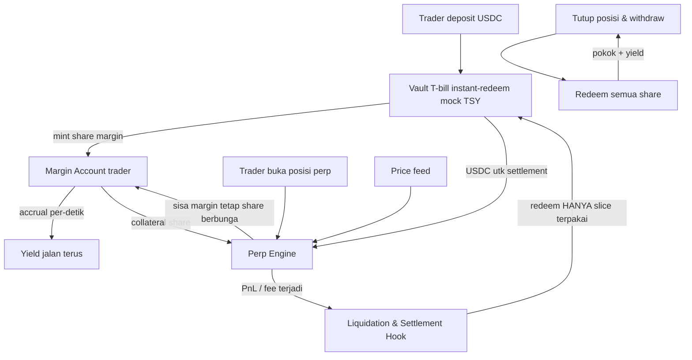

# MarginYield — Token Margin T-Bill untuk Perp DEX (E#1)

**Elevator pitch.** Trader perp menahan saldo margin berminggu-minggu dan di mayoritas venue dana itu duduk mati di USDC dengan bunga 0%. MarginYield menyolder dua primitif yang sudah ada tapi belum dipertemukan: token T-bill ber-redemption instan (pola Liquid Treasury `$TSY` — accrual per-detik, redeem 24/7) dan engine perp. Margin = share vault ERC-4626 T-bill; margin idle berbunga terus-menerus selama posisi hidup; kerugian/fee diselesaikan dengan auto-redeem **hanya slice yang terpakai**, sisanya tetap beraccrual. Dokumentasi Hyperliquid sendiri menulis bahwa layer ini *"best built by independent teams on the EVM"* — kita membangun persis yang diundang venue terbesar.

---

## 1. Latar Belakang & Data Pasar

- **OI RWA perps $4,3 miliar, naik 15x YTD 2026** (Alea Research, Jul 2026); TradeXYZ sendiri memegang 56,9% OI on-chain ($3,1 miliar). Saldo margin selalu kelipatan OI — dan di mode akun default, semuanya 0 bunga.
- **Hyperliquid**: volume perp $2B/hari awal 2025 menjadi $8B/hari akhir 2025 — 4x setahun; base case 2026 $32B/hari (Blockscholes, Mar 2026). Portfolio margin menyetel **USDC global supply cap $1 miliar** — sinyal skala dana idle di satu venue.
- **Status quo margin** (dokumentasi Hyperliquid + Ostium, dibaca Sep 2026):
  - *Unified Account* (default): perp hanya boleh kolateral USDC — **idle tanpa yield**.
  - *Portfolio Margin*: idle USDC berbunga, tapi **gated** (nilai akun >$10k atau volume >$5M, cap $25M) dan rate-nya **utilization-based** (formula `0,05 + 4,75 × max(0, util − 0,8)`) — tergantung permintaan borrow jam itu, bukan floor.
  - *Ostium*: kolateral USDC di "segregated smart contracts" — eksplisit tanpa yield; kumulatif $46 miliar volume, 95%+ OI non-kripto.
- **Primitif yang membuka jendela**: Liquid Treasury `$TSY` (Uniform Labs) — USDC ke TSY 1:1, **accrual per-detik sejak dana masuk, redemption instan 24/7/365** (buffer stablecoin 5–20%, jaminan kontraktual T+5), didukung WTGXX (WisdomTree) + JTRSY (Janus Henderson), API-first. Settlement-grade liquidity untuk margin baru mungkin sejak 2026.
- **Preseden LP mau mendanai vault jenis ini**: analisis Symbiotic (riset Batch 2) — vault $10 juta menghasilkan 8,9% APY bersih vs 5,2% DEX LP pada basis modal sama.
- **Matematika bisnis**: $1 miliar margin × 4,5% = **$45 juta/tahun** nilai dikembalikan ke trader; fee vault 10–20% = $4,5–9 juta/tahun revenue pada adopsi $1 miliar; $450–900 ribu/tahun pada adopsi $100 juta.

## 2. Grounding Riset

| Sumber | Temuan kunci |
|---|---|
| [Hyperliquid docs — Portfolio margin](https://hyperliquid.gitbook.io/Hyperliquid-docs/trading/portfolio-margin) | Idle USDC berbunga hanya di PM gated; kutipan "an EVM protocol could do so by launching a fully onchain yield-bearing ERC20" |
| [Hyperliquid — Unified Account guide](https://hyperliquidguide.com/guides/trading/unified-accounts-guide) | Default: perp kolateral USDC only, tanpa yield; PM gated $10k/$5M, cap $25M |
| [Ostium — RWA as perps](https://www.ostium.com/blog/real-world-assets-as-perps-what-you-can-trade-in-2026) | USDC segregated tanpa yield; $46B kumulatif; 95%+ OI non-kripto |
| [Liquid Treasury](https://www.liquidtreasury.co/) | Accrual per-detik + redemption instan 24/7 — primitif margin-grade |
| [Alea — RWA Perpetuals](https://alearesearch.io/reports/perspectives/rwa-perpetuals) | OI $4,3B (15x YTD); TradeXYZ 56,9% |
| [Blockscholes — 2026 year of RWA perps](https://www.blockscholes.com/premium-research/2026---the-year-of-rwa-perps) | Volume Hyperliquid $2B→$8B/hari (2025); proyeksi $32B/hari 2026 |
| [Symbiotic — liquidity comparison](https://resources.symbiotic.fi/how-rwa-issuers-should-think-about-liquidity-a-capital-efficiency-comparison) | Preseden vault exit 8,9% APY vs 5,2% DEX |

## 3. Problem Statement

Saldo margin perp di venue on-chain adalah float terbesar yang masih 0%: OI RWA perp saja $4,3 miliar dan margin selalu kelipatannya, sementara mode akun default (Unified Account Hyperliquid, seluruh Ostium) memberi bunga nol. Portfolio Margin Hyperliquid memberi bunga tapi hanya untuk akun gated minoritas, dengan rate yang mengambang mengikuti permintaan borrow jaringan — bukan floor. Primitif T-bill instan-redeem sudah tersedia 2026; tidak ada yang menyoldernya ke margin trading. Setiap hari penundaan = nilai yang bocor dari kantong trader ke venue.

## 4. Pembeda Fitur

1. **Yield tertanam di kolateral** — margin = share vault ERC-4626 T-bill; accrual berjalan per-detik selama posisi hidup. Tidak ada alur "parkir dulu, tarik, baru trade"; trader tidak mengubah kebiasaannya sama sekali.
2. **Settlement via auto-redeem slice** — saat loss/fee terjadi, engine me-redeem **hanya porsi margin yang terpakai** menjadi USDC secara atomik dalam tx yang sama; sisa margin tidak pernah keluar dari mode berbunga. Ini hanya mungkin karena redemption instan 24/7 — inilah alasan ide ini baru feasible 2026.
3. **Ungated + lintas engine** — berbentuk token, bukan fitur akun satu venue: bisa diintegrasi engine mana pun (HIP-3/HyperEVM, Arbitrum, venue sendiri). Portfolio margin Hyperliquid = fitur akun gated; MarginYield = permissionless.
4. **Floor RWA 4–5%** vs rate utilization PM yang bisa jatuh saat permintaan borrow sepi — yield margin tidak lagi bergantung perilaku peminjam lain.
5. **Pihak baru: nol.** Vault T-bill dan engine sudah ada; produk = penyolderan. Demo hackathon pakai mock vault pola $TSY.

## 5. Jawaban 4 Pertanyaan Juri

1. **Problem nyata?** $4,3 miliar OI RWA perp (15x YTD) + margin kelipatannya idle 0% di mode akun default; USDC supply cap PM Hyperliquid $1 miliar menunjukkan skala dana idle satu venue; waste terukur langsung (0% vs 4,5%).
2. **Ethereum/smart contract meaningful?** Accrual routing, margin accounting, auto-redeem settlement, liquidation hook — semua logika inti hidup di kontrak; yield dibaca dari state on-chain.
3. **Novel vs existing?** PM Hyperliquid gated + utilization-based; Ostium tanpa yield; belum ada token margin RWA terintegrasi engine di mana pun (pembacaan Sep 2026). Kutipan dokumentasi Hyperliquid = validasi pihak yang "ditantang".
4. **Deploy & scale?** Jalur adopsi dua sisi: (a) adapter resmi HyperEVM — dokumen mereka mengundang EVM yield-bearing ERC20; (b) kemitraan dengan issuer instant-redeem ($TSY butuh permintaan token). Model revenue: fee vault 10–20% dari yield margin + spread redeem. $4,5–9 juta/tahun per $1 miliar adopsi.

## 6. Teknologi

- **RWA**: vault T-bill instant-redeem (mock pola `$TSY`: accrual per-detik, redeem instan) sebagai aset margin.
- **Engine**: perp engine ringan (vault margin, PnL mark-to-index, funding period) — atau pasca-hackathon berupa adapter untuk engine yang ada.
- **Komponen kunci**: wrapper ERC-4626 + margin account + liquidation hook auto-redeem + keeper price update.
- **Stack demo**: Foundry/Anvil (warp waktu untuk percepat accrual), mock price feed, Next.js + wagmi dashboard.
- Tanpa ZK/AI — tidak esensial, tidak dipaksakan.

## 7. E2E Flow

## 8. Skenario Demo Day

1. Deposit 10.000 USDC ke vault — terima margin share; dashboard menampilkan **accrual bertambah tiap blok** (biarkan layar hidup sepanjang demo).
2. Buka posisi long dengan margin share sebagai kolateral.
3. Warp waktu / biarkan beberapa menit: saldo yield terlihat tumbuh real-time **selama posisi terbuka**.
4. Tutup posisi dengan rugi $200: tunjukkan tx settlement — **hanya $200 share yang di-redeem** jadi USDC, sisanya tidak pernah keluar dari accrual.
5. Withdraw: trader terima pokok + yield terkumpul.
6. Bandingkan berdampingan: saldo USDC polos di venue biasa (angka beku) vs MarginYield (angka hidup).

## 9. Kelemahan & Mitigasi

| Kelemahan | Mitigasi |
|---|---|
| **Platform dependency**: Hyperliquid bisa membangun native (PM sudah setengah jalan) | Kutipan docs mereka justru menyerahkan ke EVM; posisikan sebagai adapter kompatibel multi-venue, bukan fitur satu chain; nilai = netralitas |
| **Primitif $TSY muda** (risiko buffer/redemption di bawah stress) | Demo pakai mock; produksi pakai basket multi-issuer + haircut LTV pada margin share |
| **Mass liquidation events** bisa menguras buffer redemption beberapa slice sekaligus | Cap notional per akun; antrean redeem berprioritas (loss settlement dulu); throttle buka posisi baru saat buffer tipis |
| **Oracle valuasi margin share** (~$1 tapi NAV bisa melenceng) | Deviation bound + staleness check (pola NAVKeep 08); share T-bill jauh lebih stabil daripada kolateral volatil biasa |
| **Chicken-egg integrasi** (venue harus menerima token dulu) | Hackathon: engine sendiri + mock; pasca: satu venue kecil/HIP-3 dulu, gunakan angka accrual demo sebagai materi pitch integrasi |
| Rate cut menurunkan yield floor | Floor turun dari 4,5% ke berapa pun — tetap di atas 0% status quo; framing "margin tidak pernah idle" |

## 10. Roadmap Pasca-Hackathon

1. **Bulan 0–3**: audit mock → testnet publik; engine + token margin + demo accrual sebagai materi integrasi.
2. **Bulan 3–9**: adapter HyperEVM (jalur CoreWriter) + integrasi production `$TSY`/satu issuer instant-redeem; pilot satu venue perp kecil.
3. **Bulan 9+**: basket multi-issuer T-bill; lintas venue (HIP-3, Arbitrum); produk turunan: margin token sebagai kolateral lending (komposisi lanjutan); target fee revenue $450–900 ribu/tahun per $100 juta adopsi.

**Relasi antar-ide**: memakai primitif instant-redeem yang sama dengan JatuhTempo (16) — di situ untuk kepastian tanggal, di sini untuk settlement margin. Beda total dari BayarDiri (11): pinjaman retail vs margin trading.
