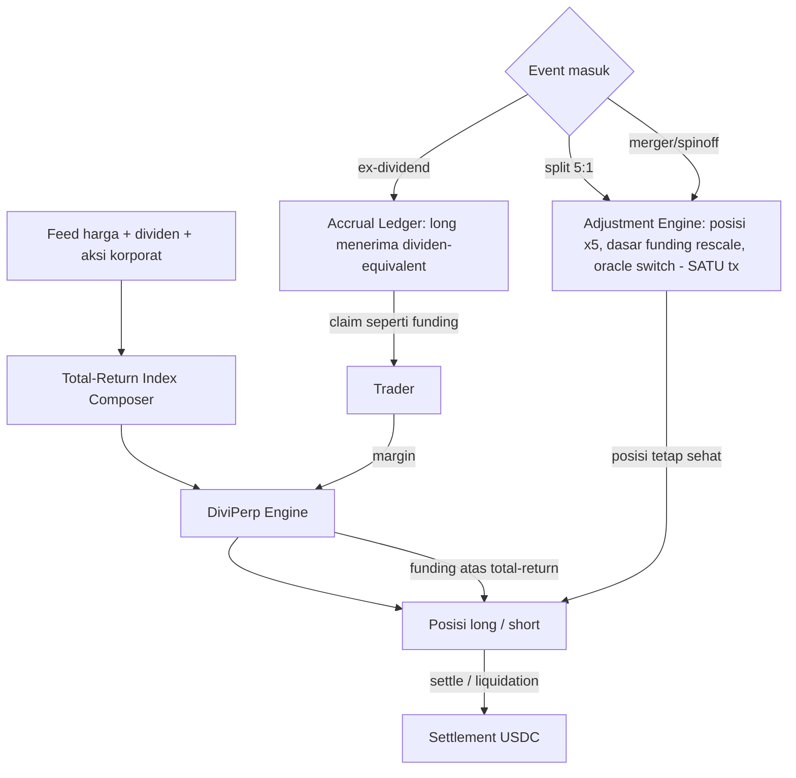

# DiviPerp — Perp Ekuitas Sadar-Dividen & Aksi Korporat (E#2)

**Elevator pitch.** Perp ekuitas on-chain tumbuh 5,7x dalam tiga bulan tapi arsitekturnya buta terhadap dua kejadian yang pasti terjadi di ekuitas: dividen dan aksi korporat. Akibatnya terukur — perp trading di premium struktural kontra underlying, dan satu stock split yang salah ditangani melenyapkan $1,51 juta posisi pengguna dalam 30 menit (insiden Ventuals SPCX). DiviPerp adalah engine perp yang menghitung funding atas **indeks total-return** (harga + dividen), membukukan **dividend accrual ledger on-chain** untuk long, dan mengubah posisi secara **atomik saat split/merger**. Venue naif crash saat split; DiviPerp mulus — replay insiden nyata jadi momen demo.

---

## 1. Latar Belakang & Data Pasar

- **Perp ekuitas = kategori RWA perps yang tumbuh tercepat**: pangsa volume mingguan naik dari ~5% ke ~28% dalam 4 bulan; $2,7 miliar menjadi **$15,6 miliar/minggu** (CoinMarketCap, Mei 2026). Proyeksi kategori: $60–80 miliar/minggu pada Q4 2026, kumulatif setahun $2,5–3,5 triliun.
- **Gap terdokumentasi hitam-putih** (CMC, Mei 2026): *"most current protocols ignore dividends, leading to structural premia/discounts; splits, mergers, spinoffs require synchronized adjustments... not stress-tested at scale"*. SNDK, MU, INTC bayar dividen — premium tumbuh seiring waktu pada nama-nama ini.
- **Insiden Ventuals SPCX** (didokumentasikan DWF Labs, Jul 2026): market SpaceX crash **45% dalam 30 menit, 405 pengguna terlikuidasi, $1,51 juta hilang** — penyebab tunggal: penyedia data off-chain salah menangani stock split 5-for-1 SpaceX.
- **Lanskap venue**: TradeXYZ 56,9% OI on-chain RWA perps ($3,1 miliar, Alea Jul 2026); OI kategori $4,3 miliar (15x YTD). HIP-3 Hyperliquid: deployer stake 500 ribu HYPE, wajib bawa **oracle + risk parameter + likuiditas sendiri**, dapat 50% fee market — deployer punya pain point persis yang DiviPerp selesaikan.
- **Regulator membuka pintu**: CFTC menerbitkan framework perpetual (trading/clearing/settlement 24/7) dan menyetujui Kalshi BTCPERP sebagai perpetual pertama tercatat di AS (2026) — jalur kepatuhan mulai ada bentuknya.
- **Oracle data ekuitas sudah matang**: Chainlink memperluas data streams ke tokenized US stocks, Pyth membangun indeks 24/7 ekuitas/logam/minyak (DWF, Jul 2026) — payload korporat aksi adalah perluasan wajar, bukan kelas pihak baru.

## 2. Grounding Riset

| Sumber | Temuan kunci |
|---|---|
| [CoinMarketCap — RWA Perpetuals State of the Market](https://coinmarketcap.com/academy/article/rwa-perpetuals-state-of-the-market-%E2%80%94-may-2026) | Ekuitas 5%→28% volume; kutipan dividen diabaikan; proyeksi kategori |
| [DWF Labs — From Thesis to Traction](https://www.dwf-labs.com/research/rwa-perpetuals-from-thesis-to-traction) | Insiden Ventuals SPCX (45%, 405 user, $1,51M); risiko sentralisasi oracle; HIP-3 economics |
| [Alea — RWA Perpetuals](https://alearesearch.io/reports/perspectives/rwa-perpetuals) | OI $4,3B 15x YTD; TradeXYZ dominan; weekend flow |
| [Hyperliquid HIP-3 / portfolio margin docs](https://hyperliquid.gitbook.io/Hyperliquid-docs/trading/portfolio-margin) | Deployer wajib bawa oracle+risk; 50% fee share; undangan build EVM |
| [Blockscholes — 2026 year of RWA perps](https://www.blockscholes.com/premium-research/2026---the-year-of-rwa-perps) | Mekanisme funding/anchor oracle perp ekuitas |

## 3. Problem Statement

Trader perp ekuitas on-chain menanggung dua bias struktural yang tidak mereka pilih: (1) karena venue mengabaikan dividen, kontrak secara sistematis trading premium kontra underlying — long melebih-bayar saat ex-dividend, funding bias; (2) aksi korporat (split, merger, spinoff) ditangani ad-hoc atau tidak sama sekali — insiden Ventuals membuktikan satu kesalahan data bisa menghapus $1,51 juta ekuitas pengguna dalam 30 menit lewat kaskade likuidasi. Semakin besar kategori ($15,6 miliar/minggu dan naik), semakin besar tabrakan yang menunggu. Hedger tokenized-stock juga tidak bisa hedge bersih: leg perp-nya membawa bias dividen.

## 4. Pembeda Fitur

1. **Funding atas indeks total-return** — referensi funding = harga + dividen terakumulasi; premium struktural hilang karena dividen bukan lagi "kejadian harga" yang mengacaukan peg, melainkan komponen eksplisit indeks.
2. **Dividend accrual ledger on-chain** — ex-dividend date masuk via feed; setiap long menerima accrual per-posisi yang bisa diclaim seperti funding. Posisi long ekuitas berdividen akhirnya menerima equivalent dividen.
3. **Corporate-action adjustment engine** — event split/merger memicu transformasi atomik dalam satu tx: size posisi dikalikan, dasar funding di-rescale, referensi oracle di-switch. Replay Ventuals (split 5:1) = spesifikasi demo.
4. **Feed = perluasan payload oracle harga** — Chainlink/Pyth sudah serve data ekuitas; entri korporat aksi tinggal kolom tambahan. Kelas pihak tepercaya baru: nol (di hackathon: mock feed + rules deterministik).
5. **Posisi bisnis = engine/module untuk deployer HIP-3** yang by-design harus meng-klaim oracle + risk sendiri dan hanya mendapat 50% fee kalau market-nya dipercaya — bukan perang venue head-on melawan TradeXYZ.

## 5. Jawaban 4 Pertanyaan Juri

1. **Problem nyata?** $1,51 juta lenyap dalam satu insiden terdokumentasi; 405 pengguna terlikuidasi 30 menit; premium struktural menghukum setiap trader nama berdividen pada kategori $15,6 miliar/minggu yang tumbuh 5,7x per kuartal.
2. **Ethereum/smart contract meaningful?** Total-return index, accrual ledger, rescale engine, funding settlement — seluruh logika inti di kontrak; kejadian dunia nyata (dividen/split) diterjemahkan menjadi transisi state deterministik on-chain.
3. **Novel vs existing?** TradeXYZ/Ostium/GMTrade/Lighter = oracle harga polos; dua laporan industri independen (CMC, DWF) menyatakan dividen/split belum ditangani siapa pun. First-mover pada mekanisme, bukan pada kategori.
4. **Deploy & scale?** Jalur revenue ganda: (a) lisensi engine + share fee ke deployer HIP-3 (deployer dapat 50% fee market — engine kita ambil bagian dari itu); (b) venue sendiri jangka panjang. Angka anchor: 0,5% pangsa volume mingguan kategori = ±$810 ribu/tahun pada fee 2 bps. Regulator AS sudah membuka framework perp (Kalshi preseden).

## 6. Teknologi

- **Perp engine ringan**: vault margin + mark-to-oracle + funding period — tanpa orderbook penuh (scope hackathon satu market).
- **Modul inti**: (1) total-return index composer; (2) dividend accrual ledger; (3) corporate-action rules engine — transformasi posisi deterministik dari event feed.
- **RWA**: ekuitas ter-tokenisasi / perp ekuitas sebagai kelas underlying.
- **Stack demo**: Foundry/Anvil, mock feed harga+dividen+split (pola "AI/ekstensi oracle hanya pengiriman data, keputusan deterministik di kontrak"), dua engine bersebelahan (naif vs DiviPerp), Next.js dashboard.
- Tanpa ZK/AI esensial — tidak dipaksakan.

## 7. E2E Flow

## 8. Skenario Demo Day

1. Buka long "NVDA-style" perp di dua engine bersebelahan: **naif** (harga polos) vs **DiviPerp** (total-return).
2. Ex-dividend date tiba: di DiviPerp, accrual dividen masuk saldo long (tx terlihat), funding tetap wajar, premium kontra underlying kolaps; di engine naif, premium membengkak terlihat.
3. **Momen utama — replay Ventuals**: feed split 5:1 masuk. Engine naif: harga index salah olah, anjlok 45%, kaskade likuidasi (tampilkan 405→beberapa posisi terlikuidasi). DiviPerp: satu tx adjustment — posisi ×5, dasar funding rescale, nol likuidasi, posisi pemegang utuh nilainya.
4. Tutup posisi: PnL long termasuk dividen terkumpul.

## 9. Kelemahan & Mitigasi

| Kelemahan | Mitigasi |
|---|---|
| **Kualitas data aksi korporat = kelemahan data paling nyata di batch ini** (Ventuals justru gagal di sini) | Rules engine deterministik + dual-source feed + challenge window sebelum adjustment besar; hackathon jujur pakai mock; produksi = partnership data (Chainlink/Pyth + vendor korporat aksi) |
| **Regulasi**: single-name equity derivatives "most exposed to securities-law enforcement" (CMC) | Posisi = engine/module untuk venue (deployer yang menghadapi regulasi, dengan framework CFTC baru + preseden Kalshi); hindari venue retail AS dari hari satu |
| **Kompetisi incumbent besar** (TradeXYZ 56,9% OI) | Jangan perang venue: lisensi engine; incumbent lambat karena harus retrofit engine hidup — kita greenfield |
| **Engine perp penuh berat untuk solo 24 jam** | Scope ketat: satu market, vault-margin, tanpa orderbook; demo side-by-side menyembunyikan kompleksitas |
| Funding atas total-return butuh riwayat dividen bersih | Ship dengan 3–5 nama berdividen besar (data publik); sisanya tanpa-dividen (perilaku = venue biasa) |

## 10. Roadmap Pasca-Hackathon

1. **Bulan 0–3**: rilis engine open-source + spesifikasi feed korporat aksi; replay Ventuals sebagai materi pitching ke deployer HIP-3.
2. **Bulan 3–9**: partnership data aksi korporat; lisensi engine ke 1–2 deployer market ekuitas berdividen; pilot funding total-return pada satu market hidup.
3. **Bulan 9+**: pendekatan jadi de-facto standar saat regulator/institusi menuntut akurasi korporat aksi; ekspansi ke index perp (dividen index) dan konversi pre-IPO perp saat listing (aksi korporat terbesar: IPO itu sendiri).

**Relasi antar-ide**: satu-satunya ide di vault di sisi derivatif ekuitas; berdiri sendiri, tapi sejarah insidennya (feed salah) sealiran dengan obsisi NAVKeep (08) pada kejujuran feed.
