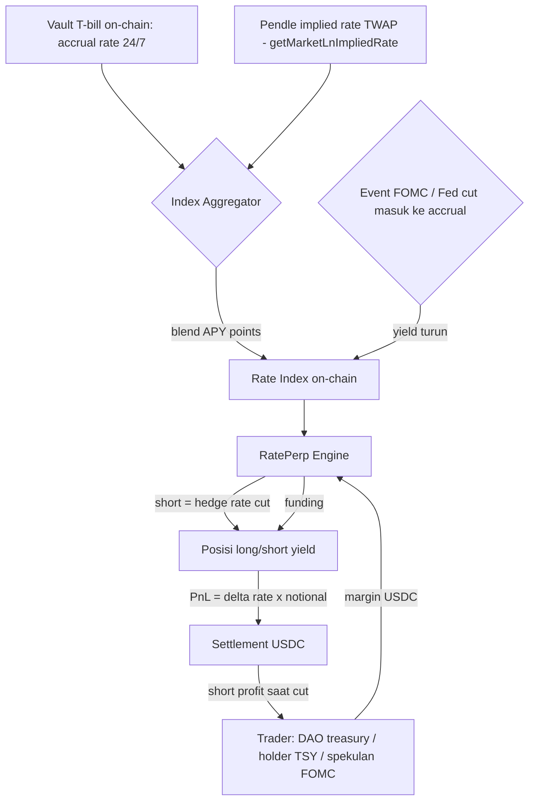

# RatePerp — Perpetual pada Level Yield Tokenized Treasury (E#3)

**Elevator pitch.** $31 miliar tokenized treasury on-chain (tumbuh 5x dalam 18 bulan) dan semua pemegangnya terpapar risiko suku bunga Fed **tanpa satu pun instrumen hedging on-chain** — bucket "Bonds" di RWA perps dilabeli industri *"single-venue, negligible volume"*. RatePerp adalah perpetual yang underlying-nya **level yield, bukan harga aset**: kontrak berdenominasi "APY points", index dibaca dari accrual rate vault T-bill on-chain + implied rate Pendle (TWAP, oraclenya bisa dibaca langsung dari kontrak). Long = betting yield naik, short = hedging rate cut. Keunggulan desain yang tidak dimiliki perp ekuitas mana pun: **oracle-nya tidak pernah tidur** — yield terus berjalan 24/7, tidak ada masalah weekend. FOMC bisa diperdagangkan setiap hari, termasuk Minggu pagi.

---

## 1. Latar Belakang & Data Pasar

- **Tokenized treasury**: $6 miliar awal 2025 menjadi **$31 miliar pertengahan 2026** (5x dalam 18 bulan, RWA.xyz via Stable Sea); produk Treasury/MMF saja $15 miliar+. Seluruh nilai ini sensitif terhadap keputusan Fed.
- **Bucket kosong terkonfirmasi**: CoinMarketCap (Mei 2026) mengkategorikan Bonds pada RWA perps sebagai *"single-venue, HIP-3-only category with negligible volume so far"* — tidak ada instrumen rate directional on-chain yang hidup.
- **Permintaan leverage atas yield terbukti**: Pendle menyelesaikan **$69,8 miliar** yield; PT-thBILL 5,35% fixed; YT-apyUSD diperdagangkan pada **leverage efektif 59x** — pasar membayar mahal untuk eksposur yield berleverasi. Yang belum ada: instrumen directional tanpa maturity.
- **Analog TradFi terbesar yang ada**: pasar interest rate swap **$400 triliun+ notional** (dikutip dokumentasi Pendle) — rates adalah pasar derivatif terdalam di dunia; versi on-chain permissionless-nya belum dibangun.
- **Fondasi teknis terkonfirmasi (DeepWiki `pendle-finance/pendle-core-v2-public`, riset Sep 2026)**: `getMarketLnImpliedRate` membaca implied rate on-chain dengan dukungan **TWAP**; `PendleChainlinkOracle` mengekspos rate via interface Chainlink — oracle publik siap dikonsumsi kontrak.
- **Timing makro 2026**: siklus rate cut berjalan (yield floating Treasury turun; fund WisdomTree yield 3,46–4,41%, Stable Sea Agu 2026) — justru saat pemegang treasury paling butuh short-rate hedge.

## 2. Grounding Riset

| Sumber | Temuan kunci |
|---|---|
| [CoinMarketCap — RWA Perpetuals](https://coinmarketcap.com/academy/article/rwa-perpetuals-state-of-the-market-%E2%80%94-may-2026) | Bucket Bonds "negligible volume"; pertumbuhan kategori; buckets 6 kategori |
| [Stable Sea × WisdomTree](https://www.prnewswire.com/news-releases/stable-sea-expands-wisdomtree-relationship-with-two-new-tokenized-funds-for-business-cash-302858855.html) | $5T kas bisnis AS idle; RWA $6B→$31B (RWA.xyz) |
| [Pendle Print #105](https://pendlefi.substack.com/p/pendle-print-105) + [AiCoin — RWA yields flow to Pendle](https://www.aicoin.com/en/article/530943) | $69,8B settled; PT-thBILL; eACRED/USDG markets; posisi Pendle sebagai rate-swap DeFi |
| [CoinGecko — Apyx × Pendle](https://www.coingecko.com/learn/apyx-pendle-dividend-backed-yield-defi) | YT-apyUSD 59x leverage — proxy permintaan leverage yield |
| DeepWiki pendle-finance/pendle-core-v2-public | `getMarketLnImpliedRate` (TWAP), `PendleChainlinkOracle`, SY type `ERC4626_NOT_REDEEMABLE` |
| [Liquid Treasury](https://www.liquidtreasury.co/) | Sumber accrual rate on-chain 24/7 untuk index (pola primitif) |
| [DWF Labs — Perpification](https://www.dwf-labs.com/research/evolution-of-rwas-perpification-and-24-7-markets) | Tesis perpification: perp = jalur tercepat on-chain-kan aset dengan price feed andal |

## 3. Problem Statement

Pemegang tokenized treasury ($31 miliar, tumbuh 5x/18 bulan) memegang aset yang pendapatannya ditentukan Fed, tanpa alat perlindungan on-chain: kalau rate cut 100bps, income portofolio turun ~22% (dari 4,5% ke 3,5%) dan tidak ada cara short "yield" di mana pun di on-chain. Pendle menawarkan PT/YT ber-maturity yang butuh modal penuh dan tanggal jatuh tempo tetap — bukan instrumen leverage directional tanpa expiry. Sementara di TradFi, rates adalah pasar derivatif terbesar yang ada ($400T+ IRS notional). DeFi punya venue 24/7 untuk memperdagangkan keputusan FOMC — instrumennya belum dibangun; bucket Bonds terbukti kosong.

## 4. Pembeda Fitur

1. **Underlying = level yield, bukan harga aset** — kontrak berdenominasi "APY points"; PnL = perubahan index rate × notional. Bukan perp harga T-bill (itu punya masalah durasi/konveksitas); ini perp **rate** sejati ala IRS/forward rate agreement.
2. **Oracle tidak pernah tidur** — index = blend accrual rate vault T-bill on-chain (yield berjalan 24/7/365) + implied rate Pendle TWAP. Tidak ada jam tutup, tidak ada gap Monday-open, tidak ada masalah weekend yang menghantui semua perp ekuitas. Weekend justru jam terbaik: memperdagangkan ekspektasi FOMC Senin.
3. **vs Pendle PT/YT**: leverage tinggi tanpa maturity, tanpa split modal PT/YT, margin-based — instrumen berbeda untuk trader rate; Pendle tetap tak tergantikan untuk lock fixed yield (komplementer: RatePerp bisa hedge posisi PT ber-maturity).
4. **vs Boros (Pendle)**: Boros = swap funding rate perp **kripto**; RatePerp = yield **T-bill** — underlying, basis investor, dan rezim risiko beda total.
5. **Index deterministik dari sumber publik on-chain** — bobot basket immutable saat deploy, setiap komponen bisa diverifikasi pembaca kontrak; pihak baru: nol.

## 5. Jawaban 4 Pertanyaan Juri

1. **Problem nyata?** $31 miliar tokenized treasury tumbuh 5x/18 bulan, seluruhnya terpapar risiko rate tanpa hedge on-chain (bucket Bonds "negligible"); analog TradFi-nya pasar $400 triliun+; siklus cut 2026 menekan income pemegang justru sekarang.
2. **Ethereum/smart contract meaningful?** Index aggregator membaca state on-chain (accrual vault + oracle Pendle), funding & PnL settlement hidup di kontrak — instrumen ini hanya mungkin on-chain (24/7 + sumber data on-chain sendiri).
3. **Novel vs existing?** Pendle = fixed-yield ber-maturity (butuh modal penuh); Boros = funding kripto; venue perp = harga aset, bucket rate kosong. RatePerp = satu-satunya instrumen directional rate tanpa expiry dengan oracle dari state blockchain sendiri.
4. **Deploy & scale?** Pengguna alami teridentifikasi: holder $TSY/BUIDL/USYC dan treasury DAO; bahkan 1% dari $31 miliar yang di-hedge = $310 juta notional — cukup untuk market hidup, tumbuh mengikuti trajektori tokenized treasury. Kemitraan paling masuk akal: issuer instant-redeem (Uniform Labs API-first — hedging instrument menambah nilai jual token mereka). Revenue: trading fee + funding.

## 6. Teknologi

- **RWA**: tokenized treasury sebagai underlying acuan (accrual rate dibaca dari vault).
- **Index aggregator on-chain**: baca accrual rate vault T-bill (mock pola $TSY) + `getMarketLnImpliedRate` TWAP (Pendle oracle lib).
- **Perp engine ringan**: margin vault + PnL = Δrate × notional + funding period standar.
- **Stack demo**: Foundry/Anvil (warp untuk percepat accrual & event FOMC), mock vault + mock Pendle oracle (interface sama dengan produksi), Next.js dashboard menampilkan index rate live.
- Tanpa ZK/AI — tidak esensial.

## 7. E2E Flow

## 8. Skenario Demo Day

1. Dashboard menampilkan **index rate live** — angka bergerak sendiri tiap blok karena accrual vault berjalan (biarkan hidup sepanjang demo).
2. Cerita: "treasury DAO memegang $10 juta TSY, income 4,5%. Fed meeting Rabu. Kalau cut 100bps, income turun $220 ribu/tahun."
3. Buka short notional $10 juta (margin kecil, leverage terlihat).
4. Warp/event: **FOMC cut** — accrual rate index turun 4,5% ke 3,5%; PnL short naik real-time di dashboard; tunjukkan setara menutup $220 ribu/tahun exposure.
5. Skenario kedua: trader long sebelum data inflasi surprise hawkish — yield naik, long profit.
6. Tutup posisi, settle USDC. Funding flow antara long-short terlihat.

## 9. Kelemahan & Mitigasi

| Kelemahan | Mitigasi |
|---|---|
| **Demand belum terbukti** — bucket kosong bisa berarti peluang BISA berarti sepi | Anchor pemegang instant-redeem token ($TSY) sebagai short alami; kemitraan Uniform Labs (API-first, insentif komersial jelas); mulai dari market bertanggal FOMC yang punya event-magnet |
| **Konstruksi index = keputusan governance** (bobot basket mana) | Bobot immutable saat deploy, komponen on-chain terverifikasi; ganti index = deploy market baru, bukan upgrade senyap |
| **Market tipis rawan manipulasi funding** di awal | Cap notional awal; funding band; borrow convention standar perp; oracle TWAP (bukan spot-instant) untuk index |
| **Ketergantungan Pendle**: market Pendle mati = salah satu sumber index hilang | Desain multi-sumber: accrual vault = sumber primer, implied rate Pendle = sekunder/validasi; interface oracle swap-able |
| **Instrumen baru = biaya edukasi** | Framing retail: "hedge penghasilan tabungan dolar kamu"; framing institusi: "FRA/FRA-ish pertama on-chain" |
| PnL kecil pada pergerakan rate normal (bps per event) | Struktur leverage tinggi (margin kecil per notional — underlying low-vol); highlight: vol rate 2026 tinggi karena cycle turn |

## 10. Roadmap Pasca-Hackathon

1. **Bulan 0–3**: testnet market perpetual index + market bertanggal FOMC; pitch kemitraan ke issuer instant-redeem (Uniform Labs) — hedging tool untuk holder mereka.
2. **Bulan 3–9**: mainnet terbatas (cap notional); integrasi posisi PT Pendle sebagai pengguna hedging alami (lock fixed yield + lindungi sisa tenor); market pertumbuhan mengikuti tokenized treasury 5x/18 bulan.
3. **Bulan 9+**: kurva tenor (market per meeting Fed ala SR3/Fed Funds futures); ekspansi underlying ke yield private credit (eACRED-style) saat datanya cukup; jalur HIP-3/venue terlisensi.

**Relasi antar-ide**: beda sumbu dari CarryX (05 — biaya simpan satu token) dan NetYield (13 — optimasi APY produk retail); konsumen alami token yang sama dengan JatuhTempo (16) dan MarginYield (17). Satu-satunya ide derivatif suku bunga di vault.
